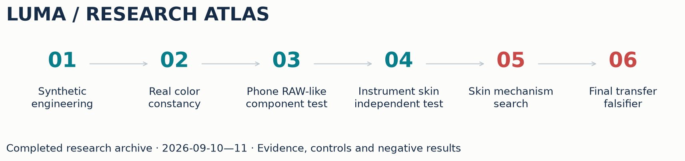
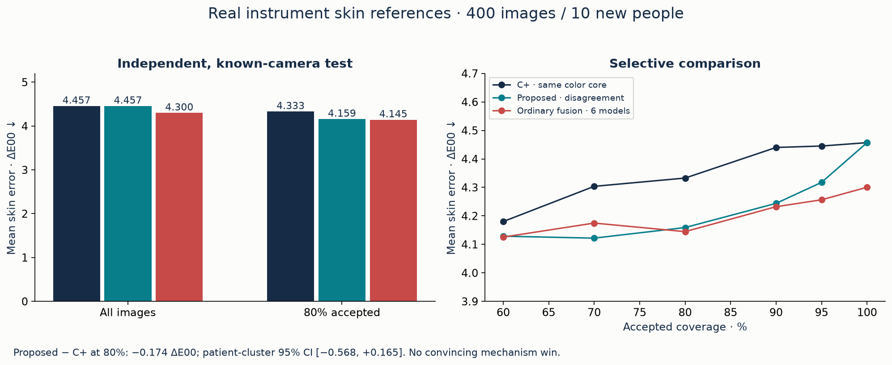
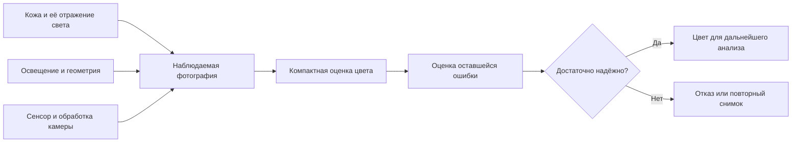
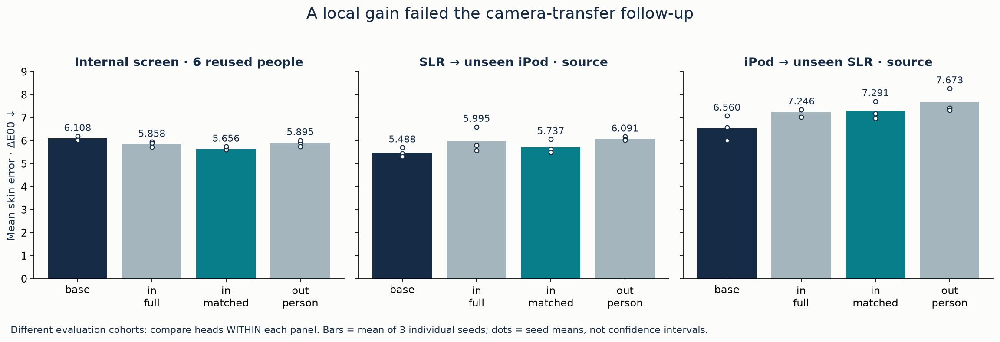
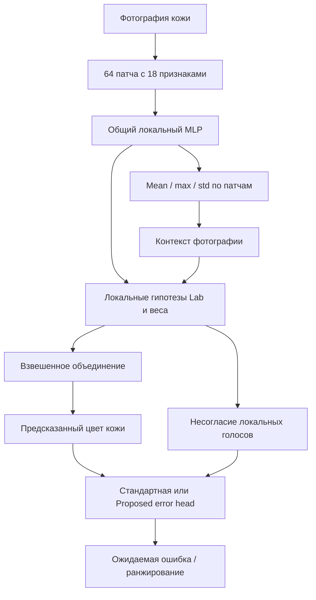
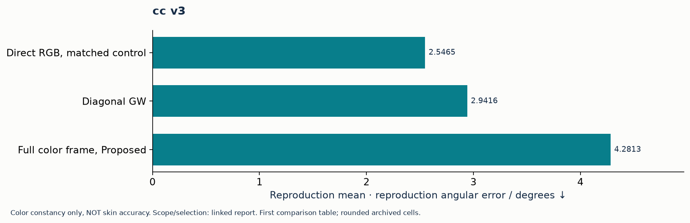
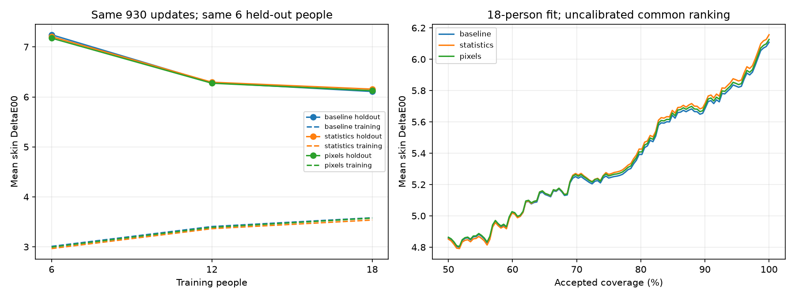

<div align="center">

# Luma Skin Vision · Research Archive

**Компактные модели цвета кожи, цветовая нормализация и оценка надёжности**

Реальные публичные данные · воспроизводимые контроли · отрицательные результаты

[Исследовательский отчёт](docs/publication/RESEARCH_REPORT_RU.md) · [Все поколения](docs/publication/GENERATIONS.md) · [Галерея](docs/publication/GALLERY.md) · [Воспроизведение](docs/publication/REPRODUCIBILITY.md)



</div>

> **Исследования остановлены 11 сентября 2026 по решению автора проекта.** Это завершённый архив. Универсальная точная модель цвета кожи для обычных смартфонов пока не получена. Неудачные гипотезы и сильные обычные контроли сохранены.

Мы исследовали конкретную задачу: **можно ли по одной фотографии получить достаточно достоверный цвет кожи — и заранее понять, когда ответу нельзя доверять?** Для будущего подбора косметики обе части важны: небольшая средняя ошибка мало помогает, если система уверенно ошибается на сложной фотографии.

Этот репозиторий показывает весь путь: постановку задачи, ограничения данных, устройство моделей, проверки необычных идей, реальные измерения и причины отказа от отдельных подходов. Исследовательскую реализацию и анализ выполнял Codex по постановке владельца проекта. Внешняя репликация другой лабораторией и рецензирование научным журналом не заявляются.

| Масштаб архива | Что именно сохранено |
|---|---|
| **53 каталога бенчмарков** | Поколения, дополнительные контроли, переоценки и диагностики |
| **1 532 строки таблиц** | Сводный CSV и JSON с указанием исходного отчёта |
| **42 новых сводных графика** | PNG для просмотра, SVG для масштабирования; прежние графики также сохранены |
| **104 исходных коммита в карте публикации** | Последовательность протоколов, результатов и исправлений; поздние правки оформления идут отдельно |
| **379 пройденных тестов** | Последний полный запуск исследовательского кода; не показатель научной точности |

<details>
<summary><strong>Оглавление: от идеи до результатов</strong></summary>

- [Главный измеренный результат](#measured-result)
- [Зачем эта технология нужна Luma](#problem)
- [Как читать метрики и не перепутать эксперименты](#metrics)
- [Поколения и повороты исследования](#generations)
- [Как устроены модели](#models)
- [Данные, камеры и приборные эталоны](#datasets)
- [Независимый тест и работа отказа](#selective)
- [Пять экспериментов, которые изменили выводы](#experiments)
- [Наблюдения и научные ограничения](#lessons)
- [Навигация по доказательствам](#evidence)
- [Размер, память и скорость](#compute)
- [Что подтверждено для продукта](#luma)
- [Как воспроизвести работу](#reproduce)
- [Частые вопросы](#faq)

</details>

<a id="measured-result"></a>

## Что удалось измерить

На **реальных фотографиях кожи с приборным эталоном** основной компактный ансамбль получил **4,457 ΔE00** на независимом тесте из **400 изображений / 10 новых людей**. При принятии 80% изображений ошибка составила **4,159 ΔE00**. Это измерение цвета кожи, а не угловая ошибка освещения.

| Независимый MSKCC тест, известные камеры | Полное покрытие · mean ΔE00 ↓ | 80% покрытия · mean ΔE00 ↓ |
|---|---:|---:|
| C+ — тот же цветовой ансамбль, стандартный error head | 4,457 | 4,333 |
| Proposed — дополнительные признаки несогласия | 4,457 | 4,159 |
| Обычная fusion из шести моделей — более крупный контроль | **4,300** | **4,145** |

Разница Proposed−C+ при 80%: −0,174 ΔE00; 95% интервал по людям **[−0,568; +0,165]** пересекает ноль. **Убедительная победа специального механизма не доказана; сильнейший обычный полный контроль не побеждён.** Эталон — среднее опубликованных SkinColorCatch Lab измерений участка кожи в исходной D65/10° конвенции. Это клинические/дермоскопические снимки Canon SLR и iPod Touch, не обычные селфи.



[Полный независимый отчёт](docs/benchmarks/skin_mskcc_selective_v1/report.md) · [Исходный JSON](docs/benchmarks/skin_mskcc_selective_v1/test_results.json) · [Профиль вычислений](docs/benchmarks/skin_mskcc_selective_v1/profile.json)

<a id="problem"></a>

## Зачем Luma восстанавливать цвет, а не просто распознавать лицо

В сценарии Beauty Concierge пользователь делает фотографию, а система должна использовать цвет кожи для дальнейшего анализа и рекомендаций. Но значение пикселя зависит одновременно от поверхности, освещения и обработки камеры. Более тёплый RGB может означать другой оттенок кожи, более тёплый источник света или другую обработку изображения.

Удобная схема задачи:



Это **концептуальная продуктовая цепочка**, а не заявление о готовой интеграции в приложение. Исследовательский репозиторий создан отдельно от исходной Luma; его результаты не являются независимым аудитом существующего продукта.

В начале работы не было возможности собрать собственный приборно размеченный facial dataset. Поэтому сначала проверяли фотометрический компонент на публичных color-constancy данных, а затем перешли к реальным фотографиям кожи с опубликованными приборными метками. Такая последовательность позволила получать измеримые результаты, сохраняя различие между компонентом и конечной задачей.

**Практические ограничения:** одно изображение при выполнении; локальная компактная модель; RTX 4060 8 GB для обучения; отсутствие обязательного облачного inference; желательная работа без camera ID, CCM и калибровочных кадров новой камеры. Последнее — исследовательское требование, которое удалось выполнить как формат входа, но пока не как универсальную гарантию точности.

<a id="metrics"></a>

## Как читать числа в этом репозитории

| Обозначение | Что измеряет | Чего из него нельзя заключить |
|---|---|---|
| **ΔE00 / CIEDE2000** | Разницу предсказанного и эталонного Lab цвета; меньше — лучше | Это не процент точности и не автоматическая гарантия подходящего оттенка косметики |
| **Reproduction angular error, °** | Ошибку цветовой коррекции в задаче color constancy | Её нельзя напрямую объявить ошибкой цвета кожи в ΔE00 |
| **Mean / median / p95** | Среднюю ошибку / середину распределения / границу, ниже которой лежит 95% ошибок | Хорошее среднее может скрывать тяжёлые ошибки в хвосте |
| **Coverage 80%** | Долю примеров, которые система принимает после ранжирования по риску | Это не «80% правильных ответов» |
| **Risk at 80%** | Среднюю реальную ошибку среди принятых 80% | Результат ранжирования не гарантирует такое же покрытие при переносе фиксированного порога |
| **Три seeds** | Три отдельных запуска обучения с разной инициализацией | Это не три независимых датасета; среднее их метрик не равно ensemble prediction |

Важна и **область проверки**:

- **Независимый тест:** люди не участвовали в разработке, модели и правила были зафиксированы до первого просмотра тестового результата.
- **Source validation:** выборка разработки; многие поздние гипотезы сравнивались на ней повторно. Это полезный поиск, но не новое независимое подтверждение.
- **Unseen-camera source:** камера отсутствует в fitting данного опыта, однако сама исследовательская выборка уже знакома по прежним опытам. В MSKCC также смешиваются эффекты камеры, человека и способа съёмки.
- **Привилегированная диагностика:** метод получает дополнительные эталоны, полный спектр или другие сведения, недоступные обычной модели. Такой результат отвечает на вопрос о механизме и не выдаётся за single-image accuracy.

Поэтому здесь нет общей кривой «каждое поколение всё точнее»: единицы, люди, камеры, бюджеты и правила выбора в разных частях работы различаются.

<a id="generations"></a>

## Все поколения — вместе с неудачами

Архив содержит **53 каталога бенчмарков**, исходники, протоколы, source locks, проверки, историю обучения, JSON/CSV, графики и журнал решений. Каталоги включают переоценки и служебные материалы: это не 53 независимых архитектуры. В сводном CSV сохранены **1 532 строки опубликованных таблиц**; разные протоколы не объединены в искусственный рейтинг.

| Линия исследования | Что проверяли | Итог |
|---|---|---|
| [Синтетический прототип](docs/benchmarks/benchmark_results.md) | Pipeline, A0/A1/A2/C/C+/Proposed, ONNX | Proposed проиграл A2; исходное состояние сохранено |
| [Color constancy V1–V2](docs/benchmarks/cc_v2_report.md) | Классические якоря, residual, selective risk | V2: 3,805° против 5,558° у matched C+ при 80% на внешней выборке; не skin accuracy |
| [V3–V7](docs/publication/GENERATIONS.md) | Цветовые базисы, графы, критик, повторные проходы, teacher, виртуальные сенсоры | Сложная архитектура и скрещивание компонентов не обеспечили общего прироста |
| [Samsung/Oppo](docs/benchmarks/phone_v1_alias_report.md) | Source-only модели на Beyond RGB | 79/88 пригодных эталонов; старая V2 сильнее новых критиков; не JPEG/HEIC skin benchmark |
| [Прямой цвет кожи](docs/benchmarks/skin_mskcc_selective_v1/report.md) | JPEG→Lab, patch votes, CNN, fusion, OOF error head | Независимые приборные измерения получены; продуктовая цель не достигнута |
| [Механизмы и альтернативы](docs/publication/GENERATIONS.md) | Спектры, вероятностные поля, обратная задача, relational и local-reference модели | Отдельные source gains; нет доказанной универсальной модели |
| [Последняя проверка](docs/benchmarks/skin_correction_transfer_v1/report.md) | Корректор +188 035 параметров и перенос между камерами | Внутренний выигрыш 7,40% не перенёсся: все три head ухудшили оба направления |



### От V1 до V7: как менялась сама идея

| Этап | Что предполагали | Что реализовали и проверили | Что осталось после проверки |
|---|---|---|---|
| [V1](docs/benchmarks/public_benchmark_report.md) | Несогласие простых экспертов поможет оценить риск | Gray World, Max RGB, Shades of Gray, Gray Edge, compact learned baseline, mixture и абляции | Реальный benchmark заработал; Proposed не стал сильнейшим при одинаковом покрытии |
| [V2](docs/benchmarks/cc_v2_report.md) | Проще поправить хороший классический ответ, чем строить всё с нуля | Learned residual вокруг якоря, matched direct C+, error heads и calibration | Выигрыш у matched C+ на внешнем протоколе, но source/часть камер регрессировали |
| [V3](docs/benchmarks/cc_v3_report.md) | Новая цветовая система координат устранит часть зависимости от камеры | Выбор трёхвекторного базиса, relational tokens, graph diffusion, posterior transport | Full frame проиграл тому же графу в обычном RGB |
| [V4](docs/benchmarks/cc_v4_report.md) | Полезно оценивать изображение после предполагаемой поправки | Posterior, generic action и physical transport critics | Специальный transport не выиграл source screen |
| [V5](docs/benchmarks/cc_v5_report.md) | Обучение на выбранных моделью поправках и повторное уточнение улучшат ответ | Общий warmup, парные сравнения, три seeds, selected actions, derivatives, equal-query controls | Отдельный selective сигнал без устойчивой общей победы; преимущества обратной связи не установлено |
| [V6](docs/benchmarks/cc_v6_report.md) | Можно совместить полезные свойства frame и critic | Комбинация канонизации и оценки поправок при сопоставимом бюджете | Скрещивание компонентов не унаследовало автоматически их сильные стороны |
| [V7 и внешний тест](docs/benchmarks/cc_v7_external/report.md) | Семантический teacher и виртуальные сенсоры улучшат перенос | GT-only controls, teacher variants, sensor transforms; teacher только при обучении | Широкая независимость от камеры не доказана; все 29 зафиксированных методов сохранены |

После этого исследование сосредоточилось на **непосредственном приборном цвете кожи**: patch votes, capture mixtures, графы, paired invariance, вероятностные поля цвета, spectral decoders, обратная задача наблюдения, локальные эталоны и correction heads. Полная последовательность этих ветвей — в [атласе всех 53 каталогов](docs/publication/GENERATIONS.md).

<a id="models"></a>

## Как устроены исследованные модели

### 1. Классический ответ как отправная точка

В CC линии дешёвый эксперт сначала оценивает освещение, а небольшая обучаемая модель уточняет поправку. Это позволяет сравнить прямое предсказание с остаточной коррекцией при близкой нейронной ёмкости. Отдельная модель риска оценивает, насколько ответу можно доверять.

Якорь здесь — проверяемое предположение, а не обязательная часть всех поколений. Его сравнивали с прямой регрессией, другими экспертами и дешёвыми статистическими контролями. Хороший результат такого семейства не означает, что сама идея residual learning нова.

### 2. PatchVotes: локальные голоса и общий контекст

В независимом skin benchmark компактная модель работает с **64 локальными 18-мерными descriptors**. Общий локальный MLP кодирует каждый патч; среднее, максимум и стандартное отклонение признаков формируют контекст фотографии. Затем каждый патч выдаёт цветовую гипотезу и вес, а агрегатор объединяет голоса.



Схема объединяет цветовую модель и последующую оценку риска; не все входы error head показаны. Основной ансамбль содержит три отдельно обученные PatchVotes модели. C+ и Proposed используют **одинаковые цветовые предсказания**, поэтому их mean при полном покрытии совпадает.

Proposed добавляет сведения о несогласии патчей и seeds. Поиск типов error head сопоставим по бюджету, но выбранные типы отличаются: C+ выбрал MLP, Proposed — HGB. Следовательно, главное сравнение проверяет две процедуры построения selective системы, а не изолированное добавление признаков при неизменной голове.

[Исходник PatchVotes](scripts/skin_mskcc_vote.py) · [Реализация selective системы](scripts/skin_mskcc_selective_core.py) · [Полный независимый протокол и результаты](docs/benchmarks/skin_mskcc_selective_v1/report.md)

### 3. Последний корректор в лимите дополнительных 200 тысяч параметров

Финальная correction ветвь использовала уже обученный core и небольшую добавку:

```text
36 устойчивых цветовых признаков + 3 предсказанных Lab координаты
                              ↓
                    39 → 384 → 384 → 64 → 3
                              ↓
                    Остаточная поправка цвета
```

Head добавляет **188 035 параметров** к core из **929 297**, всего **1 117 332** при разрешённом пределе **1 129 297**. При inference не нужен банк эталонов или camera ID. Сравнивали обучение головы на full-core predictions, matched-size predictions включённых людей и действительно person-excluded predictions. Все головы начинали с нулевой поправки и получали одинаковые 300 обновлений в пределах протокола/seed.

Эта добавка дала внутренний выигрыш, но не выдержала переноса. Уложиться в бюджет параметров оказалось проще, чем обеспечить устойчивую точность на другой камере.

<a id="datasets"></a>

## Реальные данные, камеры и эталоны

| Источник | Что доступно | Роль в исследовании | Предел интерпретации |
|---|---|---|---|
| **SimpleCube++** | 2 234 реальные линейные изображения, illuminant GT; CC BY 4.0 | Основное CC обучение и source checks | Эталон освещения не является Lab эталоном кожи |
| **INTEL-TAU** | Несколько камер и реальные illuminant references; CC BY-SA 4.0 | Внешняя CC оценка; evaluation only в проекте | Не тренировочная основа коммерческих весов этого проекта; mirror provenance ограничен |
| **Beyond RGB** | Samsung Galaxy S21 Plus / Oppo Find X5 Pro, отдельные reference captures; CC BY 4.0 | 3,23 GB выбранных данных, телефонный component test | Demosaiced camera RGB, не обычный JPEG/HEIC skin benchmark |
| **MSKCC** | 1 838 JPEG, 46 людей, SkinColorCatch Lab; исходная CC-BY | Основной прямой skin-color benchmark | Клиническая/дермоскопическая съёмка, известные Canon SLR и iPod Touch |
| **He 2021** | Региональные RGB/XYZ кожи; CC BY 4.0 | Отдельный пилот: 40 train / 20 test людей | Нет достаточного основания для ΔE00 при неподтверждённом белом |
| **UMINHO-HSFD** | Измеренные отражательные спектры лица; CC BY 4.0 | Три TRAIN лица, 22 500 выбранных спектров | Полный спектр или полученный из него RGB не заменяет независимую фотографию телефона |
| **ISSA v4** | 15 256 записей измерений кожи; CC BY 4.0 | Spectral compression и material controls | Коды людей/источников имеют документированные ограничения; часть данных осталась резервной |

Samsung и Oppo действительно присутствуют в исследованиях. Также был получен небольшой CC0 iPhone набор для вспомогательных проверок, но достаточного приборного facial ground truth для него не установлено. **Наличие фотографий определённого телефона и доказанная точность цвета кожи на этом телефоне — разные уровни evidence.**

Права проверялись по исходным релизам; лицензия сторонней загрузки не подменяла лицензию авторов. Изображения не включены в этот GitHub архив. [Полный inventory](docs/data/public_dataset_inventory.md) · [Skin inventory](docs/data/public_skin_color_inventory.md) · [Данные и права](docs/publication/DATA_AND_RIGHTS.md).

<a id="selective"></a>

## Независимый тест: как отделяли обучение, риск и проверку

| Роль MSKCC | Людей | Изображений | Назначение |
|---|---:|---:|---|
| TRAIN | 24 | 966 | Обучение; внутри этой роли — person-held-out residuals для риска |
| Source VALIDATION | 6 | 264 | Выбор моделей и настроек по протоколу |
| CALIBRATION | 6 | 208 | Фиксация шкалы ошибки и порогов принятия |
| Independent TEST | 10 | 400 | Один заранее зафиксированный независимый endpoint, 105 участков |

Люди между ролями не пересекаются. Все 400 тестовых строк содержат три полных приборных Lab чтения; target — их среднее. Повторные фотографии одного участка не считаются новыми независимыми измерениями. После первого теста этот набор стал раскрытым архивом и не использовался как новая tuning выборка для последующих поколений.

### Что происходит, когда модель отклоняет часть фотографий

| Принято | C+ mean ΔE00 | Proposed mean ΔE00 | Proposed p95 | Доля принятых с ΔE00 >10 |
|---:|---:|---:|---:|---:|
| 100% | 4,4570 | 4,4570 | 9,2631 | 3,75% |
| 95% | 4,4452 | 4,3176 | 8,8808 | 3,16% |
| 90% | 4,4401 | 4,2439 | 8,5672 | 2,78% |
| 80% | 4,3328 | 4,1591 | 8,0966 | 1,88% |
| 70% | 4,3037 | 4,1219 | 8,2565 | 1,79% |
| 60% | 4,1801 | 4,1287 | 7,9873 | 1,67% |

Отказ улучшает среднюю ошибку и уменьшает тяжёлый хвост, но не делает оставшиеся ответы безошибочными. Например, **фиксированный порог**, подобранный для 80% CAL coverage, принял **74,25% TEST**, а не 80%. Порог predicted error ≤5 принял 69,25% тестовых изображений; у 29,24% из них истинная ΔE00 всё равно превысила 5.

Это объясняет, почему недостаточно написать в интерфейсе «модель уверена»: предсказание ожидаемой ошибки требует отдельной проверки на целевых условиях. Все фиксированные покрытия, полная кривая, пороги и интервалы — в [независимом отчёте](docs/benchmarks/skin_mskcc_selective_v1/report.md).

<a id="experiments"></a>

## Пять экспериментов, которые изменили выводы

### 1. Новая система координат оказалась хуже обычного RGB

V3 попыталась убрать часть camera dependence через цветовой базис и геометрический перенос гипотез. При **одинаковых 1 215 535 параметрах** full-frame graph получила source reproduction mean **4,281°**, а RGB graph — **2,547°**. Теоретически мотивированная конструкция оказалась недостаточной: устойчивость выбора базиса и геометрия реальной ошибки тоже имеют значение.

<details>
<summary>Посмотреть сравнение V3</summary>



Это reused source development, а не независимая skin-color проверка. [Методика и ограничения](docs/benchmarks/cc_v3_report.md).

</details>

### 2. «Прогнать ответ ещё раз» не стало бесплатным улучшением

Проверялась идея многократного уточнения: предложить поправку, оценить её, выбрать следующую и повторить. Чтобы отделить полезную обратную связь от простого увеличения вычислений, adaptive search сравнили с фиксированным поиском при **одинаковом числе 25/51/103 запросов** к тому же critic.

В seeds 17/29 на первом этапе все 1 190 случаев сохранили исходную точку; ответы при 51 запросе были побитово одинаковыми у fixed и adaptive controls. В seed 43 переместился один из 595 случаев, а различие действий оставалось очень малым. При 103 запросах эффекты были небольшими и неоднозначными. **Уменьшение предсказанного critic риска не гарантировало уменьшения истинной ошибки.** [Полный recurrence experiment](docs/benchmarks/cc_v5_report.md).

### 3. Дополнительные люди дали более ясный сигнал, чем pixel adapter

На одном внутреннем holdout из шести людей baseline обучалась на 6, 12 и 18 других людях при **одинаковых 930 обновлениях**. Mean ΔE00 уменьшилась **7,2439 → 6,2843 → 6,1082**. Добавление pixel adapter при 18 людях дало **6,1258**, то есть не улучшило baseline.



Это не доказательство, что всё решается объёмом данных, и не сравнение с независимыми 4,457 ΔE00: здесь другая когорта. Но такой контроль помогает понять, на что реагирует конкретная модель и что добавленная сложность действительно приносит. [Source support curve и вмешательства в пиксели](docs/benchmarks/skin_support_curve_v1/report.md).

### 4. Хорошие компоненты не всегда дают хорошую комбинацию

Комбинировались frame и critic, spatial graph и paired patches, цветовая и person/site балансировка, local-reference и neural correction. Некоторые пары улучшали отдельные source условия, другие ухудшали перенос. Обычные двухмодельные комбинации тоже давали source gains, но с большей стоимостью inference.

Поэтому каждый результат сравнивался с простыми альтернативами: убрать ветвь, использовать среднее, убрать явную супервизию экспертов, заменить сложное распределение более простым, отказаться от reference bank. История сохраняет не только предложенные механизмы, но и случаи, когда их удаление было конкурентным. [Graph/support](docs/benchmarks/skin_graph_support_v1/report.md) · [Комбинации моделей](docs/benchmarks/skin_branch_combination_v1/report.md) · [Sampling transfer](docs/benchmarks/skin_sampling_transfer_v1/report.md).

### 5. Последний локальный успех не выдержал проверки переноса

Stable correction снизила внутреннюю mean ΔE00 **6,1082 → 5,6560**, улучшив все три seeds и пять из шести людей. p95 уменьшился **14,9960 → 12,9644**. После этого тот же механизм проверили отдельно на переносе между камерами.

| Source evaluation | Base | In-full correction | In-matched correction | Out-person correction |
|---|---:|---:|---:|---:|
| Mixed / known | 3,8277 | 3,7626 | 3,8184 | 3,9889 |
| SLR → unseen iPod | **5,4877** | 5,9953 | 5,7371 | 6,0910 |
| iPod → unseen SLR | **6,5602** | 7,2462 | 7,2908 | 7,6725 |

Это mean метрик трёх individual seeds; все числа — реальные native skin ΔE00. **Все три головы ухудшили оба unseen-camera направления.** Нельзя выбрать отдельного победителя для каждой камеры и затем назвать систему camera-blind. Данный результат завершил исследование перед решением владельца остановить работу. [Внутренний screen](docs/benchmarks/skin_crossfit_correction_v1/report.md) · [Отдельный transfer follow-up](docs/benchmarks/skin_correction_transfer_v1/report.md).

<a id="lessons"></a>

## Наблюдения, которые важнее одного лучшего числа

| Наблюдение | Что оно меняет в понимании задачи |
|---|---|
| Удаление абсолютного цвета ухудшало rank-only и bias controls | Инвариантность может уничтожать полезный сигнал вместе с нежелательной зависимостью |
| Согласие нескольких снимков сосуществовало с общей ошибкой | Consistency не равна абсолютной колориметрической точности |
| Полный спектр позволяет проверить представимость материала | Это ещё не восстановление того же материала из одной RGB фотографии |
| TRAIN MSE снижалась у heads, которые проигрывали на unseen camera | Хорошая оптимизация обучающей задачи не гарантирует переноса |
| Semantic teacher не стал универсальным колориметрическим учителем | Признаки распознавания объектов и признаки точного цвета могут требовать разного обучения |
| Многие фотографии и пары принадлежат небольшому числу людей | Количество изображений нельзя использовать вместо количества независимых участников |
| Coverage и tail error меняются при переносе порога | Надёжный отказ нужно проверять отдельно от среднего качества цветовой модели |

Отрицательные результаты относятся к **проверенным реализациям, бюджетам и данным**. Они не доказывают невозможность других графов, teachers, спектральных методов или универсальной модели вообще. Точно так же локальный положительный результат на многократно исследованной выборке не доказывает научную новизну.

В [prior-art обзоре](docs/research/prior_art.md) и [IP provenance](docs/ip) учитываются FC4, Reweight-CC, C5, CCMNet, uncertainty work, VLM-CC и более общие механизмы: stacking, local regression, distillation, graph regularization и differentiable solvers. **«Есть собственная реализация» и «доказана новизна метода» — разные утверждения.**

<a id="evidence"></a>

## Навигация

1. **[Основной отчёт](docs/publication/RESEARCH_REPORT_RU.md)** — постановка, методы, данные, результаты, ограничения и выводы.
2. **[Атлас поколений](docs/publication/GENERATIONS.md)** — каждый каталог, гипотеза, наблюдение и доказательства.
3. **[Галерея](docs/publication/GALLERY.md)** — сводные PNG/SVG и исходные risk–coverage, абляции и диагностики.
4. **[История](docs/publication/HISTORY.md)** — фиксация протоколов, исправлений и результатов.
5. **[Воспроизводимость](docs/publication/REPRODUCIBILITY.md)** — команды, окружение и доступные артефакты.
6. **[Данные и права](docs/publication/DATA_AND_RIGHTS.md)** — первичные лицензии и ограничения.
7. **[Досье Luma / Сколково](docs/publication/SKOLKOVO_EVIDENCE.md)** — реализовано / измерено / ещё не подтверждено.

<a id="compute"></a>

## Размер и вычисления

| Измеренный объект | Параметры | Ресурсы и предел утверждения |
|---|---:|---|
| Основной независимый patch ensemble | 2 774 796 | 11,11 MB весов; **1,470 ms** batch 1 на RTX 4060, только модель по готовым признакам; inference allocation 20,04 MiB |
| Обычный шестимодельный fusion | 7 337 589 | Более крупный контроль; его задержка не равна задержке patch ensemble |
| Финальный core + correction head | 1 117 332 | 4,48 MB checkpoint; inner-core training allocation 104,42–109,50 MiB, head 73,81–76,78 MiB; новая latency не измерялась |

JPEG decoding, подготовка признаков, локализация и error head не включены в 1,470 ms. Это не полная задержка приложения. Независимая модель кожи не экспортировалась в ONNX; исторические ONNX результаты относятся к другим моделям.

**Как контролировали достоверность:** протоколы фиксировались до соответствующих измерений, exact bytes связывались SHA256, GPU predictions проверялись CPU/NumPy replay, метрики — независимым scalar CIEDE2000 расчётом. В последней фазе проверены 60 exact evaluation arrays, 27 NumPy heads, 26 892 scalar color cases и 360 coverage checks; полностью повторены три core fits и три head fits. Это локальные инженерные проверки, не отдельная внешняя репликация исследования.

Сохранены и исправления, способные повлиять на интерпретацию. Например, в последнем опыте объединение known/unseen примеров в другие batch boundaries изменило четыре baseline Lab значения максимум на 3,8147×10⁻⁶. Восстановление прежних раздельных batch32 границ вернуло побитовое совпадение. Исходный lock оставлен; изменение описано отдельным recovery record. [Аудит](docs/benchmarks/skin_correction_transfer_v1/audit.json) · [История исправления](docs/research/skin_correction_transfer_batch_recovery.md).

<a id="luma"></a>

## Что это означает для Luma

Получены исследовательский код и измерительная база для будущих photometric/reliability и skin-color подсистем. Подтверждена возможность компактной регрессии цвета кожи по реальным приборным меткам. Найдены сильные обычные контроли, проблемы переноса и ограничения отказа по ожидаемой ошибке.

**Не подтверждены:** точность лица на обычных iPhone/Android, независимость от произвольной камеры, надёжный подбор косметического оттенка, клиническая пригодность или научная/патентная новизна. Цель проекта median ≤2 и p95 ≤5 ΔE00 при ≥80% покрытия на новых обычных телефонах остаётся недостигнутой; это исследовательская цель, не отраслевой стандарт.

| Уже есть | Что считалось бы следующим уровнем доказательства при возобновлении |
|---|---|
| Компактный direct-skin estimator и приборный benchmark | Новый независимый facial/phone endpoint с подходящими эталонами |
| Измеренный selective ranking | Проверенная переносимость порогов и приемлемые ошибки среди принятых |
| Source camera-held-out эксперименты | Устойчивый результат на новых обычных телефонах и людях |
| Model-only profiling | Полный измеренный путь от фотографии до ответа на целевом устройстве |
| Исследовательское досье и provenance | Подтверждение продуктовой полезности и отдельная оценка IP/прав конкретного артефакта |

Исследования сейчас **не возобновляются**. Эта таблица объясняет границу достигнутого, а не обещает новые эксперименты. Для Сколково архив содержит технические свидетельства, но не является поданной или одобренной заявкой. [Полное досье](docs/publication/SKOLKOVO_EVIDENCE.md).

<a id="reproduce"></a>

## Пересобрать оформление без данных и обучения

```bash
uv sync --extra report --extra dev
uv run python scripts/build_research_archive.py
uv run python scripts/verify_research_archive.py
```

Фотографии участников, приватные кэши и нейросетевые checkpoints не размещены. Для повторного обучения нужны отдельное получение данных по исходным условиям и восстановление окружения. [Подробности](docs/publication/REPRODUCIBILITY.md).

### Карта репозитория

```text
README.md                  Обзор, механизмы, результаты и выводы
docs/
  publication/             Полный отчёт, атлас, галерея, CSV/JSON и SVG/PNG
  benchmarks/              Исходные отчёты, метрики, логи, locks и audits
  research/                Протоколы, гипотезы, prior art и решения по этапам
  data/                    Источники данных, лицензии, preprocessing provenance
  ip/                      Происхождение методов и сторонних артефактов
  skolkovo/                Исторические технические evidence addenda
scripts/                   Подготовка, обучение, оценка и воспроизведение
src/luma_skin_vision/      Базовая исследовательская библиотека
tests/                    Проверки программной корректности
pyproject.toml + uv.lock   Зависимости и зафиксированное окружение
```

Для чтения и пересборки публикационных графиков исходные изображения и GPU не нужны. Для полного повторения обучения они нужны, как и соответствующие версии кода/данных. Небольшие числовые NPZ predictions и coefficients в архиве не являются фотографиями или полным комплектом нейросетевых весов.

Публичная история сохраняет последовательность исследования и теги. Три вспомогательных сторонних архивных файла исключены; исходная локальная история сохранена. [Карта оригинальных и публичных commit IDs](docs/publication/commit_map.json) объясняет изменившиеся хэши. Source locks не переписаны задним числом. Исторические слова `next`, `active` и `unopened` относятся к моменту написания соответствующего документа; текущий статус указан вверху этой страницы.

**Public research / source-available archive.** Публичность репозитория сама по себе не выдаёт общую лицензию на повторное использование. Лицензии данных, стороннего кода и весов учитываются отдельно: [права](docs/publication/DATA_AND_RIGHTS.md).

<a id="faq"></a>

## Частые вопросы

<details>
<summary><strong>Почему не показать одну «лучшую точность» для всех поколений?</strong></summary>

Потому что разные числа отвечают на разные вопросы. Независимые 4,457 ΔE00, внутренние 5,656 ΔE00 и CC 3,805° получены на разных данных и протоколах. Их соединение в линию прогресса было бы ошибкой. Сопоставимые методы сравниваются внутри одной таблицы или панели, а полный контекст сохранён по ссылке.

</details>

<details>
<summary><strong>Почему есть Canon и iPod, если продукт нужен для обычных телефонов?</strong></summary>

Для проверки абсолютного цвета нужен подходящий эталон. MSKCC предоставляет реальные приборные Lab измерения, но его устройства и способы съёмки отличаются от обычных селфи. Samsung/Oppo исследовались отдельно в color constancy; это не заменяет skin benchmark. Работа не утверждает, что камеры не важны, или что iPod clinical capture доказывает точность обычного iPhone.

</details>

<details>
<summary><strong>Была ли найдена собственная необычная архитектура?</strong></summary>

Были реализованы и проверены необычные гипотезы: полный цветовой frame с графом и posterior transport, correction-conditioned critics, условная инверсия наблюдения, поля цветовой ошибки, физические декодеры и локальные reference механизмы. Но необычность не обеспечила измеримого универсального превосходства, а отдельная реализация не доказывает патентную или научную новизну. Поэтому strongest ordinary controls сохранены рядом с Proposed.

</details>

<details>
<summary><strong>Можно ли сразу встроить опубликованную модель в Luma?</strong></summary>

Опубликованы код, методики и доказательная база. Готовый независимо проверенный facial smartphone модуль, полный mobile runtime и комплект production-cleared checkpoints не заявлены. Model-only latency не включает весь путь обработки фотографии. Подробности того, что реализовано, измерено и ещё не подтверждено, собраны в досье Luma/Сколково.

</details>

<details>
<summary><strong>Что полезного осталось, если универсальной победы нет?</strong></summary>

Реальный приборный benchmark, компактные сильные baselines, инструменты selective оценки, восстановимая история методов, проверенные failure modes и список гипотез, которые не оправдали добавленную сложность. Такой архив позволяет будущему исследователю начать с измеренных ограничений, а не повторять отрицательные опыты или принимать красивую идею за доказанный результат.

</details>

<details>
<summary>English abstract</summary>

This archive documents compact color normalization, selective reliability estimation and instrument-referenced skin-color regression. The independent MSKCC known-camera test contains 400 photographs from 10 new people. The primary 2.775M-parameter patch ensemble achieves mean CIEDE2000 4.457, and 4.159 at 80% coverage. Its selective improvement over matched C+ is not statistically convincing; an ordinary larger fusion achieves 4.300 and 4.145. Exploratory experiments cover canonical color frames, recurrent critics, teacher transfer, graphs, conditional densities, spectral decoders, local references and person-excluded correction. No universal camera-independent skin model is established. Negative results, source reuse, license restrictions and historical protocol repairs are preserved. Research stopped at the owner's request; this is an evidence archive, not a claim of production readiness or peer-reviewed novelty.

</details>
