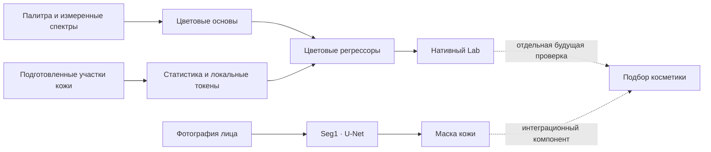

> **C_REBASE_V1 — фиксированный OOF и error-floor audit, 15 сентября 2026.**
> [Отчёт с метриками](experiments/c_rebase_v1/REPORT_RU.md) · [Текущий STATE](STATE.md) · [OOF и веса](experiments/c_rebase_v1/run/) · [Команды](experiments/c_rebase_v1/COMMANDS.md).
> 966 TRAIN / 24 человека / 6 folds. Mean 4.619, median 3.897, p95 10.190 ΔE00. Fold 0 повторён побитово. Вывод MIXED; точность селфи не подтверждена. Исторический C: HISTORICAL_NOT_REPRODUCIBLE; production не менялся.
> Ниже сохранён прежний архив; актуальное разрешение владельца и состояние работы — в STATE.

<p align="center"><b>LUMA · CHROMASEED</b><br>Исследовательский архив · 14 сентября 2026</p>


<h1 align="center">От палитры — к цвету кожи</h1>
<p align="center">Архитектуры · обучение · данные · проверяемые результаты</p>

<p align="center"><a href="docs/archive/2026-09-14/README.md"><b>Открыть полный атлас</b></a> · <a href="docs/archive/2026-09-14/ARCHITECTURES.md">Архитектуры</a> · <a href="docs/archive/2026-09-14/RESULTS.md">Результаты</a> · <a href="docs/archive/2026-09-14/TESTS.md">Тесты</a></p>

> **Исследования приостановлены по запросу автора 14 сентября 2026.** Здесь сохранены успешные и неудачные серии, исходники, протоколы и точная точка остановки. HR прошёл аудит качества, но полный runtime завершился с ошибкой; основные P3 и Seg2 не запускались. [Подробный статус](docs/archive/2026-09-14/STOP_STATUS.md).

Luma ChromaSeed — исследование оценки цвета кожи, устойчивости к условиям съёмки и выделения кожи лица. Цель продукта — измерительный компонент для косметического e-commerce и интеграций в магазины. Приложение Luma служит демонстрационной оболочкой технологии. Точность выбора оттенка косметики по обычному селфи пока независимо не подтверждена.

## Архив в цифрах

| **88 каталогов серий** | **2,377 строк таблиц** | **733 тестовых определений** |
|:---:|:---:|:---:|
| Включая контроли и диагностики | Все значения с исходным отчётом | Полные условия и параметризация |

В справочнике **805 Python-модулей**, включая исторические снимки исходников; **7 подробных карточек архитектур AS** с каждым слоем и тремя head modes HR. Это счётчики документов и определений, а не число независимых моделей или успешно выполненных тестов. [Метод подсчёта](docs/archive/2026-09-14/inventory.json).

## Что удалось измерить

| Направление | Результат | Как его понимать |
|---|---|---|
| **Цвет кожи · независимый тест** | 4.4570 ΔE00; обычный fusion — 4.3005 | 400 изображений /10 новых людей; меньше лучше. Общего превосходства предложенного метода нет |
| **Выделение кожи лица · Seg1** | 94.20% mean-image IoU | 2000 TEST-фото LaPa; качество маски, не процент правильно распознанных лиц |
| **Масштабирование до ≈5 млн** | Выигрыши зависят от сценария | Размер иногда помогает; независимая точность селфи не установлена |
| **Head range · HR** | Два выбранных результата без изменений; третий чуть хуже | Аудит качества пройден. Полный runtime/replay не завершён |
| **Расширение данных** | 52 204 публичных фото +5 частных | Большинство новых фото дают маски, а не приборный Lab; это не 52 тысячи новых эталонов цвета |

Все единицы, выборки, контроли, оговорки и ссылки на первичные JSON — в [разборе результатов](docs/archive/2026-09-14/RESULTS.md).


## Как устроены модели



| Ветвь | Основные конструкции | Читать |
|---|---|---|
| Цветовая нормализация | CompactCC, residual anchor, графы, critic, Fourier, semantic teacher | [Исторические V1–V7](docs/archive/2026-09-14/ARCHITECTURES.md#2-синтетический-старт-и-цветовая-нормализация) |
| Регрессия по изображениям кожи | PatchVotes, CaptureColor, SpatialColor, MaterialImage, LossField, correction heads | [Все механизмы](docs/archive/2026-09-14/ARCHITECTURES.md#3-модели-по-изображениям-кожи-весь-набор-механизмов) |
| Компактный ChromaSeed | Палитра, analytic ridge, Nyström kernels, gating, TAGI, локальные обновления | [Маленькие модели и способы обучения](docs/archive/2026-09-14/ARCHITECTURES.md#4-маленькие-chromaseed-и-альтернативы-backprop) |
| Большие AS / HR | Patch, soft attention, dynamic attention, mean/std/max pooling; unit/wide/linear | [Слои и формулы](docs/archive/2026-09-14/ARCHITECTURES.md#5-as-семь-архитектур-до-пяти-миллионов-параметров) |
| Спектральная палитра | P1 данные, P2 кодировщик, подготовленный P3 перенос | [Палитра → модель](docs/archive/2026-09-14/ARCHITECTURES.md#6-палитра-p1--p2--p3) |
| Маска кожи лица | Seg1 U-Net 4.42 млн; подготовленное расширение Seg2 | [Сегментация](docs/archive/2026-09-14/ARCHITECTURES.md#7-seg1-и-подготовленная-seg2) |

**189 в серии HR — не 189 архитектур.** Это 7 архитектур ×3 выходные функции ×3 роли данных ×3 seeds: 126 новых selected final моделей и 63 прежних AS-контроля. Весь процесс подбора включал 1008 завершённых новых траекторий. [Полный реестр HR](docs/archive/2026-09-14/HR_ALL_MODELS.md).

## Навигация по всему исследованию

| Раздел | Содержание |
|---|---|
| [**Полный атлас**](docs/archive/2026-09-14/README.md) | Главный вход и порядок чтения |
| [Все 88 серий](docs/archive/2026-09-14/EXPERIMENTS.md) | Карточка каждой серии, все её таблицы, код, проверки и решения |
| [Все реализации](docs/archive/2026-09-14/SOURCE_INDEX.md) | Константы, размеры, наследование, constructors/forward/fit/export |
| [Все тесты](docs/archive/2026-09-14/TESTS.md) | Полные тела проверок; отдельно исторический статус запусков |
| [Все наблюдения](docs/archive/2026-09-14/OBSERVATIONS.md) | Дневник, отрицательные результаты, errata, протоколы и источники |
| [Галерея](docs/archive/2026-09-14/GALLERY.md) | Сохранённые графики с переходом к методике |
| [Данные](docs/archive/2026-09-14/DATA.md) | Количества, роли, очистка, утечки и пригодность эталонов |
| [Модели и артефакты](docs/archive/2026-09-14/MODEL_ARTIFACTS.md) | Какие файлы доступны в Git, какие веса остаются локальными, хэши и происхождение |
| [Воспроизводимость](docs/archive/2026-09-14/REPRODUCIBILITY.md) | Проверка публикации и требования полных опытов |
| [Состояние остановки](docs/archive/2026-09-14/STOP_STATUS.md) | Все завершённые, неудачные и незапущенные этапы |

[39 каталогов первичных запусков и журналов](docs/archive/2026-09-14/RUNS.md) · [Записи моделей с JSON pointers](docs/archive/2026-09-14/model_records.csv).

Машинные данные: [каталог JSON](docs/publication/catalog.json) · [все таблицы CSV](docs/publication/all_report_tables.csv) · [индекс тестов](docs/archive/2026-09-14/test_catalog.json) · [SHA-256 импорта](docs/archive/2026-09-14/import_manifest.json) · [проверка публикации](docs/archive/2026-09-14/validation.json).

## Проверить архив

```bash
python scripts/verify_complete_archive.py
```

Только стандартная библиотека Python. Команда проверяет копии, таблицы, исходники, ссылки и согласованность ключевых результатов. Данные фотографий, GPU и запуск обучения не нужны. CI проверяет ту же команду. Подробности — [воспроизводимость](docs/archive/2026-09-14/REPRODUCIBILITY.md).

Новые большие checkpoint-массивы и фотографии участников в Git не входят. Документация, выборы моделей, метрики и зарегистрированные хэши опубликованы; ссылки `experiments/runs/...` в первичных отчётах обозначают локальные исследовательские артефакты. Исходные frozen files и отрицательные результаты сохранены.

## История, происхождение и продуктовая перспектива

[Прежняя подробная главная](README.history.md) · [Исследовательский текст этапа 10–11 сентября](docs/publication/RESEARCH_REPORT_RU.md) · [История и карта коммитов](docs/publication/HISTORY.md) · [Карта доказательств для проекта](docs/publication/SKOLKOVO_EVIDENCE.md).

Работа выполнена с помощью Codex по постановке владельца Luma. Независимая репликация другой лабораторией и рецензирование не заявляются. Архив показывает научно-техническую работу и её ограничения; он не обещает точность товарного подбора или получение статуса резидента Сколково. Условия сторонних данных и кода сохранены в [реестре происхождения](docs/publication/DATA_AND_RIGHTS.md).

<details><summary>English abstract</summary>

Luma ChromaSeed is a frozen research archive for skin-region color estimation, color constancy, compact analytical/neural learning, architecture scaling and facial-skin segmentation. It includes all retained benchmark families, source-level architecture references, complete test definitions, protocols, negative results and incomplete-run receipts. Instrument color error, segmentation IoU, synthetic palette error and numerical equivalence are kept separate. Research was paused by the project owner on September 14, 2026. Ordinary-selfie instrument color accuracy and cosmetic shade-match outcomes remain unvalidated.

</details>

<p align="center">Протокол → реализация → проверка → вывод<br><sub>Обложка: ImageGen · графики: сохранённые измерения · <a href="docs/archive/2026-09-14/DESIGN.md">Происхождение оформления</a></sub></p>
