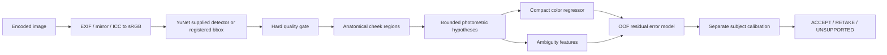

# Standalone engine architecture

The package has no dependency on the original Luma repository. Supplied audit text is PROVIDED CONTEXT. The versioned manifest carries one image-region observation with a reference target; repeated captures are clustered by subject and session. All real identity and participant images stay outside Git.

The diagram is the intended measurement flow. The current public API conservatively returns UNSUPPORTED because no real operating domain is validated. The research CLI trains/evaluates supplied registered images; it does not require a detector for synthetic rectangles. Automatic YuNet is an optional checksum-pinned adapter; no model is bundled. Landmark-driven pose gates and measured-footprint localization need real registration evidence.

Encoded color and physical target are kept distinct. A0 takes trimmed channel statistics inside cheek ROIs; A1 estimates bounded channel gains in linear sRGB. A2 fits a train-only affine matrix to paired linear colors. Every learned model uses the same torchvision MobileNetV3-small feature backbone and target normalization learned only on fitting subjects. C uses global pooling; C+ and proposed use trainable attention supervised indirectly by Lab loss. Proposed includes photometric-disagreement features; these are not recovered spectral illumination measurements.

The error estimator fits log1p(ΔE00) using subject-held-out predictions. Folds never include the held-out person's other images. C/classical runs use a constant OOF-error reference, C+ uses conventional quality features and predicted Lab, and proposed adds the full ambiguity vector. Final predictor weights are selected with validation data; error calibration consumes only the separate calibration split. Test records never fit corrections, model normalization, residual regressors or calibration.

The split-conformal-style calibration uses subject maxima of error-minus-predicted-error. A finite upper bound requires enough calibration subjects at the requested alpha. `null` residual quantile represents an infinite bound, not zero. Its assumptions concern exchangeable subject bundles; it is not a guarantee of low mean error among accepted images or under unseen-device shift. A later LTT/risk-control experiment is a separate requirement.

Evaluation records region-level continuous errors and groups by subject/device/light/measured L*. Acceptance is image-level: mean observed cheek error and maximum predicted cheek error determine the image's risk and selection score. Offline exact-count ranking curves compare the same number of images; the separately frozen deployment-policy coverage is reported without retuning on test data. Subject-cluster resampling reselects at equal coverage within each replicate.

Experiment directories carry config, source/dataset/split hashes, checkpoint and error-model hashes, OOF membership audit, history, environment and timing. Safe weights-only loading is used for locally generated PyTorch state dictionaries. Production dependency separation exists; no server platform, hosted tracking or distributed training is required.
