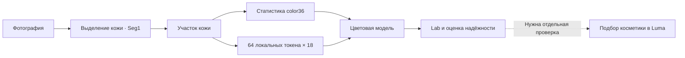

# Архитектуры Luma ChromaSeed

[Архив](README.md) · [Все серии](EXPERIMENTS.md) · [Код всех реализаций](SOURCE_INDEX.md) · [Все тесты](TESTS.md)

Это карта механизмов. Подробный справочник каждого Python-модуля содержит точные конструкторы, размеры слоёв, конфигурационные выражения, наследование, прямые проходы, fit и экспорт. Карточка каждой серии связывает их с протоколом и всеми результатами. Название серии не всегда означает новую архитектуру: смена функции потерь, LR, seed, длительности или аудит не создают новую сеть.

## 1. Контракт технологии и границы задачи

Эта схема показывает интеграционный замысел. Исторические колориметрические эксперименты получают уже подготовленные участки; последовательная система «селфи → точный приборный Lab → подходящий товар» целиком независимо не проверена. Распознавание личности не является целевой функцией моделей.

`color36`: 9 квантилей кодированного sRGB (.01, .05, .10, .25, .50, .75, .90, .95, .99), по R/G/B — 27 значений; среднее RGB — 3; стандартное отклонение — 3; корреляции RG/RB/GB — 3. Масштаб RGB [0,1]. `color36` не является изображением и теряет пространственную структуру. AS/HR дополнительно используют 64×18 локальных признаков. Нормализаторы определяются на текущей fit-части; значения Lab должны сохранять нативную D65/10° конвенцию данных.

## 2. Синтетический старт и цветовая нормализация

| Ветвь | Устройство и проверяемая идея | Подробности |
|---|---|---|
| A0/A1/A2, C/C+, Proposed | Классические базовые методы, компактная цветовая регрессия, оценка ошибки и селективное принятие. В синтетическом старте Proposed проиграл A2 | [Начальный код](../../../src/luma_skin_vision/models/__init__.py), [конфигурации](../../../configs/experiments), [историческое описание](../../publication/RESEARCH_REPORT_RU.md) |
| CompactCC / V2 CompactResidualCC | Компактный CNN, классический якорь и обучаемый остаток; сравнение при согласованной ёмкости | [CompactCC](modules/src__luma_skin_vision__cc__model.md), [V2](modules/src__luma_skin_vision__cc__v2.md), [серия](experiments/cc_v2.md) |
| V3 ColorFramePosteriorNet | Цветовой базис, распределение гипотез и EdgeDiffusionBlock; проверка необходимости более сложной геометрии | [Модуль](modules/scripts__cc_v3_model.md), [серия](experiments/cc_v3.md) |
| V3 FFCC-inspired / Fourier ridge | Гистограммы/частотное представление и выпуклое readout-обучение. Это локальная реализация/контроль, не повторение всех характеристик опубликованной FFCC | [Модуль](modules/scripts__cc_v3_ffcc.md), [ridge v1](experiments/fourier_ridge_v1.md), [ridge v2](experiments/fourier_ridge_v2.md) |
| V4 CorrectionEvidenceNet | Обучаемое свидетельство для фотометрической поправки, transport и повторное уточнение | [Модуль](modules/scripts__cc_v4_model.md), [серия](experiments/cc_v4.md) |
| V5 CorrectionEvidenceNet | Парное обучение критика, контроль бюджета запросов и повторных действий | [Модуль](modules/scripts__cc_v5_model.md), [серия](experiments/cc_v5.md) |
| V6 | Комбинация канонического базиса и физического критика; скрещивание ранее испытанных механизмов | [Серия](experiments/cc_v6.md) |
| V7 SemanticColorNet | Семантический teacher/виртуальный сенсор поверх CompactResidualCC; внешние методы и камеры | [Модуль](modules/scripts__cc_v7_core.md), [серия](experiments/cc_v7.md), [внешняя проверка](experiments/cc_v7_external.md) |

У этих экспериментов целевая величина часто — освещение, а не приборный цвет кожи. Угловая ошибка не превращается в точность подбора тонального средства. Все варианты, в том числе проигравшие базовым методам, сохранены в таблицах серий.

## 3. Модели по изображениям кожи: весь набор механизмов

| Реализация | Что вычисляет и зачем введена |
|---|---|
| [PatchVotes](modules/scripts__skin_mskcc_vote.md) | Локальные цветовые голоса, глобальный контекст, fusion и робастное уточнение; основа пиксельной ветви MSKCC |
| [GlobalColorMLP / VoteAblation](modules/scripts__skin_mskcc_vote_v2.md) | Явные контроли удаления контекста, глобальных/локальных голосов и усиленной итерации |
| [CaptureColor](modules/scripts__skin_capture_model.md) | Скрытое условие съёмки и несколько гипотез ответа; четыре эксперта, компактный сильный source baseline |
| [DistributionColor](modules/scripts__skin_copula_model.md) | Ранги, copula и абсолютные цветовые распределения; проверка того, что остаётся после удаления абсолютного цвета |
| [ColorDistribution](modules/scripts__skin_distribution_model.md) | Условное распределение Lab и решение по ожидаемой цветовой ошибке вместо единственного прямого readout |
| [PlainColor](modules/scripts__skin_expert_anchor.md) | Контроль удаления/явной супервизии экспертной структуры |
| [SpatialColor](modules/scripts__skin_spatial_model.md) | Свёрточная и рекуррентная графовая обработка с геометрическими контролями |
| [GraphSupportColor](modules/scripts__skin_graph_support_model.md) | Объединение графовой ветви и реальных paired patches |
| [NuisanceColor](modules/scripts__skin_nuisance_model.md) | Learned/grid/global graph и constant-bias контроли для факторов съёмки |
| [PairedColor](modules/scripts__skin_pair_invariance.md) | Парная инвариантность, quotient/output-consistency/VICReg варианты |
| [TrainingBranchColor](modules/scripts__skin_train_branch_model.md) | Дополнительная графовая/свёрточная ветвь, используемая при обучении |
| [LocalTeacherColor](modules/scripts__skin_local_teacher_model.md) | Перенос локального teacher: aligned/global/shuffled соответствия |
| [MaterialImage](modules/scripts__skin_material_model.md) | Спектральный декодер материала; отделяет представимость цвета от восстановления по RGB |
| [LossFieldImage](modules/scripts__skin_loss_field.md) | Предсказание поля ошибки кандидатов цвета вместо прямой регрессии; проверка 15 625 кандидатов |
| [SkinRepresentation](modules/scripts__skin_support_curve.md) | Контролируемая кривая объёма поддержки: число обучающих людей и pixel adapter |
| [ColorAdapter / DeployedColor](modules/scripts__skin_neural_reference.md) | Нейронная поправка локального reference baseline, с учётом дополнительной ёмкости |
| [StableHead / StableColorModel](modules/scripts__skin_crossfit_correction.md) | Поправка по crossfit residuals и matched-контроли, проверка переноса на камеры |

Ансамбли, смеси уже обученных ветвей, локальный reference bank, risk-cross, privileged offsets, correspondence и sampling-серии задокументированы в [карточках всех экспериментов](EXPERIMENTS.md). Они не автоматически являются дополнительными нейросетями. Привилегированный контроль, использующий доступный только для диагностики эталон, не считается развёртываемым методом.

## 4. Маленькие ChromaSeed и альтернативы backprop

| Семейство | Структура / изменение обучения | Документация |
|---|---|---|
| Local Search | Маленький MLP и градиентные/локальные способы подбора параметров; фиксированный контроль бюджета | [Серия](experiments/skin_local_search_v1.md), [SmallMLP](modules/scripts__skin_local_search_train.md) |
| ChromaSeed v1 | 36 статистик → скрытая цветовая основа → Lab; 2 749 чисел вместе с нормализацией, 10 996 байт FP32. Чистая/искажённая палитра, shuffled и более долгое обучение на коже | [Серия](experiments/chromaseed_v1.md), [реализация](modules/scripts__chromaseed.md) |
| K / KE | 128 Gaussian landmarks, нормализация и линейный readout. RPCholesky/Nyström и аналитический ridge; KE ускоряет точное обучение, не меняя модель | [K](experiments/chromaseed_kernel_v1.md), [KE](experiments/chromaseed_fast_kernel_v1.md) |
| R | Повторная остаточная поправка / refinement; отдельные проверки численной точности и стоимости | [Серия](experiments/chromaseed_refine_v1.md) |
| Perceptual | Изменение обучающего критерия под цветовую ошибку при сохранении контролей и полного бюджета | [Серия](experiments/chromaseed_perceptual_v1.md) |
| G / GS | Общее kernel-представление и acquisition gate; soft/hard routing; отдельная устойчивость около границы gate | [G](experiments/chromaseed_gated_v1.md), [устойчивость](experiments/chromaseed_gate_stability_v1.md) |
| A | Совместный ridge по `[Z, s(x)Z]`, одни 128 kernel evaluations; дозы аффинных искажений | [Серия](experiments/chromaseed_affine_v1.md) |
| X / H | Проекция raw36 в 16-мерную геометрию; гибрид общей raw/projected геометрии и residual readout | [X](experiments/chromaseed_projection_v1.md), [H](experiments/chromaseed_hybrid_v1.md) |
| C | Тот же H-consumer, но residual teacher исключает текущего человека; matched included-person контроль | [Серия](experiments/chromaseed_crossfit_v1.md) |
| FG | mean3/median3/central9/mean_std6/quant27/no_corr33/raw36/X16; проверка достаточности признаков, а не новая CNN | [Серия](experiments/chromaseed_feature_groups_v1.md) |
| Weak ridge / Camera support / Selection stability | Регуляризация, баланс поддержки камер и устойчивость выбора уже существующих методов | [ridge](experiments/chromaseed_weak_ridge_v1.md), [support](experiments/chromaseed_camera_support_v1.md), [selection](experiments/chromaseed_selection_stability_v1.md) |
| TG | `d → 64 ReLU → 3`; mean3: 451 параметр, raw36: 2 563. Adam, TAGI-diag и TAGI-full3 обучают одинаковую структуру; posterior variances не экспортируются как confidence | [Серия](experiments/chromaseed_gaussian_v1.md) |
| NR / NS / NP | Аналитический/нейронный readout, shrinkage, фиксированный скрытый базис и префиксы; NP-якорь 643 параметра | [NR](experiments/chromaseed_neural_readout_v1.md), [NS](experiments/chromaseed_neural_shrinkage_v1.md), [NP](experiments/chromaseed_neural_prefix_v1.md) |
| NB / Neural geometry | Удерживаемые блоки и геометрия решения; побитное/численное соответствие проверялось отдельно и не всегда принималось | [NB](experiments/chromaseed_neural_blocks_v1.md), [geometry](experiments/chromaseed_neural_geometry_v1.md) |
| LT | Та же маленькая модель до 131 072 обновлений; 0/16/256 цифровых вариаций строки; более длинная траектория не означает больше независимых людей | [Серия](experiments/chromaseed_long_training_v1.md) |
| WIDE / WE | Остаточные сети от 1 179 до 832 259 параметров; WE меняет LR и точки остановки без смены архитектуры | [WIDE](experiments/chromaseed_widen_v1.md), [WE](experiments/chromaseed_widen_early_v1.md) |
| Local denoise / Weight average | Локальные правила исправления и усреднение весов как самостоятельные контролируемые вмешательства | [denoise](experiments/chromaseed_local_denoise_v1.md), [average](experiments/chromaseed_weight_average_v1.md) |

Идея «подбирать веса без полного backprop» отражена в локальном поиске, аналитическом kernel/ridge-readout и TAGI. Наличие альтернативного правила обновления не доказывает его превосходство. Kernel centers, обученные веса, normalizers, optimizer state, сжатый NPZ и RAM — разные виды размера; в model cards указан конкретный объект учёта.

### Local Search: все базовые конструкции и проверка сжатия

Ridge — линейная регрессия по normalised color36 с bias. KRR — kernel ridge с более крупной опорной базой; размер зависит от текущей fit-выборки. Random RBF и Guided RBF хранят центры, widths, readout и normalizers. Guided на каждом из 64 шагов проверяет до 768 кандидатов через Schur complement и аналитически пересчитывает выходные веса: до 49 152 оценок условного улучшения без отдельного полного обучения каждого кандидата. Random использует тот же банк и размер. MLP: 36→64 SiLU→3 плюс линейный skip 36→3; AdamW, 512 шагов. RBF/MLP имеют одинаковый payload 2749 чисел /10 996 байт FP32, включая нормализацию. [Точный код](modules/scripts__skin_local_search_train.md), [33 итоговых fit и все сравнения](experiments/skin_local_search_v1.md).

Compact-prefix проверяет K8/K16/K32/K64 и payload 2036/3316/5876/10 996 байт. Сохранены fit-time source lock, amendment, отдельный evaluation status и superseded cost receipt. Маленький prefix не получил универсального подтверждения по INNER-выбору. [Весь compact run](runs/skin_local_search_compact_v1.md), [прежний receipt](runs/skin_local_search_compact_v1_superseded_cost_receipt.md).

Precision проверяет 33 исходные модели /99 вариантов хранения. FP16 и INT8 сохраняются как отдельные форматы. INT8 в этой серии — хранение с деквантизацией в FP32, не измеренный INT8 kernel; средняя ошибка и worst drift доступны в [precision/evaluation.json](evidence/run_metadata/skin_local_search_v1/precision/evaluation.json). Формат по outer-результатам не продвигался. Полные исходные модели/массивы остаются локальными.

## 5. AS: семь архитектур до пяти миллионов параметров

Общий frozen NP-якорь: 643 параметра. Обучается остаток относительно него. Все слои линейные с bias, кроме `key`. В таблице параметры включают якорь. Нормализаторы и служебные массивы отдельно влияют на число байт.

| Вариант | Кодировщик токена | Основная ветвь | Число параметров |
|---|---|---|---:|
| [patch_small](models/patch_small.md) | 18→32→24, SiLU | mean64; 60→96→64→48→3 | 17 374 |
| [patch5m](models/patch5m.md) | 18→384→256, SiLU | mean64; 292→1792→1536→1024→3 | 4 962 566 |
| [soft_small](models/soft_small.md) | 18→32→24, SiLU | контекст 48, soft attention, 4 общих прохода | 15 246 |
| [soft5m](models/soft5m.md) | 18→384→256, SiLU | контекст 1120, soft attention, 4 общих прохода | 4 846 822 |
| [dynamic_small](models/dynamic_small.md) | 18→32→24, SiLU | контекст 48, hard mask + STE, 4 общих прохода | 15 246 |
| [dynamic5m](models/dynamic5m.md) | 18→384→256, SiLU | контекст 1120, hard mask + STE, 4 общих прохода | 4 846 822 |
| [pool5m](models/pool5m.md) | 18→512, ReLU | mean/std/max; 1572→3072→3, ReLU | 4 851 846 |

### Прямой проход patch и pool

Patch усредняет закодированные токены и объединяет их с color36. Три SiLU-слоя дают трёхкомпонентную поправку; ответ в нормализованных координатах `base + tanh(head)`. Pool объединяет color36 со средним, стандартным отклонением и максимумом 512-мерных кодов. Добавка `1e-6` под корнем стабилизирует вычисление std. Последний residual head использует тот же tanh.

### Четыре рекуррентных уточнения

`context = SiLU(context_layer([x, mean(tokens)]))`. Начальный state равен context, начальный pred — base. Key вычисляется один раз. На каждом проходе query из `[state, pred]` сравнивается со всеми keys: dot-product делится на √размерности токена. Soft использует все токены; dynamic маскирует score≤0, сохраняя минимум top4. При обучении STE проводит градиент через sigmoid score. После нормировки внимания агрегат токенов поступает вместе со state, context и pred в update MLP.

`state ← 0.5 state + 0.5 tanh(update2(SiLU(update1(...))))`.

`pred ← pred + 0.25 tanh(head(state))`.

Веса разделяются между четырьмя проходами. Dynamic всё ещё кодирует и оценивает **все 64 токена**: маскирование не даёт автоматического уменьшения dense MAC или ускорения.

### Обучение и численный контракт

Банк содержит шесть независимых слотов: seeds 17/29/43 × LR 1e-5/1e-4. Batch 64; weight decay .01; gradient norm 5.0. BankAdamW и CUDA Graph уменьшают накладные расходы, но не превращают шесть слотов в ансамбль. Косинусный schedule сохраняет горизонт 8192 и множитель от 1 до .1; серия AS выбирает сохранённые точки 128/512/2048 по INNER. Инициализация head нулевая, остальные слои детерминированы seed и CRC32 имени слоя.

Loss: `0.6 × средняя MSE всех проходов + 0.4 × MSE последнего + 0.001 × gate penalty`. Выходные величины нормализованы, затем обратное преобразование даёт нативный Lab. Обучение и CUDA inference — FP32; независимый NumPy-consumer — FP64 после FP32-нормализации. Полный код, экспорт и fit: [AS module](modules/scripts__chromaseed_architecture_scale.md). Все выбранные результаты и расходы: [AS report](experiments/chromaseed_architecture_scale_v1.md).

## HR: диапазон выхода

HR сохраняет семь архитектур и меняет только последнюю функцию residual head: `unit = tanh(z)`, `wide = 4 tanh(z/4)`, `linear = z`. У всех значение 0 и производная 1 в начале координат. Нелинейности state update и attention остаются прежними. Unit использует исходную AS-реализацию и прежние экспорты. Число весов не увеличивается.

**189 = 7 архитектур × 3 head modes × 3 роли × 3 seeds.** Из них 126 новых выбранных HR-моделей и 63 прежних AS-контроля. 168 успешно завершённых новых банков ×6 слотов = 1008 обучающих траекторий, включая INNER, final и варианты LR. Это три разных счётчика; 189 не означает 189 новых архитектур. Сохранившиеся 207 result records включают ещё 18 унаследованных контрольных записей.

У каждого head свой INNER-выбор LR/шага. Поэтому наблюдаемая разница — эффект зарегистрированного рецепта выбора, а не чистая причинная оценка одной нелинейности при фиксированном checkpoint. [Все записи](HR_ALL_MODELS.md), [точная реализация](modules/scripts__chromaseed_head_range.md), [неполный runtime](STOP_STATUS.md).

## 6. Палитра P1 → P2 → P3

P1 готовит измеренные спектры; это данные, не обученная цветовая модель камеры. P2 обучает общий локальный кодировщик `18→384→256` с SiLU и auxiliary head `256→36`. Кодировщик содержит **105 856** параметров; вместе со вспомогательной головой — **115 108**. Шесть слотов: 3 seeds × aligned/shuffled. Auxiliary head отбрасывается при переносе. Источники — 19 TRAIN-кубов UMINHO; коррелированные foreground spectra не являются миллионами независимых людей и не все прошли отдельное подтверждение skin-only.

P3 переносит этот кодировщик в patch5m/soft5m/dynamic5m, согласуя нормализацию, и дообучает перенесённые веса. Три старта: original/aligned/shuffled. Общая ёмкость моделей не меняется. Для каждой архитектуры используется единый head, выбранный по INNER HR. План: 72 новых банка, 432 траектории. Основной перенос на нативных изображениях **не запускался**. CPU-квалификация подтверждает реализацию, а не улучшение качества. [Кодировщик](modules/scripts__chromaseed_palette_encoder.md), [P1](experiments/skin_spectral_palette_v1.md), [P2](experiments/chromaseed_palette_pretrain_v1.md), [подготовка P3](../../research/chromaseed_palette_transfer_preparation_2026-09-14.md).

## 7. Seg1 и подготовленная Seg2

Seg1 — U-Net ширины 24, **4 416 673 параметра**, RGB 192×192 → один logit на пиксель. Encoder: каналы 24/48/96/192/384, разрешения 192/96/48/24/12. Каждый ConvBlock: два Conv2d 3×3 без bias, после каждого GroupNorm с gcd(8, channels) группами и SiLU. Downsample — max-pool2; decoder — bilinear upsample до skip-разрешения, concat со skip, такой же ConvBlock. Последний 1×1 Conv2d 24→1 содержит bias.

Целевая маска LaPa: skin OR nose (классы 1 и 6). Loss — BCEWithLogits + soft Dice. Аугментации: согласованный flip изображения/маски, независимые RGB gain .9–1.1, exposure .85–1.15 и gamma .85–1.15. Маска оценивается отдельно от цвета. [Весь модуль и формулы](modules/scripts__skin_face_segment.md), [отчёт](experiments/facial_skin_v1.md).

Seg2 сохраняет ту же сеть и инициализируется Seg1 best.pt. Fresh AdamW lr=1e-4, weight decay=1e-4, clip5; FP16 CUDA/channels_last; 5976 обновлений. Два режима LaPa-only/LaPa+Celeba ×3 seeds. Batch32 содержит 16 общих LaPa anchors и 16 дополнительных примеров. Три бюджета 1494/2988/5976 дают 18 checkpoint choices. Выбор по equal-source validation mean-image IoU, ранний шаг при равенстве; step0 также допустим. Основных результатов **нет**. [Протокол и подготовка](../../research/skin_face_transfer_preparation_2026-09-14.md).

## 8. Биты, kernels и вычислительная стоимость

Lossless storage, fused optimizer probe, exact kernel median, batched optimizers, CUDA Graph, NumPy-consumer и recurrent streaming — отдельные инженерные направления. Сжатый файл не означает INT8-инференс; CUDA Graph не меняет математическую ёмкость; ранний return не гарантирует качество. [Compute analysis](../../research/chromaseed_compute_structure_2026-09-14.md), [streaming](../../research/chromaseed_recurrent_streaming_2026-09-14.md), [INNER passes](../../research/chromaseed_inner_passes_2026-09-14.md), [CPU probes](EXPERIMENTS.md).

Большая recurrent-сеть требует 28 631 680 dense MAC на полный ответ. Из них 11 255 168 — фиксированная часть, затем 4×4 344 128. Три прохода уменьшают арифметический счёт на 15.17%, два — на 30.34%; это **не измеренное сокращение latency**. Политика ранней остановки после диагностики не принята.
