# Галерея сохранённых измерений

[Архив](README.md) · [Все серии](EXPERIMENTS.md)

Графики разных задач не складываются в общую кривую прогресса. Единицы и выборки определены в исходном отчёте рядом с каждым изображением. Обложка в эту галерею измерений не включена.

## cc_v2

[Все результаты, методика и ограничения](experiments/cc_v2.md)

## cc_v3

[Все результаты, методика и ограничения](experiments/cc_v3.md)

## cc_v4

[Все результаты, методика и ограничения](experiments/cc_v4.md)

## cc_v5

[Все результаты, методика и ограничения](experiments/cc_v5.md)

## cc_v7_external

[Все результаты, методика и ограничения](experiments/cc_v7_external.md)

## chromaseed_affine_v1

[Все результаты, методика и ограничения](experiments/chromaseed_affine_v1.md)

## chromaseed_architecture_scale_v1

[Все результаты, методика и ограничения](experiments/chromaseed_architecture_scale_v1.md)

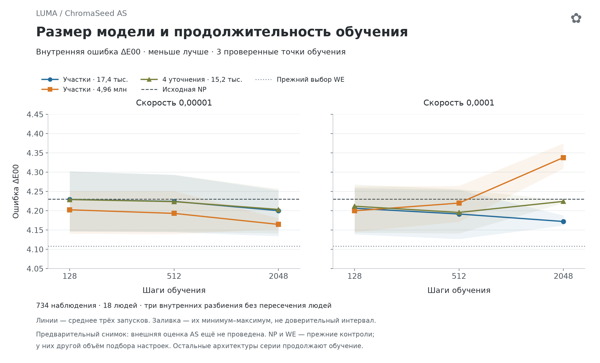

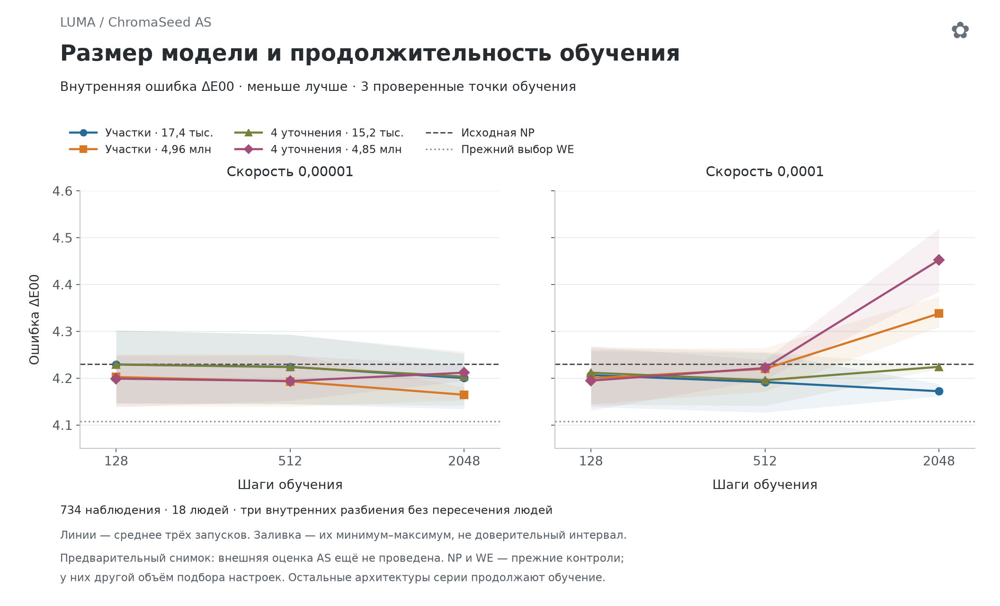

## chromaseed_camera_support_v1

[Все результаты, методика и ограничения](experiments/chromaseed_camera_support_v1.md)

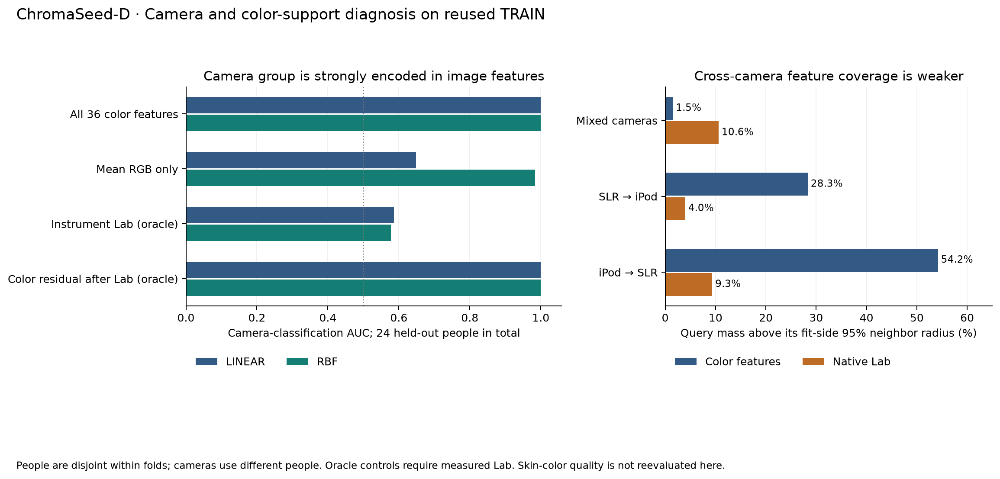

## chromaseed_crossfit_v1

[Все результаты, методика и ограничения](experiments/chromaseed_crossfit_v1.md)

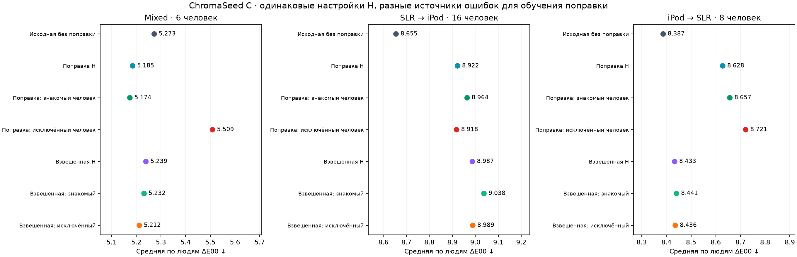

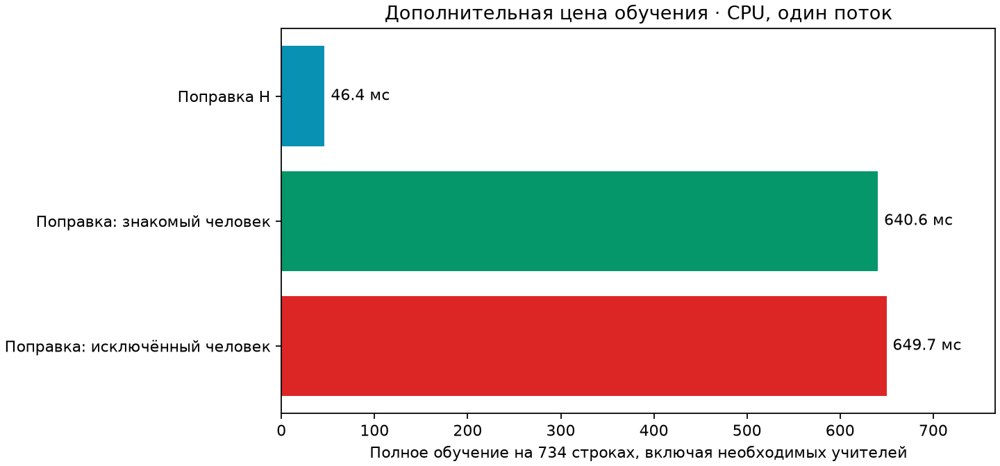

## chromaseed_fast_kernel_v1

[Все результаты, методика и ограничения](experiments/chromaseed_fast_kernel_v1.md)

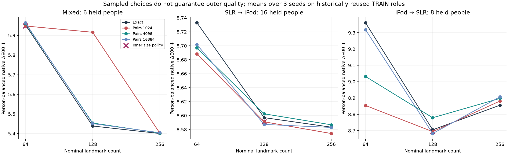

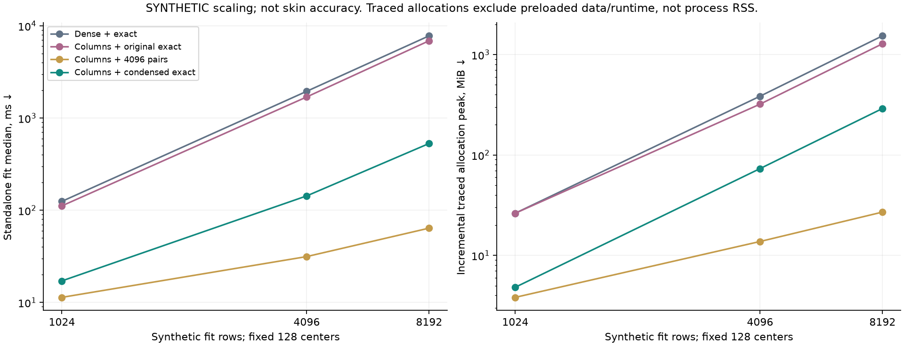

## chromaseed_feature_groups_v1

[Все результаты, методика и ограничения](experiments/chromaseed_feature_groups_v1.md)

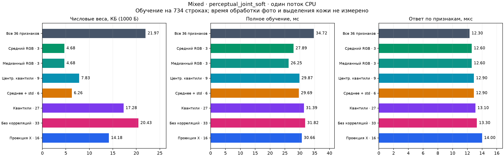

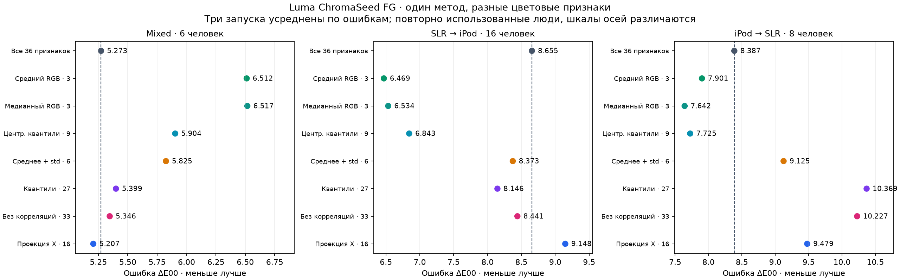

## chromaseed_gate_stability_v1

[Все результаты, методика и ограничения](experiments/chromaseed_gate_stability_v1.md)

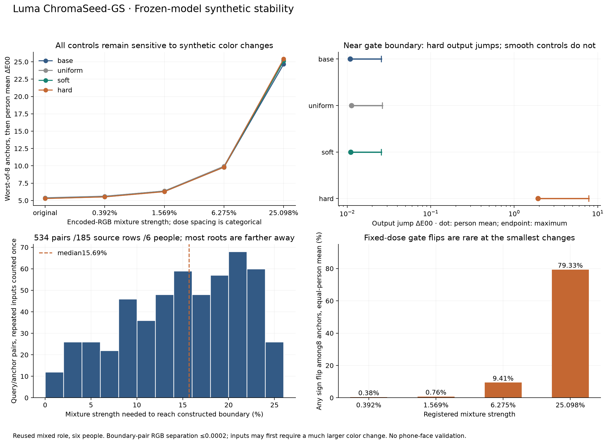

## chromaseed_gated_v1

[Все результаты, методика и ограничения](experiments/chromaseed_gated_v1.md)

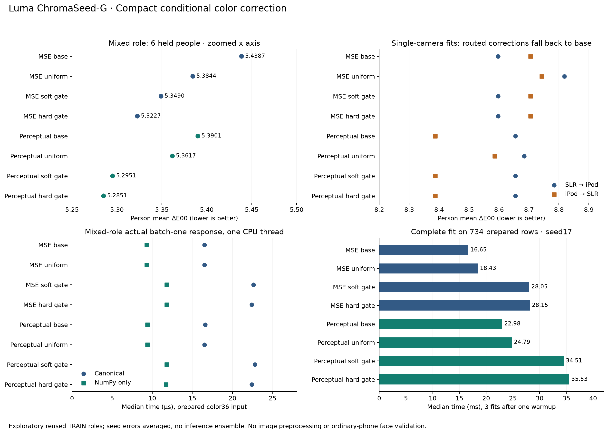

## chromaseed_gaussian_v1

[Все результаты, методика и ограничения](experiments/chromaseed_gaussian_v1.md)

## chromaseed_hybrid_v1

[Все результаты, методика и ограничения](experiments/chromaseed_hybrid_v1.md)

## chromaseed_kernel_v1

[Все результаты, методика и ограничения](experiments/chromaseed_kernel_v1.md)

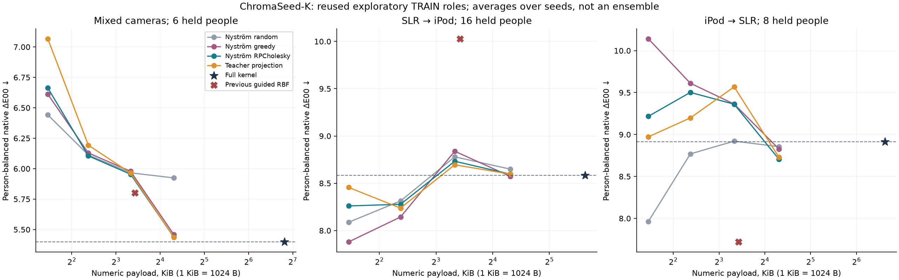

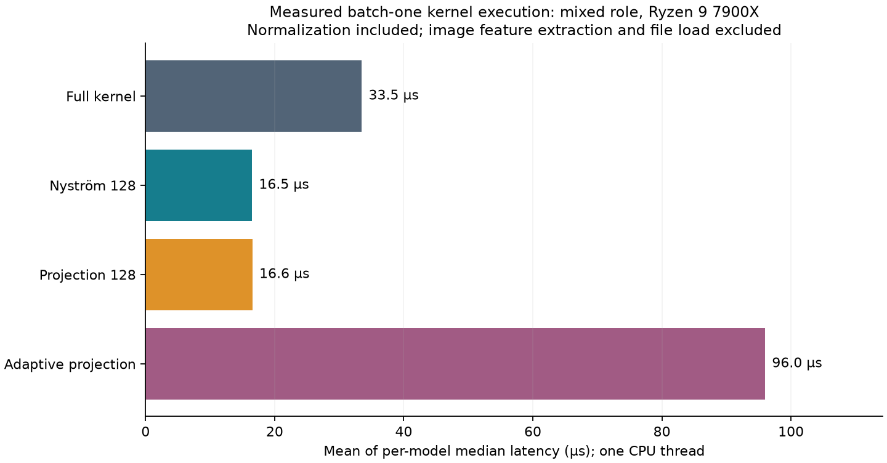

## chromaseed_neural_readout_v1

[Все результаты, методика и ограничения](experiments/chromaseed_neural_readout_v1.md)

## chromaseed_perceptual_v1

[Все результаты, методика и ограничения](experiments/chromaseed_perceptual_v1.md)

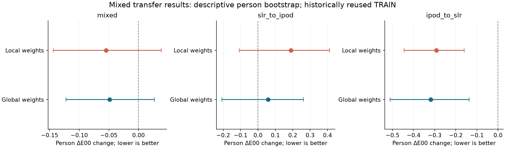

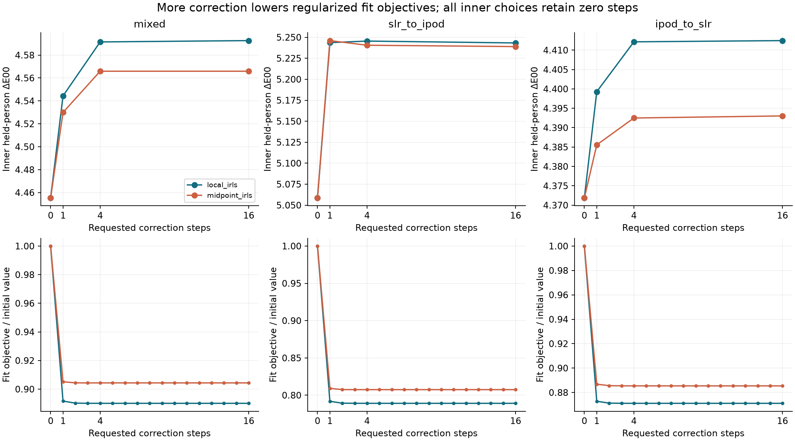

## chromaseed_projection_v1

[Все результаты, методика и ограничения](experiments/chromaseed_projection_v1.md)

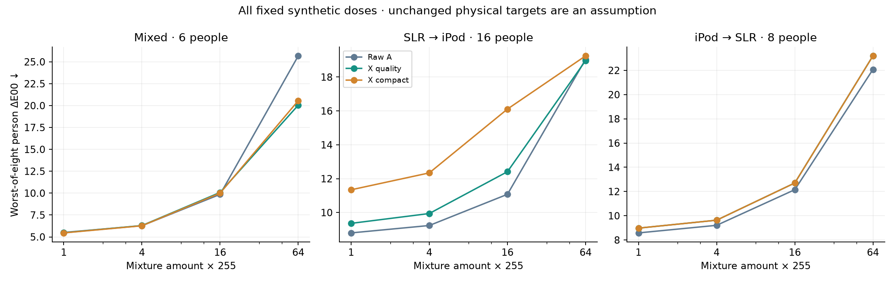

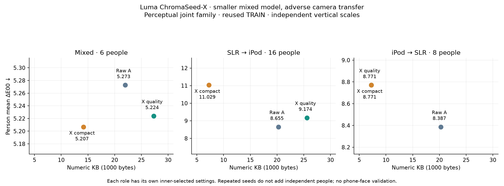

## chromaseed_refine_v1

[Все результаты, методика и ограничения](experiments/chromaseed_refine_v1.md)

## chromaseed_selection_stability_v1

[Все результаты, методика и ограничения](experiments/chromaseed_selection_stability_v1.md)

## chromaseed_v1

[Все результаты, методика и ограничения](experiments/chromaseed_v1.md)

## chromaseed_weak_ridge_v1

[Все результаты, методика и ограничения](experiments/chromaseed_weak_ridge_v1.md)

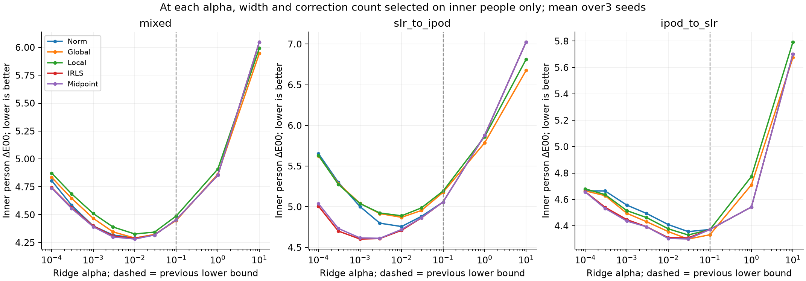

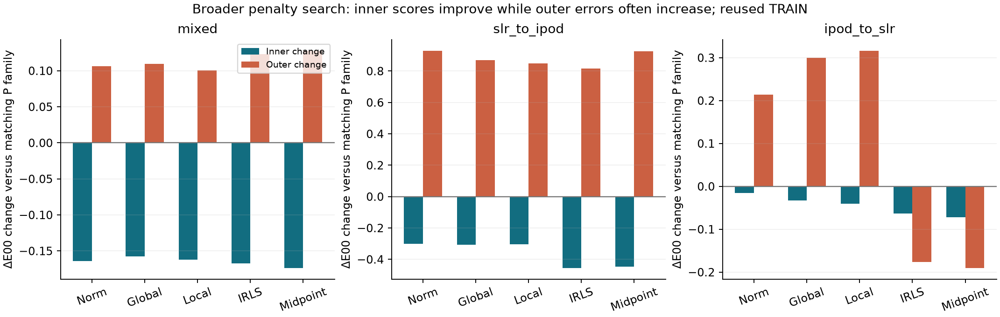

## phone_v1

[Все результаты, методика и ограничения](experiments/phone_v1.md)

## phone_v1_alias

[Все результаты, методика и ограничения](experiments/phone_v1_alias.md)

## skin_appearance_inverse_v1

[Все результаты, методика и ограничения](experiments/skin_appearance_inverse_v1.md)

## skin_capture_support_v1

[Все результаты, методика и ограничения](experiments/skin_capture_support_v1.md)

## skin_color_sampling_v1

[Все результаты, методика и ограничения](experiments/skin_color_sampling_v1.md)

## skin_correction_transfer_v1

[Все результаты, методика и ограничения](experiments/skin_correction_transfer_v1.md)

## skin_crossfit_correction_v1

[Все результаты, методика и ограничения](experiments/skin_crossfit_correction_v1.md)

## skin_distribution_v1

[Все результаты, методика и ограничения](experiments/skin_distribution_v1.md)

## skin_expert_anchor_v1

[Все результаты, методика и ограничения](experiments/skin_expert_anchor_v1.md)

## skin_gradient_transfer_v1

[Все результаты, методика и ограничения](experiments/skin_gradient_transfer_v1.md)

## skin_graph_support_v1

[Все результаты, методика и ограничения](experiments/skin_graph_support_v1.md)

## skin_local_reference_transfer_v1

[Все результаты, методика и ограничения](experiments/skin_local_reference_transfer_v1.md)

## skin_local_search_v1

[Все результаты, методика и ограничения](experiments/skin_local_search_v1.md)

## skin_loss_field_v1

[Все результаты, методика и ограничения](experiments/skin_loss_field_v1.md)

## skin_material_image_v1

[Все результаты, методика и ограничения](experiments/skin_material_image_v1.md)

## skin_mskcc_pixels_v1

[Все результаты, методика и ограничения](experiments/skin_mskcc_pixels_v1.md)

## skin_mskcc_selective_v1

[Все результаты, методика и ограничения](experiments/skin_mskcc_selective_v1.md)

## skin_neural_reference_v1

[Все результаты, методика и ограничения](experiments/skin_neural_reference_v1.md)

## skin_offset_diagnostic_v1

[Все результаты, методика и ограничения](experiments/skin_offset_diagnostic_v1.md)

## skin_patch_likelihood_v1

[Все результаты, методика и ограничения](experiments/skin_patch_likelihood_v1.md)

## skin_relational_probe_v1

[Все результаты, методика и ограничения](experiments/skin_relational_probe_v1.md)

## skin_risk_cross_v1

[Все результаты, методика и ограничения](experiments/skin_risk_cross_v1.md)

## skin_sampling_transfer_v1

[Все результаты, методика и ограничения](experiments/skin_sampling_transfer_v1.md)

## skin_support_curve_v1

[Все результаты, методика и ограничения](experiments/skin_support_curve_v1.md)

