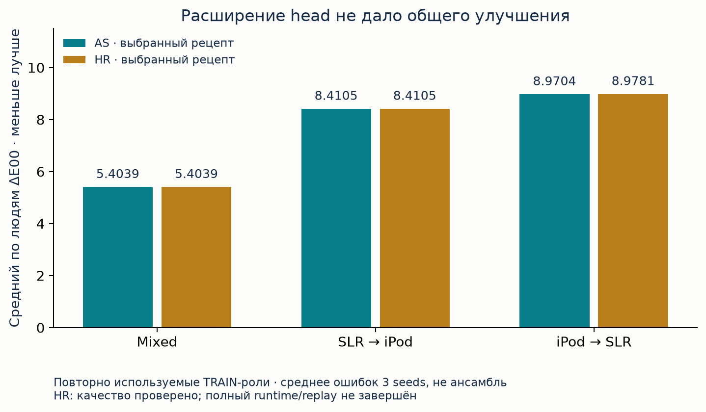
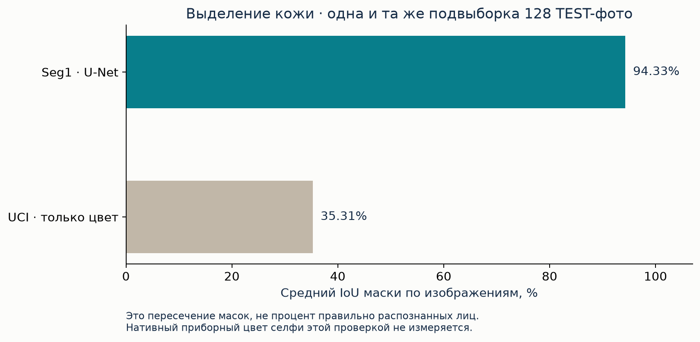

# Результаты: что измерено и что из этого следует

[Архив](README.md) · [Все таблицы 88 серий](EXPERIMENTS.md) · [Каждое наблюдение и решение](OBSERVATIONS.md)

## Сначала — разные целевые величины

| Задача | Метрика | Можно ли назвать процентом верных фото? |
|---|---|---|
| Приборный цвет кожи | ΔE00: меньше лучше; смотреть observer/white, способ усреднения и людей | Нет. Нужен заранее выбранный порог допустимой ошибки и независимая выборка |
| Маска кожи | IoU/Dice по пикселям; смотреть mean-image или global | Нет. IoU 94.2% не означает 94.2% правильно обработанных лиц |
| Цвет освещения | Угловая ошибка направления illuminant | Нет. Это компонент цветовой нормализации |
| Синтетическая палитра | Ошибка в искусственно заданной задаче | Нет. Она не измеряет реальную камеру |
| Численная проверка | Побитное соответствие или допуск Lab/весов | Нет. Это корректность реализации, а не практическая точность |

## Независимый инструментальный тест прежнего этапа

400 изображений / 10 новых людей, известные камеры, первая зафиксированная проверка MSKCC. Основной ансамбль: **4.4570 ΔE00**, при принятии 80% изображений: **4.159 ΔE00**. Обычный fusion: **4.3005 ΔE00** на полной выборке — лучше основной предложенной модели. Это не подтверждение «прорывного» превосходства. После публикации этот TEST считается раскрытым и не становится свежим от новых переоценок.

[Все 41 цветовых сравнения, risk models и интервалы](../../benchmarks/skin_mskcc_selective_v1/test_results.json) · [Полный протокол/отчёт](experiments/skin_mskcc_selective_v1.md).

## Рост размера и длительности: неоднородный эффект

LT продлил 643-параметровую модель до **131 072 обновлений** и **8 388 608 предъявлений** на траекторию. До 256 цифровых вариаций каждой исходной строки не добавили новых людей. В фиксированном максимальном режиме 256/lr=.0003 mixed улучшился 5.77054→5.46195, но SLR→iPod ухудшился 8.29435→9.12002, iPod→SLR — 8.58953→9.13320. Внутренний выбор во всех трёх ролях предпочёл режим без добавок. [Все точки, включая регрессии](experiments/chromaseed_long_training_v1.md).

WIDE 832 259 параметров улучшил два сценария по сравнению с NP, ухудшив третий. Алгоритм INNER выбрал другие размеры; нельзя задним числом объявлять m832 общим победителем по понравившимся внешним значениям. WE расширил сетку LR и ранних остановок без смены сетей: 7 улучшений и 5 ухудшений в 12 сравнениях. [WIDE](experiments/chromaseed_widen_v1.md) · [WE](experiments/chromaseed_widen_early_v1.md).

## AS и HR: последняя завершённая проверка качества

Ниже **заранее выбранный overall recipe** каждой роли, а не минимальная ошибка из всех строк после просмотра результатов. Данные — повторно используемые роли исходных TRAIN 966 наблюдений / 24 человека. Среднее ошибок отдельных seeds не является качеством ансамбля.

| Роль | AS: выбранный вариант | AS ΔE00 | HR: выбранный вариант | HR ΔE00 | Разница HR−AS |
|---|---|---:|---|---:|---:|
| mixed | pool5m / unit | 5.403851404 | pool5m / unit | 5.403851404 | 0 |
| SLR→iPod | pool5m / unit | 8.410492078 | pool5m / unit | 8.410492078 | 0 |
| iPod→SLR | patch5m / unit | 8.970359153 | patch5m / linear | 8.978130204 | +0.007771051 |

Из 42 сравнений нового head с unit: **8 улучшений, 34 ухудшения**. Наибольшее уменьшение ошибки — около **0.0180 ΔE00**; ни одного улучшения на 0.1; девять ухудшений более чем на 0.1. У каждой головы отдельно выбирались LR/шаг на INNER, поэтому это не изолированный эффект нелинейности при одном checkpoint.

Аудит HR принят: максимум расхождения NumPy/CUDA **0.0000144074 Lab** при зарегистрированном допуске 0.002 с дополнительной численной погрешностью 1e-6. Это поддерживает корректность проверки качества, но **полный runtime/replay не завершён**. [Все 69 групп и 207 записей](HR_ALL_MODELS.md), [аудит](../../benchmarks/chromaseed_head_range_v1/audit.json), [остановка](STOP_STATUS.md).

## Seg1: сильный результат по маске, другая задача

| Показатель | Значение | Выборка / условие |
|---|---:|---|
| Параметры | 4 416 673 | U-Net width24, RGB192 |
| Размер сохранённого checkpoint | 17 680 385 байт | Не peak RAM и не размер приложения |
| TRAIN | 15 914 изображений | LaPa |
| VAL | 1 692 изображения | Выбор checkpoint |
| TEST mean-image IoU | **94.195626%** | 2 000 изображений |
| TEST global IoU | **94.279998%** | Агрегированная матрица ошибок по пикселям |
| TEST global Dice | **97.055795%** | Агрегированная матрица ошибок по пикселям |
| Обучение | 1 275.240 с ≈21 мин 15 с | 12 эпох / 5 976 обновлений, RTX 4060 |
| Только модель, CPU median | 20.10 мс | 4 потока, channels_last |
| JPEG→маска, CPU median / p95 | 30.55 / 35.07 мс | 15 вызовов, JPEG уже в RAM |

На одной фиксированной подвыборке 128 TEST-изображений mean IoU: Seg1 **0.94325581**, UCI-цветовой baseline **0.35312704**. Ошибка извлечённого видимого цвета относительно авторской маски на общих 126/128 изображениях: **0.4913 против 8.2417 ΔE00**. Оба цвета взяты из одного и того же RGB; это оценка выделения области, а не приборный цвет под стандартным освещением.

Люди LaPa не снабжены достаточным исходным идентификатором для доказательства person-disjoint split; раскрытый TEST не превращается в новый независимый тест. [Отчёт со всеми скоростями и ограничениями](experiments/facial_skin_v1.md), [исходные TEST-результаты](evidence/data_growth_2026_09_14/facial_skin_v1/test_results.json).

## Палитра, локальные обновления, память и отрицательные результаты

Синтетическая палитра v1 дала отдельные небольшие улучшения, но shuffled и дополнительное обучение на коже оказались важными конкурентными контролями. Ядровые и аналитические readout-модели дали компактные и быстрые решения без сквозного градиентного обучения всех весов. Они не обеспечили универсального переноса между камерами. TAGI сравнивается с Adam на той же сети; нельзя приписывать свойствам архитектуры разницу правил обучения. [Полные серии](EXPERIMENTS.md).

Сохранены неэквивалентность retained neural blocks, consumer erratum TG, erratum подсчёта FG, неудачные запуск/возобновление HR, ранняя некорректная разметка CAVE v1, ограничения мобильного loader и повторное раскрытие тестов. Первоначальные выводы и исправления доступны вместе через [журнал наблюдений](OBSERVATIONS.md). Неудачные файлы не вычищены ради красивой истории.

## Что можно сказать о причинах ограниченного качества

HR не поддержал гипотезу, что ограничение residual head является главным устранимым барьером. LT показал, что больше обновлений и цифровых вариаций не заменяют реальное разнообразие. WIDE/AS показывают, что размер иногда помогает, но не устраняет зависимость от сценария. Это результаты конкретных контролируемых серий, а не доказательство единственной причины плато.

Ограничения, подтверждённые постановкой: 966 инструментально размеченных TRAIN-наблюдений от 24 людей, повторное использование ролей, конфундирование людей/камер, сжатое представление color36, отсутствие эталонного цвета у новых сегментационных фото. Влияние каждого ограничения по отдельности не установлено. P3 и Seg2 были подготовлены для следующих проверок, но остановлены до основных запусков. Сам факт наличия ещё 52 204 публичных фото не равен росту числа пар «фото камеры + приборный Lab».

Для e-commerce этот архив подтверждает проведённую R&D-работу и даёт проверяемые компоненты. Он не подтверждает точность выбора оттенка товара, экономический эффект интеграции, патентную новизну или получение статуса резидента Сколково. Исходная продуктовая постановка и ранее подготовленная карта доказательств сохранены в [SKOLKOVO_EVIDENCE.md](../../publication/SKOLKOVO_EVIDENCE.md).
