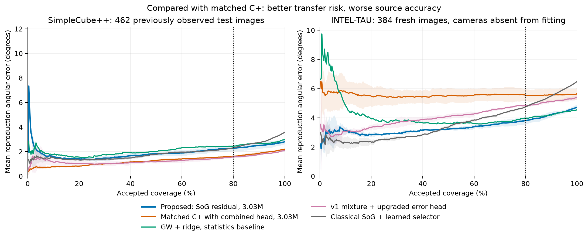
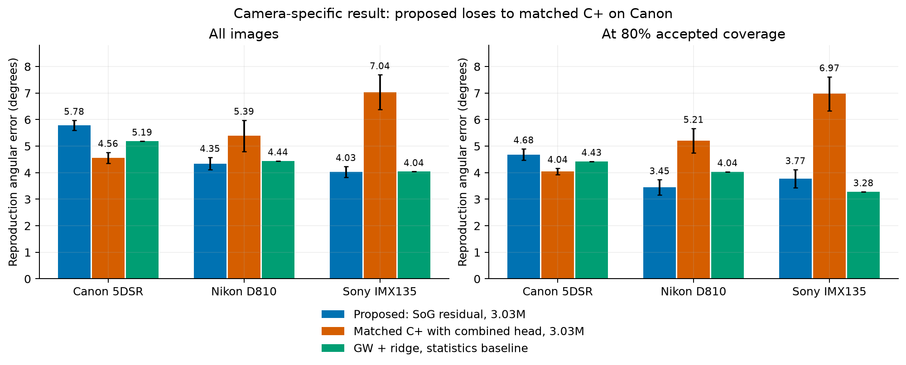

# Public camera-transfer improvement — measured CC v2, 2026-09-10

**The source-selected compact residual method reduces mean reproduction error at 80% accepted coverage on 384 fresh images from three unseen camera models from 5.558° to 3.805° (31.5%) versus the strongest capacity-matched direct C+ control. It does not win on every camera or against every strong alternative.** Source accuracy regresses; Canon transfer loses; a very cheap GW+ridge control remains competitive. This is real component evidence, not facial skin-color validation or a claim of new mathematics/SOTA.

## Data, original licenses and protocol

All estimator, selector and calibration fitting uses **SimpleCube++**, 2,234 real linear images, **CC BY 4.0**. Its official training population is split by capture date into 1,126 estimator training, 119 validation, 259 risk fitting and 268 calibration images. Its 462 official test images were already observed in V1, and 66 of 67 test dates overlap development dates: this is a known-camera/source regression diagnostic, not a fresh scene-independent confirmation.

The fresh test comprises **128 camera-unique field images each from Canon 5DSR, Nikon D810 and Sony IMX135_BLCCSC in INTEL-TAU**. Deterministic archive-path hashes selected IDs before pixels/GT were read; shared-camera/lab categories and the previous Sony 001–030 pilot were excluded. Training sees only source Canon 550D/600D cameras. Sony IMX135 was already observed through the V1 Sony30 pilot; its new128 images are disjoint, but that camera model is not new to the research history. Canon5DSR and NikonD810 are new to development; all three are absent from fitting. No target-camera identity, CCM, extra target images, target-dataset aggregate statistics or adaptation is used at inference. This is a custom three-camera transfer subset, not the authors' full 10-fold protocol or a leave-one-camera-out training study. Known/unseen also changes dataset and scene distribution, so the difference is not solely attributable to camera.

Original INTEL-TAU terms are **CC BY-SA 4.0**, verified through [the original Metax record](https://metax.fairdata.fi/v3/datasets/f0570a3f-3d77-4f44-9ef1-99ab4878f17c). These images are **evaluation-only**; no weights or thresholds were fitted with them. The mirror's MIT badge is ignored. Bounded extraction transferred 4,433,685,559 bytes, not the hundreds-of-GB full collection. Every TIFF/WP pair has frozen mirror CRC, size and local SHA-256 verification. The bounded original-host range probe did not establish whole-archive checksum identity to the pinned mirror; that identity remains **unverified**. See [acquisition and provenance](../data/cc_v2_camera_acquisition.md) and [dataset inventory](../data/public_dataset_inventory.md).

The [original INTEL-TAU paper](https://pure.au.dk/ws/files/301638552/INTEL_TAU_A_Color_Constancy_Dataset.pdf) supports processed linear TIFF decoding and illuminant WP targets. These files are already black-corrected and saturation-normalized; no extra black subtraction or gamma transform is applied. GT chart-acquisition frames are not published. No genuine corresponding surface-color reference is available here: **ΔE00 is not calculated**. Approximate camera CCMs are not substituted for measured reference colorimetry.

## Proposed method and fair controls

The proposed source-selected model uses an unnormalized Shades-of-Gray anchor, a compact residual CNN on channel-normalized input, and restores the anchor to obtain an illuminant. A separately fitted error predictor combines 64 scene-context features and 21 relative hypothesis/spatial features. Its target is held-out log1p reproduction angular error; a separate source split fits a positive scalar calibration. This is an expected-error estimate and a ranking mechanism, not a guaranteed bound on color error.

The normalization/predict/restore construction is known, including [Cotogni and Cusano 2022, Eq. 19](https://arxiv.org/pdf/2207.00292), with direct color-constancy overlap in their 2024 work. Positive-diagonal equivariance is qualified by nondegenerate channels and fixed preprocessing; real sensor spectral differences are not generally diagonal. See [fresh prior art](../research/cc_v2_prior_art.md).

The strongest matched C+ receives the same 3,033,651-parameter MobileNetV3-large backbone, 128×128 input, scratch initialization, source splits, 120 epochs, batch 32, AdamW/cosine budget, gain augmentation=0 and seeds 17/29/43. Both have the same search over five candidate selector models and context/cheap/combined ablations. The ordinary context-only C+ is also retained. The proposed and strong-control combined blocks were locked using source out-of-fold risk before any fresh-target error was evaluated. Calibration data are disjoint from risk fitting.

All numbers below are **REPRODUCED LOCALLY**, averaged across three independently trained seeds unless marked otherwise; this is not a prediction ensemble. Standard learned controls include direct CNNs and statistics→ridge/HGB regressors. No FC4/C5/FFCC weight reproduction or compatible author-number comparison is claimed. Classical full-coverage estimates are identical across selector seeds and use full processed images; their selective curves additionally use frozen V1 learned selectors, which have CNN/expert compute cost.

## Reproduced comparison (degrees; lower is better)

| Method | Source mean | Source 80% | Fresh mean | Fresh 80% | Fresh AURC |
| --- | --- | --- | --- | --- | --- |
| Proposed: SoG residual, combined risk | 2.821 | 2.276 | 4.719 | 3.805 | 3.392 |
| Strong matched C+: direct, combined risk | 2.196 | 1.626 | 5.662 | 5.558 | 5.562 |
| Standard C+: direct, context risk | 2.196 | 1.781 | 5.662 | 5.601 | 5.749 |
| V1 mixture, upgraded risk | 2.085 | 1.562 | 5.379 | 4.829 | 4.100 |
| V1 direct, upgraded risk | 2.166 | 1.538 | 5.966 | 5.591 | 5.091 |
| Statistics + HGB, combined risk (1 fit) | 2.243 | 1.797 | 6.876 | 6.972 | 6.723 |
| GW + ridge, combined risk (1 fit) | 2.980 | 2.510 | 4.558 | 3.994 | 4.276 |
| GW + ridge, cheap risk (ablation, 1 fit) | 2.980 | 2.447 | 4.558 | 3.977 | 4.190 |
| Gray World + frozen V1 selector | 4.592 | 3.368 | 6.166 | 5.166 | 3.828 |
| Max RGB + frozen V1 selector | 5.657 | 3.352 | 10.805 | 9.188 | 5.876 |
| Shades of Gray + frozen V1 selector | 3.573 | 2.316 | 6.481 | 4.755 | 3.640 |
| Gray Edge + frozen V1 selector | 3.887 | 2.638 | 6.841 | 4.816 | 3.808 |
| GW residual, combined (exploratory, 1 seed) | 2.993 | 2.463 | 4.229 | 3.745 | 3.381 |

The primary method improves over V1 mixture+upgraded selector on fresh risk80 by 21.2%. However, its source mean/risk80 worsen by 28.5%/39.9% versus strong matched C+. The single-seed GW residual diagnostic has a lower fresh full mean (4.229°) and slightly lower point risk80 (3.745°); it was not promoted after seeing target errors. Cheap GW+ridge also has a lower full mean (4.558°). **There is no universal strongest-baseline victory.**

## Fixed coverage and calibration under shift

| Accepted coverage | Proposed | Strong C+ | GW+ridge cheap | SoG + learned selector |
| --- | --- | --- | --- | --- |
| 100% | 4.719 | 5.662 | 4.558 | 6.481 |
| 95% | 4.410 | 5.575 | 4.422 | 5.944 |
| 90% | 4.210 | 5.571 | 4.191 | 5.486 |
| 80% | 3.805 | 5.558 | 3.977 | 4.755 |
| 70% | 3.590 | 5.602 | 3.719 | 4.236 |
| 60% | 3.384 | 5.547 | 3.626 | 3.841 |

Fixed coverage is a retrospective diagnostic using predicted-score ranking, not target-label selection. Counts use floor(N×coverage): nominal80% means307/384=79.95%. A threshold fixed at the source-calibration80% quantile instead accepts **47.66%** of fresh images, with mean accepted error **3.218°**; strong C+ accepts60.16%, error5.540°. Therefore the deployable fixed threshold does not preserve nominal coverage under distribution shift. No finite-sample risk-control guarantee has been implemented.

The curve does not dominate all alternatives at every coverage. In particular, classical SoG with its learned selector is strong at lower coverage. Shading is variability across trained seeds, not a population confidence interval.

| Fresh error prediction | Mean predicted° | Mean observed° | MAE° | Spearman |
| --- | --- | --- | --- | --- |
| Proposed: SoG residual, combined risk | 4.282 | 4.719 | 2.812 | 0.481 |
| Strong matched C+: direct, combined risk | 2.919 | 5.662 | 3.224 | -0.026 |
| GW + ridge, cheap risk (ablation, 1 fit) | 4.663 | 4.558 | 3.094 | 0.314 |

These held-out diagnostics are computed without refitting. Mean calibration on source does not establish calibration on new cameras.

## Cameras unseen during model/selector fitting

| Camera (128 each) | Proposed mean | C+ mean | Proposed 80% | C+ 80% |
| --- | --- | --- | --- | --- |
| Canon 5DSR | 5.782 | 4.557 | 4.683 | 4.042 |
| Nikon D810 | 4.346 | 5.390 | 3.450 | 5.205 |
| Sony IMX135_BLCCSC | 4.030 | 7.038 | 3.774 | 6.974 |

**Canon is a negative result.** Nikon and Sony improve against C+, but the proposed method is not best among all alternatives on each camera. No per-camera threshold was fitted.

## Established illumination metrics and catastrophic tails

Fresh recovery angular error:

| Method | mean | median | trimean | best25 | worst25 | p90 | p95 |
| --- | --- | --- | --- | --- | --- | --- | --- |
| Proposed: SoG residual, combined risk | 4.083 | 2.803 | 3.139 | 0.813 | 9.385 | 9.064 | 11.356 |
| Strong matched C+: direct, combined risk | 4.535 | 3.871 | 4.041 | 2.316 | 7.900 | 7.287 | 9.205 |
| GW + ridge, cheap risk (ablation, 1 fit) | 3.869 | 2.950 | 3.107 | 0.920 | 8.517 | 8.151 | 11.127 |

Fresh reproduction angular error:

| Method | mean | median | trimean | best25 | worst25 | p90 | p95 |
| --- | --- | --- | --- | --- | --- | --- | --- |
| Proposed: SoG residual, combined risk | 4.719 | 3.491 | 3.832 | 0.948 | 10.534 | 10.252 | 12.611 |
| Strong matched C+: direct, combined risk | 5.662 | 4.618 | 4.882 | 2.549 | 10.573 | 9.952 | 12.360 |
| GW + ridge, cheap risk (ablation, 1 fit) | 4.558 | 3.608 | 3.801 | 1.095 | 9.833 | 9.477 | 12.841 |

| Fresh method | Full >10° | 80% >10° | 80% >20° | 80% p95° |
| --- | --- | --- | --- | --- |
| Proposed: SoG residual, combined risk | 11.20% | 5.65% | 0.33% | 10.214 |
| Strong matched C+: direct, combined risk | 10.16% | 9.23% | 0.43% | 11.787 |
| GW + ridge, cheap risk (ablation, 1 fit) | 8.85% | 5.54% | 0.00% | 10.984 |

Catastrophic errors remain among accepted examples. Refusal is mandatory for nonfinite, negative and channel-degenerate inputs in the exported interface; the real test contains no such invalid rows, so those contracts are tested with constructed invalid inputs.

## Paired uncertainty and mechanism ablations

Paired2,000-draw bootstrap, first-minus-second, conditional on the fitted seeds, gives fresh reproduction mean difference against strong C+ **−0.942° [−1.318,−0.573]** and risk80 difference **−1.753° [−2.132,−1.336]**. These intervals use camera-stratified exact-whitepoint-hash proxy clusters (342 groups); image-level intervals are also saved. Exact reference hashes are only a sensitivity proxy, not verified physical scene IDs. The source uses capture-date clusters. There is no multiple-comparison correction or claim of independence across all real scenes/camera populations.

Against cheap GW+ridge, risk80 difference is **−0.172° [−0.428,+0.147]**: superiority at80% is **not established**. The predeclared descriptive AURC summary is3.392 versus4.190; a secondary AURC interval is−0.798 [−1.287,−0.307]. This supports lower average selective risk over the full curve in this sample but does not turn the80% tie into a win or eliminate the all-coverage accuracy tradeoff.

For the exact same SoG residual estimator, replacing context-only risk with combined relative features improves fresh risk80 from **4.266° to3.805°**, paired difference **−0.461° [−0.610,−0.286]**. Cheap features alone achieve3.863°. Thus there is measured incremental selective value in relative context, while novel error supervision or a new uncertainty principle is not demonstrated.

All17 CNN configurations,6 preserved V1 estimator/control configurations,2 final statistics estimators and594 method/domain records remain in [runs](cc_v2/runs/), [all-results CSV](cc_v2/all_results.csv) and [aggregate](cc_v2/aggregate.json). The original12 statistics candidates and numerically corrected same12-candidate screen are both preserved: standardization amplified roundoff in mathematically zero GW features; the fix and a fitted-model invariance test preceded fresh-error evaluation, and the winning candidate IDs did not change. No failed variant was erased. Source-selection amendments and the final lock are recorded in [protocol](cc_v2/methods_protocol.md).

## Compute and export

The representative seed17 model has **3,033,651 parameters**; checkpoint12,324,047bytes (12.324MB), fitted Ridge head3,758bytes. RTX4060 FP32 batch1 median model-only latency is **4.181ms**. Thumbnail→GPU estimator/features→CPU calibrated head is **6.027ms**. Preloaded648×432 PNG bytes→decode/mask/128thumbnail→score is **24.691ms**, p95 **25.485ms**, excluding disk/ZIP I/O, correction rendering and downstream face processing. These are100 measurements after20 warmups, on Ryzen9 7900X with4 CPU threads; the model receives128×128 input. No4K/phone latency is implied.

Peak PyTorch allocated training memory is **762.34MiB**, including233.45MiB source tensors cached on GPU; peak reserved852MiB. Inference peak allocated28.12MiB, reserved36MiB. These are allocator measurements, **not total CUDA-context/driver/process VRAM**. The matched C+ model-only median is4.083ms and PNG→score30.307ms; sequential CPU timing drift and different fitted head types prevent a robust speed-superiority claim. Raw measurements and exact script snapshot are in [profile](cc_v2/profiles/profile.json).

The FP32 ONNX is12,141,768bytes. ONNX Runtime CPU real-input parity passed with maximum score difference4.30e-6° and identical acceptance flags; constructed invalid inputs were refused. See [export receipt](cc_v2/profiles/export_report.json) for graph/dtype checks and exact vectors. The compact estimator plus Ridge score and fixed threshold is exported after positive matched evidence. **TensorRT, FP16/INT8 accuracy and production smartphone integration remain NOT MEASURED.**

## What this proves for Luma and the next decision

We validated the photometric normalization/reliability core of the future Luma Skin Vision Engine on established color-constancy data with real ground truth, within a documented custom transfer protocol. The measured effect is lower selective reproduction error against matched direct CNN controls using one image and no test-camera calibration or large model. It does not prove arbitrary camera independence, reliable absolute color reconstruction, physically calibrated skin Lab/ΔE00, skin-specific repeatability, cosmetics recommendation quality, or patentability.

Prioritize **C: compact single-image camera transfer**, with relative-feature risk estimation as the measured B ablation and reproduction risk as the limited A proxy. The known equivariant wrapper is an engineering choice, not an invention. Keep the cheap GW+ridge and GW residual controls as serious alternatives. The next experimental milestone should use independent multi-camera **source validation**, strong compact published-method reproduction (e.g. FFCC under separately verified code/data terms), and a new frozen test population; investigate the Canon failure without tuning this now-observed384-image test. Do not prematurely ship a universal correction policy. Skin-specific colorimetric validation remains future work requiring a facial dataset with appropriate reference measurements; its current unavailability does not block this public-data track.

The earlier negative synthetic state2685bf0 and V1 public state7637d6d remain frozen under their original milestone tags. This report supersedes neither their measurements nor their conclusions. [Current status](../research/CURRENT_RND_STATUS.md), [Skolkovo component evidence](../skolkovo/cc_v2_evidence_addendum.md), [reproduction instructions](cc_v2/REPRODUCE.md), [independent metric audit](cc_v2/independent_metric_review.md).
