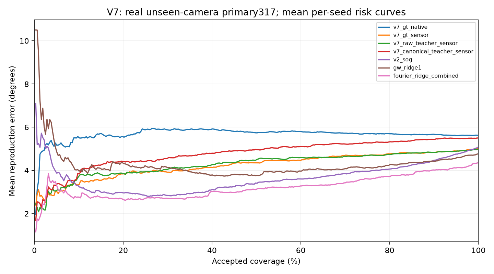

# V7 real benchmark: all frozen methods and camera-transfer results

All29 methods were locked before new INTEL-TAU pixel/GT decoding. Results are
locally reproduced, not author-published numbers. V7 has five arms by three
seeds; its semantic teacher is training-only. All data/weight/code licensing
and provenance remain separate. No skin-color accuracy or universal camera
independence is inferred from this color-constancy benchmark.

Primary external317 images:103 Canon5DSR,112 NikonD810,102 SonyIMX135, all camera
models absent from source estimator/risk training. Full384 sensitivity includes
67 rows sharing exact reference-file hashes with historical V2. Reference hashes
are only proxy groups, not proven physical scene identities. Original INTEL-TAU
CC BY-SA4.0 is used for evaluation only; sparse-mirror byte provenance remains
limited. Training uses CC BY4.0 SimpleCube++; standard DINOv2 teacher Apache2.0.

Known-camera comparison: official SimpleCube TEST462. These image IDs are absent
from fitting but capture dates overlap, and earlier methods already evaluated
this split. It is not a new independent capture-group test. Source camera models
are Canon550D/600D, both present in training. Neither target camera IDs nor CCMs
are fed into prediction, and no target-camera adaptation or calibration occurs.

Numbers average three per-seed metrics where available, not three-model
ensembles. Lower is better. 80% primary coverage accepts253/317 when supported.
Full means include explicit neutral fallback diagnostics for unsupported rows;
unsupported counts and attainable coverage are preserved per method.

|Family|Models|Known full °|Unseen full °|Unseen risk80 °|Unseen p95 °|Source80 threshold target coverage|
|---|---:|---:|---:|---:|---:|---:|
|direct_hgb7|1|2.2431|6.6570|6.7645|14.1021|54.57%|
|fourier_ridge_combined|1|2.6330|4.3552|3.7135|10.9136|33.44%|
|fourier_ridge_raw|1|2.6330|4.3552|3.6233|10.9136|28.39%|
|gray_edge|1|3.8866|6.9723|5.9718|18.6961|37.22%|
|gray_world|1|4.5922|6.3911|5.8960|16.2521|43.22%|
|gw_ridge1|1|2.9798|4.7642|4.2349|12.5935|40.38%|
|max_rgb|1|5.6572|11.2831|9.6008|21.0070|39.75%|
|shades_gray|1|3.5735|6.3484|5.7798|15.8396|36.59%|
|v2_direct|3|2.1959|5.7125|5.6778|12.1937|59.41%|
|v2_sog|3|2.8212|5.0868|4.0576|14.2511|47.74%|
|v7_canonical_teacher_native|3|2.2270|5.7573|5.7084|12.5398|60.57%|
|v7_canonical_teacher_sensor|3|2.6017|5.5013|5.3135|12.6369|41.43%|
|v7_gt_native|3|2.1898|5.6224|5.6985|12.1891|62.99%|
|v7_gt_sensor|3|2.6167|5.0057|4.7682|12.7812|53.73%|
|v7_raw_teacher_sensor|3|2.4999|4.9761|4.7481|12.2134|40.59%|

|Family|100%|95%|90%|80%|70%|60%|
|---|---:|---:|---:|---:|---:|---:|
|direct_hgb7|6.6570|6.6717|6.7076|6.7645|6.8360|7.0518|
|fourier_ridge_combined|4.3552|4.1138|4.0200|3.7135|3.4221|3.2805|
|fourier_ridge_raw|4.3552|4.1410|3.9090|3.6233|3.4107|3.2632|
|gray_edge|6.9723|6.5327|6.2793|5.9718|5.3250|5.0314|
|gray_world|6.3911|6.3543|6.2296|5.8960|5.6698|5.4065|
|gw_ridge1|4.7642|4.5697|4.4321|4.2349|4.0659|3.9667|
|max_rgb|11.2831|10.8083|10.3527|9.6008|8.8480|7.8177|
|shades_gray|6.3484|6.1238|6.0461|5.7798|5.4415|5.1174|
|v2_direct|5.7125|5.7256|5.6847|5.6778|5.7246|5.7754|
|v2_sog|5.0868|4.7563|4.4618|4.0576|3.8484|3.6032|
|v7_canonical_teacher_native|5.7573|5.6943|5.6929|5.7084|5.8307|5.9133|
|v7_canonical_teacher_sensor|5.5013|5.4848|5.4387|5.3135|5.2273|5.1017|
|v7_gt_native|5.6224|5.6176|5.6739|5.6985|5.7229|5.8018|
|v7_gt_sensor|5.0057|4.8973|4.8284|4.7682|4.6843|4.4635|
|v7_raw_teacher_sensor|4.9761|4.8883|4.8349|4.7481|4.6559|4.5937|

|Unseen primary camera|Family|Full °|Risk80 °|
|---|---|---:|---:|
|Canon_5DSR|direct_hgb7|4.5641|4.6809|
|Canon_5DSR|fourier_ridge_combined|4.1018|3.5485|
|Canon_5DSR|fourier_ridge_raw|4.1018|3.6181|
|Canon_5DSR|gray_edge|8.0749|6.7676|
|Canon_5DSR|gray_world|5.7641|5.6575|
|Canon_5DSR|gw_ridge1|4.7662|4.0711|
|Canon_5DSR|max_rgb|13.8731|12.3932|
|Canon_5DSR|shades_gray|7.1604|6.3223|
|Canon_5DSR|v2_direct|4.5723|4.3968|
|Canon_5DSR|v2_sog|5.3147|4.2168|
|Canon_5DSR|v7_canonical_teacher_native|4.5505|4.3379|
|Canon_5DSR|v7_canonical_teacher_sensor|5.1126|4.9779|
|Canon_5DSR|v7_gt_native|4.3803|4.2839|
|Canon_5DSR|v7_gt_sensor|4.7330|4.5468|
|Canon_5DSR|v7_raw_teacher_sensor|4.6572|4.3862|
|Nikon_D810|direct_hgb7|6.9860|7.1427|
|Nikon_D810|fourier_ridge_combined|4.2714|3.6632|
|Nikon_D810|fourier_ridge_raw|4.2714|3.2162|
|Nikon_D810|gray_edge|7.6139|6.8050|
|Nikon_D810|gray_world|7.3717|6.6684|
|Nikon_D810|gw_ridge1|5.1989|4.7584|
|Nikon_D810|max_rgb|10.4361|9.1479|
|Nikon_D810|shades_gray|6.8381|6.8086|
|Nikon_D810|v2_direct|5.5107|5.3762|
|Nikon_D810|v2_sog|5.7882|4.7116|
|Nikon_D810|v7_canonical_teacher_native|5.4558|5.2684|
|Nikon_D810|v7_canonical_teacher_sensor|5.5921|5.2697|
|Nikon_D810|v7_gt_native|5.3172|5.2329|
|Nikon_D810|v7_gt_sensor|5.1559|4.7606|
|Nikon_D810|v7_raw_teacher_sensor|4.9541|4.6085|
|Sony_IMX135_BLCCSC|direct_hgb7|8.4089|8.1629|
|Sony_IMX135_BLCCSC|fourier_ridge_combined|4.7031|4.0047|
|Sony_IMX135_BLCCSC|fourier_ridge_raw|4.7031|4.0357|
|Sony_IMX135_BLCCSC|gray_edge|5.1543|4.4937|
|Sony_IMX135_BLCCSC|gray_world|5.9476|5.2775|
|Sony_IMX135_BLCCSC|gw_ridge1|4.2848|3.9827|
|Sony_IMX135_BLCCSC|max_rgb|9.5976|7.9660|
|Sony_IMX135_BLCCSC|shades_gray|4.9907|4.5920|
|Sony_IMX135_BLCCSC|v2_direct|7.0854|7.1353|
|Sony_IMX135_BLCCSC|v2_sog|4.0864|3.5962|
|Sony_IMX135_BLCCSC|v7_canonical_teacher_native|7.3070|7.4871|
|Sony_IMX135_BLCCSC|v7_canonical_teacher_sensor|5.7941|5.7590|
|Sony_IMX135_BLCCSC|v7_gt_native|7.2116|7.3739|
|Sony_IMX135_BLCCSC|v7_gt_sensor|5.1161|4.9930|
|Sony_IMX135_BLCCSC|v7_raw_teacher_sensor|5.3224|5.2079|

|Prespecified contrast A minus B|Full difference and95% proxy-cluster CI|Risk80 difference and95% CI|
|---|---|---|
|v7_canonical_teacher_sensor minus v7_raw_teacher_sensor|0.5252 / [0.3807516422907444, 0.6679193442952731]|0.5654 / [0.38527027242776224, 0.7756663213958984]|
|v7_gt_sensor minus v7_gt_native|-0.6166 / [-0.919849082598471, -0.2994761241580536]|-0.9303 / [-1.237962592729787, -0.609738587582312]|
|v7_canonical_teacher_sensor minus v2_sog|0.4145 / [0.049364993869361974, 0.7561906244276781]|1.2559 / [0.9349623652208364, 1.577695655594537]|
|v7_gt_sensor minus v2_sog|-0.0810 / [-0.4184387360488526, 0.24668466184038124]|0.7106 / [0.39278093440936035, 1.0052597021629033]|
|v7_canonical_teacher_sensor minus gw_ridge1|0.7371 / [0.4378916979055937, 1.0286145685060983]|1.0786 / [0.7203505887986162, 1.4349225951182325]|
|v7_canonical_teacher_sensor minus fourier_ridge_combined|1.1461 / [0.7095362888228725, 1.6030339309745902]|1.6000 / [1.2285478255694045, 1.9651182481587783]|

Primary canonical-teacher contrast: full +0.5252°; risk80 0.5654°
(negative favors candidate). Inspect both the intervals and individual-camera
results; a pooled improvement alone does not establish consistent superiority.
All29 methods, including failures, remain in the results. The strongest observed
control is reported in the complete table; no result is relabeled as reproduced
from an author's publication. Multiple-comparison and scene-dependence limits
remain; teacher pretraining overlap is unknown.

Model/compute: each V7 student has3,033,651 deployment parameters and369,024
training-only projection parameters. Saved training checkpoint13,816,203 bytes
includes the projection. Peak allocated training memory is about933 MiB with
source/teacher caches and initial state included. V7 inference latency, inference
VRAM, deployed file size and ONNX/TensorRT performance are NOT MEASURED in this
report. No earlier synthetic or V2 timing is substituted for V7 measurement.

Luma implication: this is component-level evidence about photometric
normalization and reliability on real public illuminant references. Genuine
surface CIEDE2000, facial skin colorimetry and ordinary phone JPEG/HEIC robustness
remain unvalidated. The candidate Skolkovo positioning is technical planning,
not an approved legal classification or established patent novelty.

[All population summaries](report/summary.json), [paired intervals](report/paired_intervals.json),
[full per-method metrics and curves](evaluation/results.json). Per-image predictions
and separate reference arrays are retained without dataset image publication.
