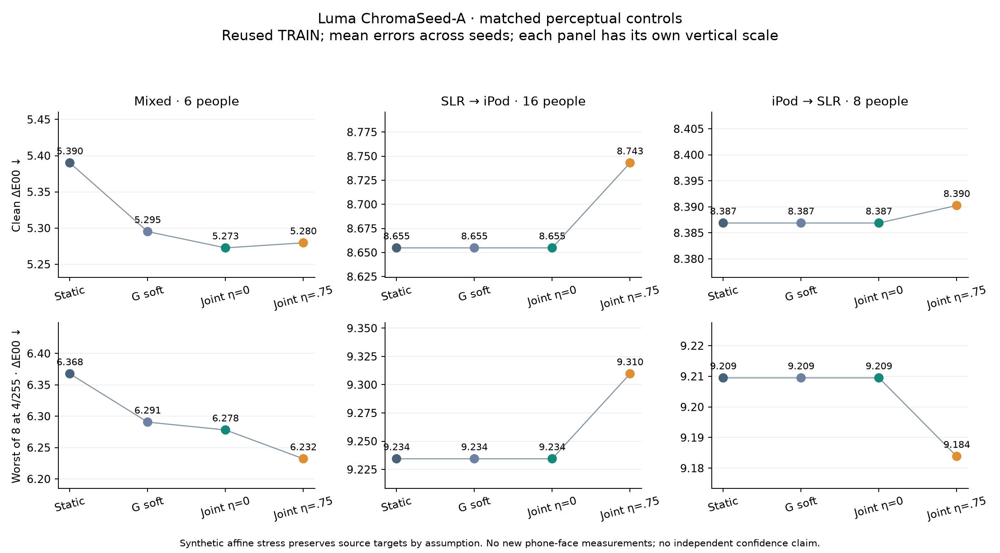
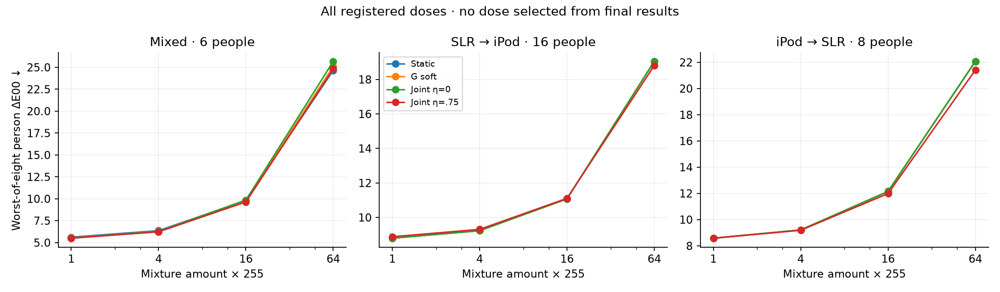

# Luma ChromaSeed-A: совместное обучение и цветовые искажения

Серия завершена и независимо проверена. На смешанном разбиении совместное обучение плавной поправки даёт **5.272642 ΔE00** против 5.295118 у прежнего G soft и 5.390066 у статической основы. Это небольшой исследовательский результат на шести ранее использованных людях. При выборе по обычной ошибке все12 решений оставили **η=0**, то есть без добавления искажённых цветов. Польза здесь связана с совместным обучением коэффициентов, а не с подтверждённым переносом палитры на лица.

Активные веса занимают **21,973 байта**, массивы потребителя — 44,640 байта; ответ по готовому вектору36 признаков — **11.8 мкс**, полное обучение на734 исходных строках — **34.60 мс** (CPU Ryzen9 7900X, один поток). Это не время обработки фотографии и не замер на телефоне. Все112 повторных полных обучений точно воспроизвели сохранённые массивы.

## Что именно проверялось

Четыре семейства: статическое и совместное плавное, каждое с обычной и общей перцепционной квадратичной функцией потерь.128 общих опорных цветов; исходные нормировки, ширина ядра, центры и классификатор условий съёмки обучаются только на исходных строках обучения. Совместная модель обучает сразу оба блока [Z,s(x)Z], без цикла обратного распространения ошибки. На разбиениях с одной камерой она точно совпадает с соответствующей новой статической моделью. Это свойство состава обучающих данных; модель не определяет автоматически неизвестный телефон.

16 цифровых вариантов на исходную строку: восемь углов RGB-куба × дозы1/255 и4/255. Квантили, средний цвет и стандартные отклонения преобразуются согласованно; исходная инструментальная цель сохраняется как синтетическое допущение. Общий вес каждого исходного примера неизменен. Новых людей, фотографий и физических измерений не добавлено. Исследована доля искажений η∈{0,.25,.5,.75}, α∈{.1,1,10}, три случайных базиса. Полная сетка, включая сильную регуляризацию, сохранена.

Две заранее заданные политики: clean минимизирует обычную внутреннюю ошибку; guarded минимизирует худшую ошибку восьми искажений4/255, допуская внутреннюю обычную ошибку не более чем на0.05 выше лучшего η=0. Все12 clean выбрали η=0, все12 guarded — η=.75, α=.1 везде. Ограничение0.05 относится к внутреннему выбору, **не гарантирует** такое же ухудшение на отложенных людях.

## Сопоставимые результаты

Среднее ΔE00 по человеку, затем среднее ошибок трёх базисов; меньше лучше. Это не ансамбль и не увеличение числа независимых участников. Исходные роли используют966 записей24 людей и многократно пересекались между прошлыми сериями. При переносе между камерами одновременно меняются люди и распределение.

| Семейство / политика | Mixed | SLR → iPod | iPod → SLR |
|---|---:|---:|---:|
| norm_static / clean | 5.438652 | 8.597000 | 8.705018 |
| norm_static / guarded | 5.446757 | 8.671774 | 8.700098 |
| norm_joint_soft / clean | 5.331149 | 8.597000 | 8.705018 |
| norm_joint_soft / guarded | 5.338888 | 8.671774 | 8.700098 |
| perceptual_static / clean | 5.390066 | 8.654805 | 8.386889 |
| perceptual_static / guarded | 5.397213 | 8.743031 | 8.390257 |
| perceptual_joint_soft / clean | 5.272642 | 8.654805 | 8.386889 |
| perceptual_joint_soft / guarded | 5.279610 | 8.743031 | 8.390257 |
| g_norm_base / reference | 5.438652 | 8.597000 | 8.705018 |
| g_norm_soft / reference | 5.349017 | 8.597000 | 8.705018 |
| g_perceptual_base / reference | 5.390066 | 8.654805 | 8.386889 |
| g_perceptual_soft / reference | 5.295118 | 8.654805 | 8.386889 |
| constant / reference | 13.656917 | 12.267125 | 10.599715 |

| Совместная перцепционная модель | Mixed clean | Mixed стресс4/255 | SLR→iPod clean | SLR→iPod стресс4/255 |
|---|---:|---:|---:|---:|
| clean | 5.272642 | 6.278089 | 8.654805 | 9.234482 |
| guarded | 5.279610 | 6.232160 | 8.743031 | 9.309668 |

Искажения немного улучшают смешанный стресс-тест, но ухудшают прямой перенос SLR→iPod и по обычной, и по стрессовой ошибке. На обратном переносе стресс улучшается, а обычная ошибка меняется мало и разнонаправленно. Поэтому вариант guarded не повышается до универсальной основной модели. Постоянный Lab даёт нулевую изменчивость, но большую ошибку: одна устойчивость ответа недостаточна.

Внутренняя смешанная ошибка совместной перцепционной модели без искажений 4.464672, у G soft 4.431187, у статической основы 4.448451. Поэтому улучшение внешнего результата 5.272642 не разрешает объявить архитектуру победителем по независимому выбору. Сравнение с G soft: −0.022476 ΔE00, лучше у 4/6 людей; описательный интервал ресэмплирования фиксированных прогнозов [−0.163324,+0.109194] включает 0. Это не новая подтверждающая проверка и не учёт всей истории выбора архитектур.

Сохранены более старые ориентиры: полный KRR5.3984/8.5845/8.9125; guided RBF5.8013/10.0280/7.7193; динамический R5.3551/9.9089/9.8122; G hard5.2851/8.6548/8.3869. Они получены в прошлых сериях на тех же исторических ролях, здесь не переобучались. У G hard предыдущая GS-проверка выявила разрыв ответа на границе переключения; текущая плавная модель не использует такое жёсткое переключение. A не превосходит лучшие старые ориентиры на всех ролях.

## Все дозы и вычислительная стоимость

Общий первичный процесс прочтения/обучения/выбора/сохранения/оценки занял 15.930с, без импорта библиотек и независимого аудита.1,884 сохранённых конфигурации в12 банках — не1,884 независимых обучения: в них576 точных однокамерных копий,144 импортированных G-контроля и12 констант. Выполнено1,152 новых решений коэффициентов,192 разложения матриц,36 построений базиса,4 обучения плавного переключателя; вспомогательный код ещё вычисляет36 базовых решений и36 theta-решений.

| Mixed, seed17 | Полное обучение, мс | Ответ, мкс¹ | Веса, байт |
|---|---:|---:|---:|
| norm_static / clean | 17.865 | 9.3 | 20284 |
| norm_static / guarded | 43.162 | 9.3 | 20284 |
| norm_joint_soft / clean | 32.018 | 11.9 | 21973 |
| norm_joint_soft / guarded | 83.152 | 11.8 | 21973 |
| perceptual_static / clean | 20.363 | 9.3 | 20284 |
| perceptual_static / guarded | 46.034 | 9.3 | 20284 |
| perceptual_joint_soft / clean | 34.600 | 11.8 | 21973 |
| perceptual_joint_soft / guarded | 88.481 | 11.9 | 21973 |

¹ Для ответа приведена медиана медиан трёх базисов,20 прогревов и3 прохода по каждому запросу. Обучение — медиана трёх полных повторов после одного прогрева, включая подготовку признаков из готовых color36, нормировки, расстояния, базис, варианты и коэффициенты. Декодирование фотографии, обнаружение лица, маска кожи, извлечение color36, импорт, ввод/вывод, поиск сетки и память библиотек исключены. Добавление вариантов делает обучение дороже; GPU здесь не использовался. Фактические все роли/семейства/политики и разброс времени сохранены в runtime.json.

## Независимая проверка

23 численных теста проверены отдельной командой; окончательный результат фиксирует verification.json. Аудит воспроизводит2,402,100 внутренних ответов, все144 пары оценок кандидатов,24 выбора и15 групп контроля. Все111 итоговых моделей ×33 преобразования =1,462,758 ответов,444 набора метрик по дозе/человеку/камере.72 выбранных экземпляра и12 положительных проб переобучены независимым QR/SVD способом; расхождение максимум **9.63e-06 Lab**, допустимо0.001. Исходные нормировки проверены по исходным строкам, базисы сопоставлены с замороженным проверенным G.72 статических η=0/α=.1 полезных контроля точно совпали с G. Ни одна запись решения не нарушила проверку нормальных уравнений, отрицательных собственных значений Gram не было.

Общий высокий уровень качества на обычных фотографиях лиц пока не доказан. Здесь подготовленные статистики участков кожи и цели native Lab исходного набора, не подбор оттенка продукта, распознавание личности или готовый SDK обработки лица. Семейство называется **Luma ChromaSeed**; A — обозначение этой серии, а не утверждение о новизне или правовой охране названия. Для резидентства и коммерческого обещания нельзя превращать эти числа в доказательство точности на телефонах.

[Протокол](../../research/chromaseed_affine_v1_protocol.md) · [Все политики](all_policies.csv) · [Все дозы](all_doses.csv) · [Полная внутренняя сетка](all_inner_candidates.csv) · [Аудит](audit.json) · [Скорость](runtime.json) · [Проверка файлов](verification.json) · [Воспроизведение](reproduce.md) · [Карточка модели](../../architecture/chromaseed_affine_model_card.md) · [Следующее решение](../../research/chromaseed_affine_next_decision.md)
