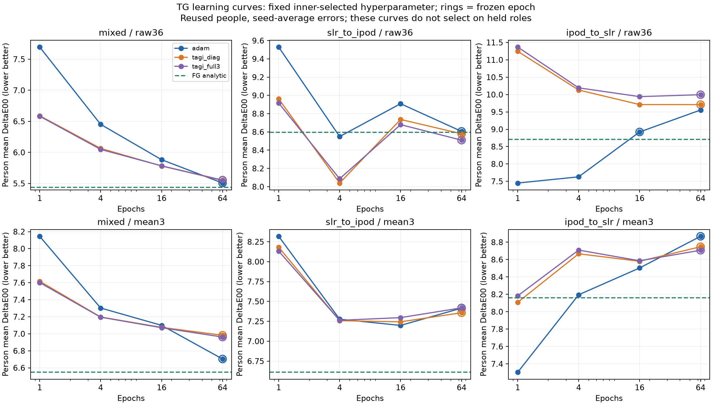
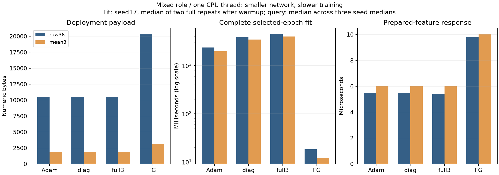

# Luma ChromaSeed TG: локальное гауссовское обучение

Маленькая ReLU-сеть работает: **451 параметр / 1 855 байт** по среднему RGB или **2 563 параметра / 10 564 байта** по 36 цветовым признакам. Ответ занимает около **5,4–6,1 мкс** на одном потоке CPU. Это компактнее и быстрее текущего аналитического FG-consumer, но обучение существенно медленнее. В **16/18** сравнений выбранные новые сети хуже FG; гауссовские варианты хуже соответствующего Adam в **7/12**. Универсального улучшения качества и эффективного обучения не получено.

Сравнение использует одинаковую архитектуру d→64 ReLU→3, начальные средние весов, порядок примеров и person→site→image веса. Три seed, два фиксированных набора входов, три параметра обучения, эпохи1/4/16/64. Внутренние оценки выбрали18 настроек до финального обучения;17 предпочли64 эпохи, reverse/raw36 Adam —16. Adam минимизирует взвешенную квадратичную ошибку; гауссовские процедуры поддерживают приближённые распределения весов. Совпадение архитектуры не означает одинаковую статистическую задачу или объём состояния обучения.

**Данные:** только исходный TRAIN,966 строк/24 человека, измеренный native D65/10° Lab участков кожи. Mixed:734 fit/232 query,18/6 человек; SLR→iPod:323/643,8/16; обратно643/323,16/8. Люди и роли повторно использованы и пересекаются между сценариями; камера связана с составом людей. Это исследовательская оценка, не независимый тест на селфи. Старые validation/calibration/test не открывались. ΔE00 — ошибка цвета, меньше лучше, её нельзя переводить в процент точности. Таблица усредняет ошибки трёх отдельных моделей, не их предсказания.

## Все зафиксированные варианты

Parameter — learning rate у Adam, стандартное отклонение наблюдения в нормализованном Lab у TAGI, alpha=.1 у FG. FG — точный импорт norm_static из предыдущего исследования, без условной или perceptual-поправки. Constant — сбалансированная константа. Размер — числовой payload; полный NPZ, FP64-кэш и состояние обучения отдельно в CSV. Fit включает нормализацию, веса примеров, инициализацию, все выбранные эпохи и экспорт; FG заново считает ширину, центры и readout. Измерены seed17, один прогрев и два полных повтора. Query — медиана по seed-медианам реального NumPy-consumer.

| Role | Input | Method | Parameter | Epoch | Mean ΔE00 ↓ | p90 ↓ | Bytes | Fit ms | Query μs |
|---|---|---|---:|---:|---:|---:|---:|---:|---:|
| mixed | raw36 | adam | 0.0003 | 64 | 5.506610 | 10.7355 | 10,564 | 2387.04 | 5.50 |
| mixed | mean3 | adam | 0.001 | 64 | 6.703580 | 14.6066 | 1,855 | 1994.96 | 6.00 |
| mixed | raw36 | tagi_diag | 1.0 | 64 | 5.548741 | 10.7898 | 10,564 | 3883.12 | 5.50 |
| mixed | mean3 | tagi_diag | 1.0 | 64 | 6.982556 | 14.4399 | 1,855 | 3490.45 | 6.00 |
| mixed | raw36 | tagi_full3 | 1.0 | 64 | 5.553386 | 10.8102 | 10,564 | 4482.17 | 5.40 |
| mixed | mean3 | tagi_full3 | 1.0 | 64 | 6.961798 | 14.5161 | 1,855 | 4024.02 | 6.00 |
| mixed | raw36 | fg_norm_static | 0.1 | None | 5.438652 | 10.3506 | 20,284 | 18.27 | 9.80 |
| mixed | mean3 | fg_norm_static | 0.1 | None | 6.547224 | 13.7263 | 3,127 | 12.16 | 10.00 |
| mixed | constant | constant | None | None | 13.656917 | 24.1055 | 12 | — | 1.20 |
| slr_to_ipod | raw36 | adam | 0.0003 | 64 | 8.605746 | 13.7292 | 10,564 | 1081.11 | 5.40 |
| slr_to_ipod | mean3 | adam | 0.003 | 64 | 7.415713 | 12.6593 | 1,855 | 883.52 | 6.00 |
| slr_to_ipod | raw36 | tagi_diag | 1.0 | 64 | 8.579215 | 13.6802 | 10,564 | 1729.83 | 5.40 |
| slr_to_ipod | mean3 | tagi_diag | 0.3 | 64 | 7.357815 | 12.5741 | 1,855 | 1549.45 | 6.00 |
| slr_to_ipod | raw36 | tagi_full3 | 1.0 | 64 | 8.509649 | 13.6345 | 10,564 | 1959.32 | 5.40 |
| slr_to_ipod | mean3 | tagi_full3 | 0.3 | 64 | 7.419135 | 12.5515 | 1,855 | 1769.18 | 6.00 |
| slr_to_ipod | raw36 | fg_norm_static | 0.1 | None | 8.597000 | 13.6453 | 20,284 | 10.08 | 9.80 |
| slr_to_ipod | mean3 | fg_norm_static | 0.1 | None | 6.608981 | 10.6975 | 3,127 | 5.86 | 10.10 |
| slr_to_ipod | constant | constant | None | None | 12.267125 | 19.4611 | 12 | — | 1.20 |
| ipod_to_slr | raw36 | adam | 0.0003 | 16 | 8.921917 | 16.5726 | 10,564 | 529.40 | 5.50 |
| ipod_to_slr | mean3 | adam | 0.0003 | 64 | 8.867700 | 16.4876 | 1,855 | 1743.11 | 6.10 |
| ipod_to_slr | raw36 | tagi_diag | 0.3 | 64 | 9.709960 | 18.7380 | 10,564 | 3434.65 | 5.50 |
| ipod_to_slr | mean3 | tagi_diag | 1.0 | 64 | 8.747354 | 16.5425 | 1,855 | 3128.55 | 6.00 |
| ipod_to_slr | raw36 | tagi_full3 | 0.3 | 64 | 9.995897 | 18.2803 | 10,564 | 3921.07 | 5.50 |
| ipod_to_slr | mean3 | tagi_full3 | 1.0 | 64 | 8.707169 | 16.4549 | 1,855 | 3519.96 | 6.10 |
| ipod_to_slr | raw36 | fg_norm_static | 0.1 | None | 8.705018 | 15.5016 | 20,284 | 15.98 | 9.80 |
| ipod_to_slr | mean3 | fg_norm_static | 0.1 | None | 8.158681 | 14.8289 | 3,127 | 11.03 | 10.00 |
| ipod_to_slr | constant | constant | None | None | 10.599715 | 19.1456 | 12 | — | 1.20 |

## Что показывают качество и длительное обучение

Mixed/raw36: FG5.438652, Adam5.506610, diag5.548741, full3 5.553386. При 64 эпохах Gaussian не превосходит Adam, хотя первые эпохи здесь лучше. Mixed mean3 ухудшается:6.547224→6.703580/6.982556/6.961798. Прямой raw36-перенос full3 немного улучшает FG8.597000→8.509649, но описательный парный интервал разницы[-.5294,.3301] включает ноль; улучшаются8/16 человек. Обратный raw36-перенос ухудшается8.705018→9.995897,0/8 человек улучшаются. Интервалы условны на фиксированных предсказаниях повторно использованных людей и не учитывают весь процесс выбора модели.

Больше эпох не гарантирует перенос: reverse/raw36 Adam меняется7.4506→7.6293→8.9219→9.5548; внутренний выбор всё равно16. Мы сохраняем этот выбранный результат. Прямой перенос тоже немонотонен. Увеличивать бюджет только из-за17/18 выборов64 без нового протокола нельзя считать установленным решением проблемы.

## Реальная стоимость

На734 mixed fit-строках raw36: FG18.27 мс, Adam2387.04 мс, diag3883.12 мс, full3 4482.17 мс. Mean3:12.16/1994.96/3490.45/4024.02 мс. Это конкретная NumPy FP64 online-реализация на одном потоке CPU, не предел быстродействия метода и не CUDA/cuTAGI benchmark. Батчирование независимых траекторий ускоряет общий поиск, но не подменяет время обучения одной модели. Все72 полных повторных обучения дали побитно одинаковые экспортированные массивы.

Сеть хранит только средние FP32-веса и нормализаторы. Временный постоянный массив параметров при обучении: Adam61 512/10 824 байта для raw36/mean3, Gaussian41 008/7 216. Это средние и два момента Adam либо средние и дисперсии Gaussian; данные, временные матрицы, RNG и память процесса не включены. FP64-кэш consumer20 816/3 659 байт, не весь Python-процесс. Изображения, детектор лица, выделение кожи, подготовка признаков, мобильный runtime и I/O не измерялись. GPU в этой серии не использовался.

## Численная устойчивость и воспроизводимость

У диагонального варианта в одной из180 траекторий обнаружены2 отрицательных обновления дисперсии до ограничения и6 881 срабатывание floor=1e-12. Это mixed/inner/fold2/mean3/sigma.1/seed17; минимум до floor−.0026853. Сумма считается по конечным кумулятивным счётчикам каждой траектории, без повторного сложения префиксов. У full3 все180 траекторий без отрицательных дисперсий и без floor; минимум2.1732e-8. Floor был зафиксирован до обучения. Стабильность full3 полезна для корректности приближения, но сама по себе не улучшает точность. Эти дисперсии не являются калиброванной уверенностью в цвете кожи.

540 траекторий,2 160 обученных checkpoint и84 точных FG-контроля в12 банках;13 708 800 обновлений по примерам. Независимый аудит проверил379 100 OOF-выходов,216 кандидатов/18 выборов,94 642 clean-выхода и988 350 stress-выходов. Clean и stress пересекаются по identity: их суммы не означают независимые наблюдения. Все54 финальные траектории независимо обучены скалярным кодом с Cholesky-решением; все216 экспортированных сетей совпали точно, максимум расхождения параметров0. Все фактические consumer проверены. 18 численных тестов прошли до обучения; финальный повтор и хеши находятся в verification.json. Ни новый датасет, ни веса, ни пакеты не загружались.

## Источник метода и следующие действия

[TAGI, Goulet et al., JMLR2021](https://www.jmlr.org/papers/v22/20-1009.html) дал исходную идею приближённых гауссовских распределений и обратного послойного вывода. Наши diag/full3 — самостоятельные ограниченные реализации с локальной линеаризацией ReLU; full3 сохраняет ковариацию трёх выходов, скрытые состояния и параметры остаются диагональными. Это не перебор весов и не воспроизведение авторского cuTAGI benchmark. Формулы и отличия зафиксированы в протоколе.

Следующая гипотеза — проверить аналитическое обучение выходного слоя этой же маленькой ReLU-сети после случайной и коротко обученной основы. В архиве уже есть frozen random/palette-readout; сама идея не новая. Нужна отдельная сравнимая постановка на TG-архитектуре и независимый контроль, без повторного выбора по известным внешним ошибкам. Она пока не запущена. Общее качество на обычных фото лиц остаётся непроверенным; общая цель активна.

[Шесть полных CSV](selected.csv): [эпохи](learning_curves.csv), [stress](all_doses.csv), [внутренние кандидаты](inner_candidates.csv), [парные сравнения](paired.csv), [дисперсии](variance_checkpoints.csv). [Аудит](audit.json) · [Все замеры](runtime.json) · [Машинная сводка](summary.json) · [Воспроизведение](reproduce.md) · [Receipt](verification.json) · [Протокол](../../research/chromaseed_gaussian_v1_protocol.md) · [Модель](../../architecture/chromaseed_gaussian_model_card.md) · [Следующее решение](../../research/chromaseed_gaussian_next_decision.md) · [Форумы и данные](../../research/chromaseed_forum_methods_data_2026-09-13.md).
