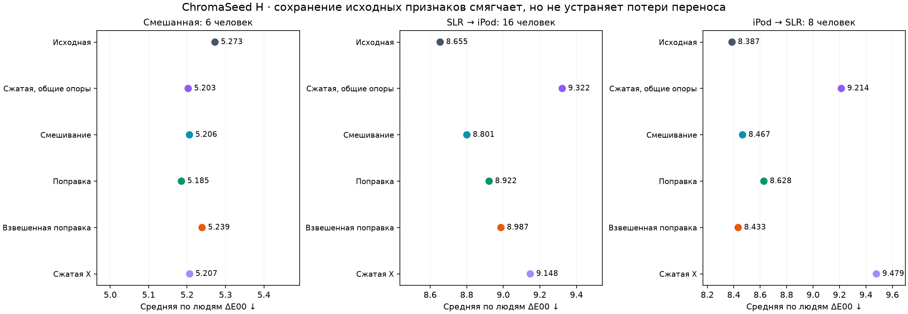
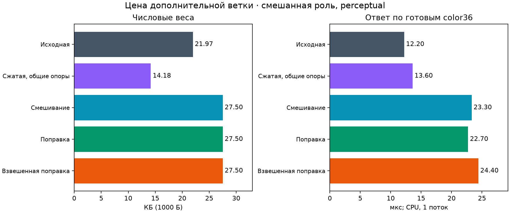

# ChromaSeed H: общие опоры и цветовая поправка

**Прогресс эксперимента; универсального улучшения нет.** Сохранил исходное цветовое представление и добавил обучаемую ветку в 16 координатах. Веса обоих ядер используют одни 128 исходных опорных строк. Сравнил обычное смешивание, обучение поправки и её плавное ослабление по среднему сходству с опорами. Каждая схема могла выбрать нулевую поправку по внутренним данным; все 18 селекторов смешивания/поправок выбрали положительную силу. Это не гарантия качества на внешнем сдвиге.

В смешанной роли обычная perceptual-поправка: **5.272642 → 5.185283 ΔE00**. Размер **21,973 → 27,503 Б** (+25.17%), ответ **12.2 → 22.7 мкс**, полное обучение734 строк **35.87 → 45.41 мс**. Это одна последовательная серия измерений CPU; дополнительная ветка оказалась медленнее. Две ветки не названы динамической перестройкой связей или новым методом обратного распространения ошибки.

Все 8 mixed-сопоставлений численно улучшились, но **16/24** сопоставления с исходной моделью ухудшились — **все 16/16 переносов между камерами**. Для perceptual-поправки прямой перенос 8.654805 → 8.922499, обратный 8.386889 → 8.627988. Сглаженное ослабление даёт mixed5.239053, но также не побеждает исходную модель на переносах. Новую ветку универсальной заменой не объявляю.

## Качество и стоимость

| Вариант (perceptual) | Mixed ΔE00 | SLR→iPod | iPod→SLR | Веса mixed, Б | Ответ mixed, мкс | Fit734, мс |
|---|---:|---:|---:|---:|---:|---:|
| Исходная | 5.272642 | 8.654805 | 8.386889 | 21,973 | 12.2 | 35.87 |
| Сжатая, общие опоры | 5.202796 | 9.322320 | 9.213744 | 14,181 | 13.6 | 46.19 |
| Смешивание | 5.206195 | 8.800746 | 8.466563 | 27,503 | 23.3 | 44.87 |
| Поправка | 5.185283 | 8.922499 | 8.627988 | 27,503 | 22.7 | 45.41 |
| Взвешенная поправка | 5.239053 | 8.987209 | 8.433364 | 27,503 | 24.4 | 46.69 |
| Сжатая X | 5.206762 | 9.147710 | 9.479015 | 14,181 | 13.8 | — |

Таблица показывает отдельные потери, усреднённые по трём seed 17/29/43; это не ансамбль и не три независимых набора людей. Mixed имеет 6 ранее использованных отложенных людей, переносы 16 и 8; роли пересекаются. Смена камеры связана также со сменой людей и распределения. Диапазон парного bootstrap по людям (выборка с возвращением) для mixed perceptual-поправки: -0.1951…0.0204 ΔE00, улучшились 3/6. Он включает ноль; это описательный bootstrap фиксированных предсказаний после многократной исследовательской работы, без учёта повторной подгонки/выбора архитектуры. Некоторые normalized-диапазоны не включают ноль, но также не являются независимым доказательством. Все 24 диапазона доступны в [аудите](audit.json).

## Что именно обучено

Исходный A joint-soft alpha0.1/eta0 воспроизведён точно. У projected-only H и у обеих веток гибрида совпадают исходные landmark-индексы; нормализаторы, проекция, ширины, сглаженный gate и perceptual-метрика обучаются только на fit-части. H projected-only отличается от X, где сжатое ядро само выбирало свои опоры; фиксированный X d16/tau0.5/alpha0.1 сохранён отдельно без переобучения.

В staged-поправках решается регуляризованная задача на остатке от экспортированной FP32 исходной модели. Support h(x)=mean(Kraw)^p с p1/4 включён и в обучающий дизайн, и в ответ. Все 6 support-выборов предпочли p1; p4 сохранён в полной сетке и принудительных проверках. Это гладкая мера сходства с ядром, без порога и без калибровки уверенности. При одной обучающей камере gate отсутствует, но projected-поправка остаётся активной. Входной camera-ID, правильный Lab и статистика соседних запросов не используются.

Гибрид хранит raw-центры один раз и выводит projected-центры при загрузке. У активного mixed варианта числовые веса27,503Б, а кешированные массивы NumPy73,088Б; NPZ-контейнер, процесс Python, временные массивы и вызывающий код считаются отдельно. Два ядра и проекция реально вычисляются при ответе; экономия хранения не означает ускорение. Полный fit projected-only также вычисляет исходный readout — это явно включено в его время. Подготовка36 цветовых статистик, поиск лица/кожи и работа на телефоне не измерялись. Точное вычисление ширины всё ещё хранит квадратичный вектор расстояний.

## Объём и воспроизводимость

До реального fit зафиксированы [протокол](../../research/chromaseed_hybrid_v1_protocol.md), исходники и входные SHA. Девять внутренних банков →30 решений →три финальных банка →111 моделей на33 искажениях. Время основного workflow18.402с, без импорта/audit/runtime; повторного использования H банков не было.

- 2,964 записи:2,880 H,72 импортированных X,12 констант. Внутри H есть72 повторно точно обученных A-контроля и216 rho1 endpoint-алиасов; они не выдаются за независимые новые модели. Сила поправки повторно использует уже найденные веса.
- 936 решений readout,288 Gram-разложений,36 raw+36 projected базисов,24 точные ширины,12 ковариаций,4 gate-fit и36+36 вспомогательных решений исходного построителя.
- 258 записей внутренних кандидатов,30 замороженных выборов,419,900 OOF-предсказаний,1,462,758 финальных предсказаний и444 dose-сводки проверены независимо. Все 33 преобразования законны для цветовых статистик; неизменность целевого Lab при них — синтетическое предположение.
- Независимые weighted-SVD/exhaustive-distance/dense-pivot/QR расчёты:90 выбранных реконструкций и18 принудительно положительных. Максимальное расхождение9.44e-06 Lab, одноточечный NumPy-потребитель1.53e-12; ширины совпали. Аудит45.40с.
- Все 111 потребителей измерены реально. 144 полных timing-fit (120 выбранных и24 положительных, включая warmup) точно повторили числовые веса. 15 основных и3 независимых численных теста; окончательная команда и её результат записаны в [verification](verification.json).

[Полная таблица39 вариантов](all_policies.csv) · [Все156 dose-строк](all_doses.csv) · [Все258 внутренних кандидатов](all_inner_candidates.csv) · [JSON-сводка](summary.json) · [Runtime](runtime.json) · [Воспроизведение](reproduce.md).

## Решение и границы

Этот результат поддерживает сохранение исходных признаков: гибрид смягчает провал projected-only, но baseline по-прежнему лучше в переносах. Ни дополнительная ветка, ни её сходство с fit-примерами не решили исходную проблему. Семейство остаётся **Luma ChromaSeed**; H — номер исследовательской схемы, без заявления о патентной новизне или свободе товарного знака.

Использован только original TRAIN: 966 записей/24 человека. Legacy validation/calibration/test не читались. Обычные лица со смартфонов, точность выделения кожи, свет, подбор косметики и end-to-end интеграция не валидированы; это не доказательство готовности технологии или достаточности для «Сколково». Широкая цель активна. [Карточка модели](../../architecture/chromaseed_hybrid_model_card.md) · [Следующее решение](../../research/chromaseed_hybrid_next_decision.md).
