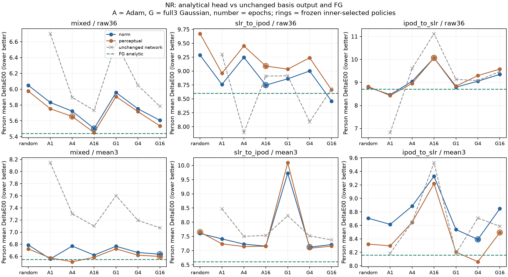
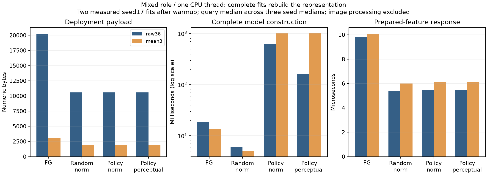

# Luma ChromaSeed NR: аналитический выход маленькой сети

Выходной слой действительно обучается аналитически и складывается обратно в прежнюю сеть: **10 564 байта** для36 признаков или **1 855 байт** для среднего RGB. В mixed случайная raw36-основа плюс norm-readout полностью создаётся за **5.929 мс**, mean3 — **5.079 мс**. Но ошибки соответственно **6.048158 / 6.788076 ΔE00**. Предыдущий FG raw36 даёт **5.438652** при **18.192 мс**. Меньше ошибка — лучше; это не процент точности.

Аналитическая замена улучшила исходный обученный выход в54/72 сравнений, но79/84 новых вариантов хуже соответствующего FG. Все12 заранее зафиксированных правил выбора уступают FG. Есть работающий компромисс размера и стоимости, но универсального улучшения всей технологии нет. Для вариантов с обученной основой полное время ниже включает её создание; быстрый пересчёт последнего слоя не считается бесплатным обучением всей модели.

## Протокол и все правила выбора

Одна архитектура d→64 ReLU→3; raw36 и mean3 для всех сценариев. Семь основ: случайная, Adam после1/4/16эпох(rate.001), full3 Gaussian после1/4/16эпох(sigma1). Три seed17/29/43. По каждой основе проверены norm и локальная квадратичная аппроксимация ΔE00, alpha.1/1/10 с незарегуляризованным свободным членом. Нормализаторы и первая матрица при пересчёте выхода неизменны. Данные для новых фотографий не загружались.

Внутренние разбиения по людям зафиксировали84 alpha и12 правил выбора основы до финального обучения. В77/84 случаях выбранalpha10, ещё7 —alpha1. Все12 правил выбралиalpha10. Это граница проверенной сетки; более сильная регуляризация здесь не испытана. Нельзя объявлять найденные настройки глобальным оптимумом или задним числом выбрать удобный внешний результат.

| Role | Input | Loss | Chosen basis | Error ΔE00 ↓ | FG ↓ | Full fit ms | Query μs |
|---|---|---|---|---:|---:|---:|---:|
| mixed | raw36 | norm | adam_e16 | 5.502520 | 5.438652 | 613.374 | 5.50 |
| mixed | raw36 | perceptual | adam_e4 | 5.654729 | 5.438652 | 162.562 | 5.50 |
| mixed | mean3 | norm | tagi_full3_e16 | 6.636132 | 6.547224 | 1009.927 | 6.10 |
| mixed | mean3 | perceptual | tagi_full3_e16 | 6.599125 | 6.547224 | 1013.485 | 6.10 |
| slr_to_ipod | raw36 | norm | adam_e16 | 8.747565 | 8.597000 | 268.037 | 5.60 |
| slr_to_ipod | raw36 | perceptual | adam_e16 | 9.091206 | 8.597000 | 269.495 | 5.60 |
| slr_to_ipod | mean3 | norm | tagi_full3_e4 | 7.122817 | 6.608981 | 114.609 | 6.10 |
| slr_to_ipod | mean3 | perceptual | random | 7.653154 | 6.608981 | 3.345 | 6.10 |
| ipod_to_slr | raw36 | norm | adam_e16 | 10.067767 | 8.705018 | 535.603 | 5.60 |
| ipod_to_slr | raw36 | perceptual | adam_e16 | 10.067797 | 8.705018 | 538.022 | 5.60 |
| ipod_to_slr | mean3 | norm | tagi_full3_e4 | 8.391640 | 8.158681 | 226.811 | 6.20 |
| ipod_to_slr | mean3 | perceptual | tagi_full3_e16 | 8.494089 | 8.158681 | 887.228 | 6.20 |

Каждая ошибка сначала усредняется по людям, затем по трём отдельным моделям. Это не ансамбль предсказаний. p90 и все127 сравниваемых варианта на сценарий доступны в CSV, включая проигравшие и неизменённые сети. Правила выбора используют внутреннюю ошибку и заранее определённые tie-breaks; внешние оценки не меняют выбор.

## Случайная основа: полная стоимость без предобучения

| Role | Input | Loss | Error ΔE00 ↓ | Full fit ms | Numeric B |
|---|---|---|---:|---:|---:|
| mixed | raw36 | norm | 6.048158 | 5.929 | 10564 |
| mixed | raw36 | perceptual | 5.975431 | 9.620 | 10564 |
| mixed | mean3 | norm | 6.788076 | 5.079 | 1855 |
| mixed | mean3 | perceptual | 6.722797 | 8.396 | 1855 |
| slr_to_ipod | raw36 | norm | 9.286951 | 1.647 | 10564 |
| slr_to_ipod | raw36 | perceptual | 9.674299 | 3.425 | 10564 |
| slr_to_ipod | mean3 | norm | 7.604862 | 1.561 | 1855 |
| slr_to_ipod | mean3 | perceptual | 7.653154 | 3.345 | 1855 |
| ipod_to_slr | raw36 | norm | 8.790445 | 4.309 | 10564 |
| ipod_to_slr | raw36 | perceptual | 8.822311 | 7.246 | 10564 |
| ipod_to_slr | mean3 | norm | 8.705993 | 4.231 | 1855 |
| ipod_to_slr | mean3 | perceptual | 8.321937 | 7.171 | 1855 |

Полное обучение измерено для126 настроек: по3 повтора с нуля, первый прогрев исключён, два остальных образуют медиану. Все **378/378** экспортированных payload совпали побитно. Измерены нормализация, инициализация, все эпохи основы, подготовка признаков, решение и экспорт; для FG заново рассчитаны ширина/центры/readout. Это NumPy FP64 на одном потоке CPU, не мобильная или CUDA скорость.

**Размер** — числовые веса с нормализаторами, не NPZ-файл и не весь процесс Python. Развёрнутый FP64-кэш3659/20816 B для mean3/raw36. Дополнительные скрытые моменты, матрицы метрики и линейные системы нужны только при обучении. Их явные размеры есть в CSV/runtime; сумма таких фазовых массивов не является измерением пикового RAM. Извлечение лица/кожи, цветовых признаков, чтение изображений, I/O и телефонный runtime не входят в микросекунды ответа.

## Проверка результата и ограничения

Исходный TRAIN:966 строк/24 человека с приборным native D65/10° Lab участков кожи. Mixed fit734/query232,18/6человек; SLR→iPod323/643,8/16; обратно643/323,16/8. Люди и роли повторно используются и пересекаются между сценариями; камера связана с составом людей. Это не свежий тест на обычных селфи. Старые validation/calibration/test не открывались. Синтетические33 изменения цвета диагностируют чувствительность, не доказывают естественную цветопередачу камеры.

144 траектории/432 checkpoint и72 случайные основы,3024 аналитических решения,3540 записей в12 банках.979200 обновлений по примерам. Все501500 OOF-выходов,252 оценки/84 выбора/12 правил и5020818 финальных выходов независимо проверены, включая381 фактический consumer.369 совпадающих TG-основ и84 FG-контроля сохранены точно. Независимые144 скалярных обучения восстановили504 основы:503 побитно, у одной максимум7.45058e-9 вw1. Это внутри заранее заданных2e-6atol/rtol; порог не менялся.

Все3024 выходных решения восстановлены другим методом: расширенная задача наименьших квадратов с pivoted QR вместо нормальных уравнений/Cholesky, аналитическая цветовая метрика вместо конечных разностей. Максимальное отличие на fit/query —5.8087233e-06 Lab, на выбранном stress —2.478171e-06; допустимый предел.001. Consumer отличается от сохранённых выходов не более1.1795009e-12.24 численных теста прошли до обучения; финальный повтор записан в receipt.

Первый аудит завершил вычисления, но остановился на моём дополнительном требовании504 побитных совпадений, которого не было в протоколе. Счётчик заменён на измеряемое число точных совпадений с отдельной записью расхождения, а исходные численные допуски сохранены. Повторный полный аудит прошёл. Код обучения/данные/веса не менялись. Отдельно исправлена описательная ошибка старой TG model card: быстрый Predictor принимает один color36, пакетная функция — отдельный интерфейс; старые измерения уже использовали правильный вызов.

Первичный workflow 61.634 с; успешный аудит141.416 с; profiling97.794 с. Эти расходы исследования не равны времени обучения одной модели. Исследование завершено; новых фоновых процессов после проверок не осталось. Общая цель активна, качество на обычных фото лиц ещё не подтверждено.

## Что проверять следующим

В старом ChromaSeed уже были frozen random/palette-readout и аналитические kernel-readout; NR не объявляет эти идеи новыми. Его вклад — проверенное сравнение на одной конкретной компактной TG-архитектуре с полным учётом стоимости. Следующий ограниченный вопрос — влияние более сильной регуляризации на эту же замороженную основу. Поскольку77/84 alpha и все12 правил упёрлись в10, до новой сетки нужно проверить геометрию штрафа и выбор на внутренних людях. Новые результаты нельзя получить перестановкой уже просмотренных внешних строк. Следующая серия пока не запущена.

[Все модели](all_models.csv) · [Все дозы](all_doses.csv) · [Внутренние кандидаты](inner_candidates.csv) · [Правила выбора](policies.csv) · [Парные сравнения](paired.csv) · [JSON](summary.json) · [Аудит](audit.json) · [Замеры](runtime.json) · [Receipt](verification.json) · [Протокол](../../research/chromaseed_neural_readout_v1_protocol.md) · [Воспроизведение](reproduce.md) · [Модель](../../architecture/chromaseed_neural_readout_model_card.md) · [Следующее решение](../../research/chromaseed_neural_readout_next_decision.md) · [Поправка к TG интерфейсу](../../research/chromaseed_gaussian_consumer_erratum.md).
