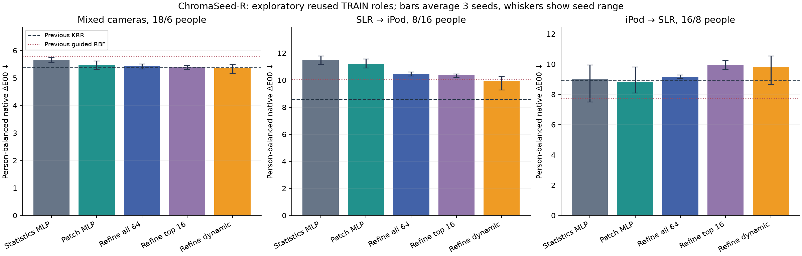
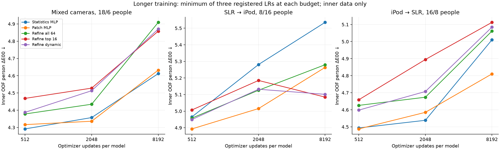
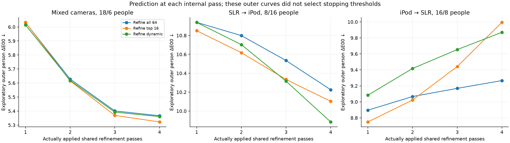

# Luma ChromaSeed-R: результаты серии v1

Измеренный исследовательский результат на повторно использованных разбиениях исходного TRAIN. Это не новая независимая проверка на лицах со смартфонов. Чем меньше ΔE00, тем точнее цвет.

Повторное уточнение дало небольшой выигрыш на смешанных камерах, но устойчивого превосходства над прежними сильными моделями нет. Во всех 15 сочетаниях семейства и протокола внутренний выбор остановился на 512 шагах; увеличение до 2048/8192 не помогло. На обратном переносе поздние поправки усиливали ошибку. [Вывод и следующий эксперимент](../../research/chromaseed_refine_next_decision.md).

Обучены **405 внутренних вариантов и 45 финальных моделей**. До 8192 шагов на модель, три seed и три скорости обучения. Внутренние разбиения выбирали и скорость, и длительность обучения, затем порог раннего выхода. Суммарное время банков обучения: **813.4 с**, максимум выделенной CUDA-памяти: **241.6 МиБ**. Время в сумме не включает полный аудит, выгрузку прогнозов и измерение CPU.

## Точность после зафиксированного выбора

Среднее ошибок трех отдельно обученных моделей; это не ансамбль. Протоколы перекрываются, seed не заменяют людей.

| Модель | Смешанные камеры, 6 человек | SLR → iPod, 16 человек | iPod → SLR, 8 человек | FP32, байт |
|---|---:|---:|---:|---:|
| Statistics MLP | 5.647 | 11.515 | 9.008 | 71,572 |
| Patch MLP | 5.472 | 11.214 | 8.830 | 67,828 |
| Refine all 64 | 5.421 | 10.443 | 9.162 | 59,316 |
| Refine top 16 | 5.396 | 10.353 | 9.941 | 59,316 |
| Refine dynamic | 5.355 | 9.909 | 9.812 | 59,316 |
| Предыдущий krr | 5.398 | 8.584 | 8.913 | 114,820* |
| Предыдущий guided_rbf | 5.801 | 10.028 | 7.719 | 10,996* |
| Предыдущий random_rbf | 5.752 | 10.364 | 8.062 | 10,996* |
| Предыдущий mlp | 5.786 | 9.481 | 9.731 | 10,996* |

*Числа старых моделей взяты из ранее проверенного отчета с теми же ролями. Размер KRR зависит от объема fit. Новый размер включает веса, нормализацию, аналитический старт и числовой порог; архив и полный конвейер обработки фото имеют отдельный размер.

## Настройки и фактическая работа модели

| Протокол | Модель | Шаги / LR | ΔE, 4 прохода или статическая | ΔE, выбранный выход | Проходов | CPU, мкс, фикс. → адапт. | Обучение 3 моделей, с |
|---|---|---|---:|---:|---:|---:|---:|
| mixed | Statistics MLP | 512 / 0.001 | 5.647 | 5.647 | 1.00 | 18.7 → 18.8 | 0.18 |
| mixed | Patch MLP | 512 / 0.001 | 5.472 | 5.472 | 1.00 | 42.4 → 42.4 | 0.52 |
| mixed | Refine all 64 | 512 / 0.001 | 5.367 | 5.421 | 3.12 | 144.1 → 149.0 | 1.20 |
| mixed | Refine top 16 | 512 / 0.001 | 5.323 | 5.396 | 3.11 | 150.2 → 153.5 | 1.22 |
| mixed | Refine dynamic | 512 / 0.001 | 5.360 | 5.355 | 3.73 | 152.1 → 157.3 | 1.26 |
| slr_to_ipod | Statistics MLP | 512 / 0.0003 | 11.515 | 11.515 | 1.00 | 18.8 → 18.7 | 0.17 |
| slr_to_ipod | Patch MLP | 512 / 0.0003 | 11.214 | 11.214 | 1.00 | 42.3 → 42.2 | 0.51 |
| slr_to_ipod | Refine all 64 | 512 / 0.001 | 10.225 | 10.443 | 2.98 | 144.6 → 130.1 | 1.21 |
| slr_to_ipod | Refine top 16 | 512 / 0.003 | 10.103 | 10.353 | 2.97 | 149.0 → 134.1 | 1.22 |
| slr_to_ipod | Refine dynamic | 512 / 0.001 | 9.885 | 9.909 | 3.96 | 152.8 → 159.0 | 1.25 |
| ipod_to_slr | Statistics MLP | 512 / 0.001 | 9.008 | 9.008 | 1.00 | 19.0 → 19.0 | 0.16 |
| ipod_to_slr | Patch MLP | 512 / 0.001 | 8.830 | 8.830 | 1.00 | 42.3 → 42.3 | 0.52 |
| ipod_to_slr | Refine all 64 | 512 / 0.001 | 9.266 | 9.162 | 3.15 | 144.3 → 149.0 | 1.21 |
| ipod_to_slr | Refine top 16 | 512 / 0.0003 | 9.994 | 9.941 | 3.66 | 148.8 → 155.0 | 1.22 |
| ipod_to_slr | Refine dynamic | 512 / 0.001 | 9.870 | 9.812 | 3.24 | 153.7 → 150.9 | 1.25 |

CPU: NumPy FP32, один вход, с нормализацией и настоящим прекращением цикла; среднее медиан трех seed, прогрев 20 примеров и три полных повтора всех held-строк. Извлечение признаков, детекция лица, браузер и телефон сюда не входят. Обучение — реальное время банка из трех независимых сетей; деление на три дает амортизированную стоимость, не время одиночного запуска.

## Динамические связи

Все варианты сначала кодируют и оценивают 64 участка. Маска выбирает связи для объединения признаков; новые обучаемые веса во время ответа не создаются. В NumPy объединяются действительно выбранные участки, но кодирование остается плотным. Уменьшение числа связей само по себе не означает ускорение всего конвейера.

| Протокол | Seed | Число связей, min–max | Доля проходов только с 4 | Разных чисел связей по входам, проходы 1/2/3/4 |
|---|---:|---:|---:|---|
| mixed | 17 | 4–64 | 51.0% | 51 / 48 / 49 / 50 |
| mixed | 29 | 4–64 | 60.3% | 50 / 44 / 46 / 44 |
| mixed | 43 | 4–64 | 50.3% | 47 / 42 / 40 / 42 |
| slr_to_ipod | 17 | 4–64 | 40.7% | 60 / 60 / 59 / 60 |
| slr_to_ipod | 29 | 4–64 | 46.3% | 61 / 60 / 59 / 60 |
| slr_to_ipod | 43 | 4–64 | 71.2% | 56 / 55 / 44 / 45 |
| ipod_to_slr | 17 | 4–64 | 45.3% | 20 / 28 / 26 / 26 |
| ipod_to_slr | 29 | 4–64 | 57.3% | 33 / 41 / 41 / 43 |
| ipod_to_slr | 43 | 4–64 | 49.3% | 47 / 47 / 48 / 37 |

## Проверка и пределы выводов

Независимый аудит проверил 315 хешей файлов, 180 наборов нормализации/аналитического старта, все 15 решения выбора и 45 финальных моделей. Внутренних контрольных прогнозов: 3645; финальных строк, проверенных отдельной NumPy-реализацией: 17970. Максимальное расхождение компоненты native Lab с CUDA: 0.0010643.

Парные интервалы по людям — описательные: выборка мала, данные уже использовались, протоколы перекрываются. Нельзя выдавать эти интервалы за подтверждение нового алгоритма или точности на обычных фото лиц. Модели оценивают цвет подготовленных участков кожи, а не личность человека. Палитровое предобучение из v1 в этой серии не применялось: надежного переноса оно не показало.

| Протокол | A − B | Δ среднего, меньше 0 лучше A | Описательный 95% интервал | Людей лучше A |
|---|---|---:|---|---:|
| mixed | patch_mlp − stats_mlp | -0.175 | [-0.445, 0.064] | 4/6 |
| mixed | recur_soft − patch_mlp | -0.051 | [-0.183, 0.127] | 5/6 |
| mixed | recur_dynamic − patch_mlp | -0.117 | [-0.242, 0.011] | 5/6 |
| mixed | recur_dynamic − recur_soft | -0.066 | [-0.163, 0.029] | 3/6 |
| mixed | recur_dynamic − recur_top16 | -0.041 | [-0.127, 0.063] | 4/6 |
| slr_to_ipod | patch_mlp − stats_mlp | -0.301 | [-0.447, -0.156] | 12/16 |
| slr_to_ipod | recur_soft − patch_mlp | -0.771 | [-1.309, -0.210] | 10/16 |
| slr_to_ipod | recur_dynamic − patch_mlp | -1.305 | [-1.909, -0.704] | 13/16 |
| slr_to_ipod | recur_dynamic − recur_soft | -0.534 | [-0.671, -0.365] | 15/16 |
| slr_to_ipod | recur_dynamic − recur_top16 | -0.444 | [-0.590, -0.270] | 15/16 |
| ipod_to_slr | patch_mlp − stats_mlp | -0.179 | [-0.368, 0.009] | 7/8 |
| ipod_to_slr | recur_soft − patch_mlp | 0.333 | [0.054, 0.613] | 1/8 |
| ipod_to_slr | recur_dynamic − patch_mlp | 0.982 | [0.451, 1.572] | 1/8 |
| ipod_to_slr | recur_dynamic − recur_soft | 0.650 | [0.303, 1.053] | 0/8 |
| ipod_to_slr | recur_dynamic − recur_top16 | -0.129 | [-0.399, 0.136] | 4/8 |

Повторное вычисление и условная маршрутизация — известные идеи: [Adaptive Computation Time](https://arxiv.org/abs/1603.08983), [Universal Transformers](https://arxiv.org/abs/1807.03819), [CondConv](https://arxiv.org/abs/1904.04971). Реализация их сочетания для цвета кожи сама по себе не доказывает научную новизну. Действующие ограничения лицензии датасета и весов не менялись.

Воспроизведение: [reproduce.md](reproduce.md). Полные настройки и машинные результаты: [summary.json](summary.json), [selections.json](selections.json), [audit.json](audit.json), [runtime.json](runtime.json).

Дополнительное сжатие весов: [числа](precision.json). На этих весах арифметика остается FP32 после декодирования; уменьшение файла не означает ускорение вычислений.

[Разбор FP16/INT8 и переключения раннего выхода](precision.md).
