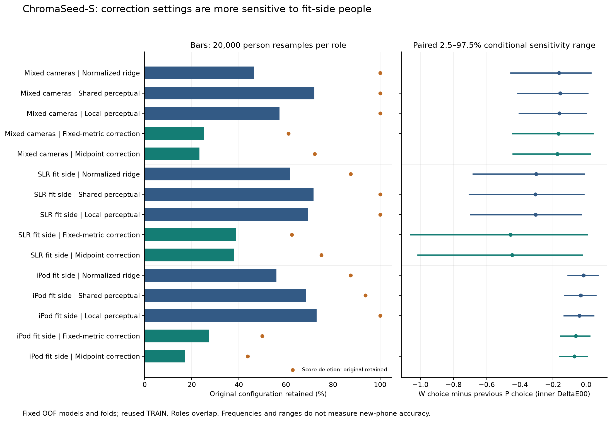

# ChromaSeed-S: people and model-selection sensitivity

**Diagnostic progress; no new accuracy gain or model promoted.** Fixed OOF predictions show that iterative correction settings depend more strongly on fit-side people than static readouts. Yet weak ridge remains strongly preferred on the SLR fit side even when people are resampled; a single influential person does not account for that direction of selection. The cause of the earlier outer regressions is still not established.

The completed [W study](../chromaseed_weak_ridge_v1/report.md) motivated this diagnostic after 13 of 15 matching-family outer comparisons worsened. S does not read those outer predictions, fit new models or choose replacement settings. It studies only the previously saved inner score table.

## What was measured

Nine inner OOF archives; all 891 family-candidate scores reproduce W (maximum difference 1.78e-15). Fit-side groups contain 18, 8 and 16 people, with overlap across roles. Each candidate is scored by averaging its image errors within people, then across the three model seeds. These are separate model runs, not a prediction ensemble.

Remove each person from selection scores once: 210 family decisions. Then make 20,000 camera-stratified person resamples per role: 60,000 shared draws yield 300,000 family decisions. No models are retrained. The main diagnostic took 1.585s excluding interpreter import; this is diagnostic processing time, not training or inference speed.

## All registered groups

| Fit-side role | Family | Single-person deletions changing choice | Original choice retained in bootstrap | Weak alpha (<0.1) selected | Original rank, 95th percentile | Full-OOF regret, 95th percentile |
|---|---|---:|---:|---:|---:|---:|
| Mixed cameras | Normalized ridge | 0/18 | 46.48% | 97.56% | 4 | 0.1686 |
| Mixed cameras | Shared perceptual | 0/18 | 72.08% | 98.23% | 3 | 0.1680 |
| Mixed cameras | Local perceptual | 0/18 | 57.28% | 98.83% | 3 | 0.1523 |
| Mixed cameras | Fixed-metric correction | 7/18 | 25.17% | 99.19% | 11 | 0.1704 |
| Mixed cameras | Midpoint correction | 5/18 | 23.29% | 99.54% | 11 | 0.1670 |
| SLR fit side | Normalized ridge | 1/8 | 61.72% | 99.97% | 5 | 0.1247 |
| SLR fit side | Shared perceptual | 0/8 | 71.74% | 99.99% | 4 | 0.1701 |
| SLR fit side | Local perceptual | 0/8 | 69.54% | 100.00% | 5 | 0.1670 |
| SLR fit side | Fixed-metric correction | 3/8 | 38.88% | 99.97% | 11 | 0.2785 |
| SLR fit side | Midpoint correction | 2/8 | 38.05% | 99.97% | 11 | 0.2690 |
| iPod fit side | Normalized ridge | 2/16 | 56.02% | 61.81% | 4 | 0.1865 |
| iPod fit side | Shared perceptual | 1/16 | 68.43% | 74.41% | 2 | 0.0563 |
| iPod fit side | Local perceptual | 0/16 | 73.02% | 81.22% | 2 | 0.0465 |
| iPod fit side | Fixed-metric correction | 8/16 | 27.28% | 89.42% | 9 | 0.2337 |
| iPod fit side | Midpoint correction | 9/16 | 17.09% | 91.86% | 9 | 0.2423 |

Full-OOF regret is the chosen alternative’s score on the same original OOF table minus the original minimum. It measures the size of a configuration switch; it is not a fresh performance estimate. Exact switches can occur among nearly equivalent settings. Repeated stopped trajectories retain the registered fewer-step tie break.

Static methods change in 4/126 score-deletion cases; iterative families change in 34/84. These counts are descriptive: methods share the same people and are not independent trials. The original correction configuration survives only 17.09–38.88% of bootstrap draws. All 15/15 runner-up paired ranges include zero.

## Fixed paired comparisons to previous P selections

Both configurations stay fixed for each comparison. Lower is better for W. The intervals below are empirical percentile ranges conditional on these fitted predictions, these folds and camera proportions; they are **not population confidence intervals or selection-corrected tests**.

| Fit-side role | Family | W − P inner person mean | Conditional 2.5–97.5% range | Fraction below zero |
|---|---|---:|---:|---:|
| Mixed cameras | Normalized ridge | -0.1640 | [-0.4541, 0.0273] | 92.45% |
| Mixed cameras | Shared perceptual | -0.1576 | [-0.4129, 0.0089] | 96.19% |
| Mixed cameras | Local perceptual | -0.1618 | [-0.4045, 0.0008] | 97.39% |
| Mixed cameras | Fixed-metric correction | -0.1674 | [-0.4455, 0.0413] | 92.77% |
| Mixed cameras | Midpoint correction | -0.1739 | [-0.4414, 0.0242] | 94.89% |
| SLR fit side | Normalized ridge | -0.3021 | [-0.6824, -0.0114] | 97.95% |
| SLR fit side | Shared perceptual | -0.3072 | [-0.7053, -0.0133] | 98.14% |
| SLR fit side | Local perceptual | -0.3043 | [-0.6992, -0.0290] | 98.53% |
| SLR fit side | Fixed-metric correction | -0.4559 | [-1.0586, 0.0072] | 97.29% |
| SLR fit side | Midpoint correction | -0.4464 | [-1.0157, -0.0217] | 98.06% |
| iPod fit side | Normalized ridge | -0.0159 | [-0.1101, 0.0710] | 62.31% |
| iPod fit side | Shared perceptual | -0.0327 | [-0.1315, 0.0577] | 74.39% |
| iPod fit side | Local perceptual | -0.0402 | [-0.1328, 0.0449] | 81.31% |
| iPod fit side | Fixed-metric correction | -0.0632 | [-0.1549, 0.0220] | 91.98% |
| iPod fit side | Midpoint correction | -0.0717 | [-0.1597, 0.0081] | 95.96% |

## Decision

Do not promote a correction count or a new conservative selection rule from this retrospective diagnostic. Shared/local static SLR choices survive every single-person deletion and select weak alpha in approximately 99.99–100% of conditional resamples. Thus restoring the old penalty through a stability rule alone is not supported as a generalization fix. Conversely, iterative configuration switches often concern very small inner score gaps. Neither finding proves what caused the cross-camera loss.

The next useful investigation is a separately registered input/target support diagnostic: quantify camera-group coverage and person-held-out camera predictability in the available color features, with matched color-range controls. That can help distinguish hypotheses about camera processing from changes in people/color distribution. It cannot isolate camera causality in this dataset and is planned, not launched. Preserve the existing stronger models while investigating.

## Verification and limits

Eight synthetic numerical tests pass. An independent audit reconstructed all 12474 candidate/person errors from OOF, all 891 mean scores, 15 original choices, 210 deletion choices, all 60,000 stratified draws and 300,000 bootstrap choices/ranks. It recomputed all 30 paired ranges. Maximum person-score drift 0; maximum paired-gap drift 3.55e-15. The audit uses separate aggregation/selection loops but shares the previously verified CIEDE2000 formula and frozen role helper.

Only the original TRAIN cache was opened, loading target, patient and device arrays. No colors, images, tokens, old validation/calibration/test or outer predictions were loaded. Exported local numerical artifacts use ordinal person axes; no direct patient identifiers. All W/P and earlier source locks are preserved. No model fitting, new data download, deployment or publication occurred.

The fits share training people, so resampling fixed OOF losses omits training and fold-generation uncertainty. Historical reuse and overlapping roles remain. These results establish neither ordinary-phone facial quality, scientific novelty, fairness across skin tones, nor Skolkovo eligibility. The broad compact/fast/high-quality goal remains active.

For the established risk of overfitting selection criteria, see [Cawley and Talbot (2010)](https://www.jmlr.org/papers/v11/cawley10a.html). For limits on universally unbiased cross-validation variance estimation, see [Bengio and Grandvalet (2004)](https://www.jmlr.org/papers/v5/grandvalet04a.html). Neither paper identifies the cause in our dataset.

[Protocol](../../research/chromaseed_selection_stability_v1_protocol.md) · [Reproduce](reproduce.md) · [Audit](audit.json) · [Verification](verification.json) · [Summary](summary.json) · [Next decision](../../research/chromaseed_selection_stability_next_decision.md)
