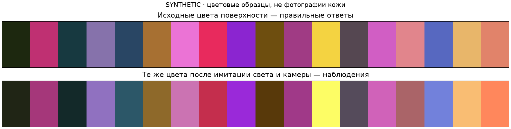
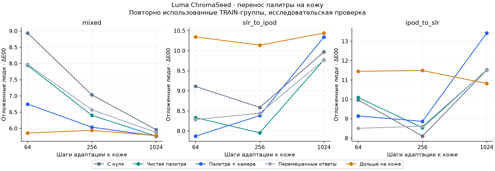

# Luma ChromaSeed v1 — палитра → кожа

Исследовательское имя модели: **Luma ChromaSeed**. Размер всех сравниваемых вариантов — 2749 чисел с нормализацией, 10 996 байт FP32. Учим цветовую основу на синтетических поверхностях, затем проверяем перенос на инструментально размеченные участки кожи.

Это не подтверждение точности на обычных селфи: используются только исходные TRAIN966 фото/24 человека и уже известные пересекающиеся группы. Старые validation/calibration/test не открывались. Ни изображения, ни веса не отправлялись внешним сервисам.

## Предобучение: только синтетика

32 768 обучающих и 4096 отдельных проверочных цветов. Цель — исходный Lab поверхности под D65, наблюдение — чистый или искажённый RGB. Симулятор приблизителен и не моделирует спектральную физику кожи/реального сенсора. Эти ошибки нельзя сравнивать напрямую с ошибками реальной кожи.

| Основа | Чистая синтетическая проверка ΔE00 | С искажениями ΔE00 | Предобучение одной модели, с |
|---|---:|---:|---:|
| Чистая палитра | 0.721 | 7.121 | 2.872 |
| Палитра + камера | 2.317 | 6.743 | 2.518 |
| Перемешанные ответы | 29.617 | 29.636 | 2.551 |

## Перенос с дообучением всей сети

Основная точка — 1024 шага адаптации; batch256. Скорость обучения выбрана только по person-held-out внутренним фолдам, усредняя3 seeds. Предобученные варианты получают ещё2048 шага синтетики. Контроль «Дольше на коже» получает2048 дополнительных шагов реальных данных текущего fit, затем тот же сброс оптимизатора и1024 шага. «Перемешанные ответы» сохраняет вычислительный бюджет синтетики, но разрушает правильное соответствие цвета и ответа.

Ошибка — инструментальный native Lab ΔE00, сначала средняя по человеку, затем по людям; меньше лучше. Значения усредняют отдельные модели по seeds, а не ансамбль.

| Протокол | Вариант | Внутренний ΔE00 | Отложенные люди ΔE00 | По снимкам | Адаптация, с | До неё, с |
|---|---|---:|---:|---:|---:|---:|
| mixed | С нуля | 4.589 | 5.959 | 6.183 | 1.306 | 0.000 |
| mixed | Чистая палитра | 4.562 | 5.760 | 5.975 | 1.172 | 2.872 |
| mixed | Палитра + камера | 4.643 | 5.768 | 6.000 | 1.398 | 2.518 |
| mixed | Перемешанные ответы | 4.545 | 5.875 | 6.101 | 1.361 | 2.551 |
| mixed | Дольше на коже | 4.493 | 5.779 | 6.009 | 1.286 | 2.535 |
| slr_to_ipod | С нуля | 4.819 | 9.970 | 9.970 | 1.371 | 0.000 |
| slr_to_ipod | Чистая палитра | 4.752 | 9.770 | 9.592 | 1.275 | 2.872 |
| slr_to_ipod | Палитра + камера | 4.772 | 10.341 | 10.091 | 1.313 | 2.518 |
| slr_to_ipod | Перемешанные ответы | 4.787 | 9.764 | 9.679 | 1.417 | 2.551 |
| slr_to_ipod | Дольше на коже | 4.842 | 10.440 | 10.242 | 1.312 | 2.628 |
| ipod_to_slr | С нуля | 4.665 | 11.508 | 11.719 | 1.319 | 0.000 |
| ipod_to_slr | Чистая палитра | 4.660 | 11.526 | 11.730 | 1.266 | 2.872 |
| ipod_to_slr | Палитра + камера | 4.680 | 13.420 | 13.766 | 1.280 | 2.518 |
| ipod_to_slr | Перемешанные ответы | 4.611 | 11.511 | 11.712 | 1.444 | 2.551 |
| ipod_to_slr | Дольше на коже | 4.541 | 10.824 | 11.009 | 1.313 | 2.608 |

На графике показаны дополнительные шаги адаптации, а не полная стоимость обучения. LR для всех трёх точек один, выбран по внутренней1024-точке; ранние точки не имеют отдельного подбора. Предобучение и дополнительная реальная тренировка не бесплатны.

## Замороженная основа + аналитические выходные веса

Здесь скрытый слой вообще не дообучается на коже. Веса выхода вычисляются через ridge, а вспомогательная нормализация признаков поглощается весами. Объём модели остаётся прежним. Случайная основа — обязательный контроль: если она не хуже цветовой, выигрыш нельзя приписать палитре.

| Протокол | Основа | Отложенные люди ΔE00 | CPU fit, мс |
|---|---|---:|---:|
| ipod_to_slr | Чистая палитра | 13.880 | 0.950 |
| ipod_to_slr | Случайная основа | 10.722 | 0.953 |
| ipod_to_slr | Палитра + камера | 13.983 | 0.969 |
| ipod_to_slr | Перемешанные ответы | 11.567 | 1.010 |
| mixed | Чистая палитра | 5.978 | 1.189 |
| mixed | Случайная основа | 5.889 | 1.222 |
| mixed | Палитра + камера | 5.894 | 1.043 |
| mixed | Перемешанные ответы | 5.807 | 1.131 |
| slr_to_ipod | Чистая палитра | 9.432 | 0.596 |
| slr_to_ipod | Случайная основа | 10.136 | 0.548 |
| slr_to_ipod | Палитра + камера | 9.754 | 0.519 |
| slr_to_ipod | Перемешанные ответы | 10.826 | 0.590 |

Время analytic-head серии записывалось при параллельно работающем основном GPU-эксперименте. Это ориентир реализации, не выделенный benchmark CPU. Код NumPy float64, один поток BLAS. Общая стоимость цветового предобучения учитывается отдельно.

## Цена эксперимента и воспроизводимость

Генерация палитры: 3.44 с; сумма9 synthetic fits: 23.82 с. 486 реальных training traces (включая отдельные warmups), сумма fit-времени 684.79 с, wall time основной real-fit фазы 699.11 с. Вторичная frozen-head фаза: 4.09 с. Это измерения RTX4060/локального CPU по готовым36 признакам, без извлечения лица и фотографических признаков.

Никакого выбора renderer strength, числа pretrain steps или итогового варианта по внешним данным не выполнялось. Сохранены отрицательные контроли,3 seeds, кривые и zero-shot диагностика. Подтверждение на новых лицах и новом освещении остаётся отдельной задачей.

Связанные идеи известны: [domain randomization](https://arxiv.org/abs/1703.06907); [нелинейная обработка камеры после white balance](https://openaccess.thecvf.com/content_CVPR_2019/html/Afifi_When_Color_Constancy_Goes_Wrong_Correcting_Improperly_White-Balanced_Images_CVPR_2019_paper.html). Работы не воспроизводились целиком, сторонние модели/данные не загружались. Название рабочее, наличие прав на товарный знак не проверялось.

[Основной протокол](../../research/chromaseed_v1_protocol.md) · [Протокол замороженной основы](../../research/chromaseed_frozen_protocol.md) · [Точные агрегаты](summary.json) · [Независимый аудит](audit.json)
