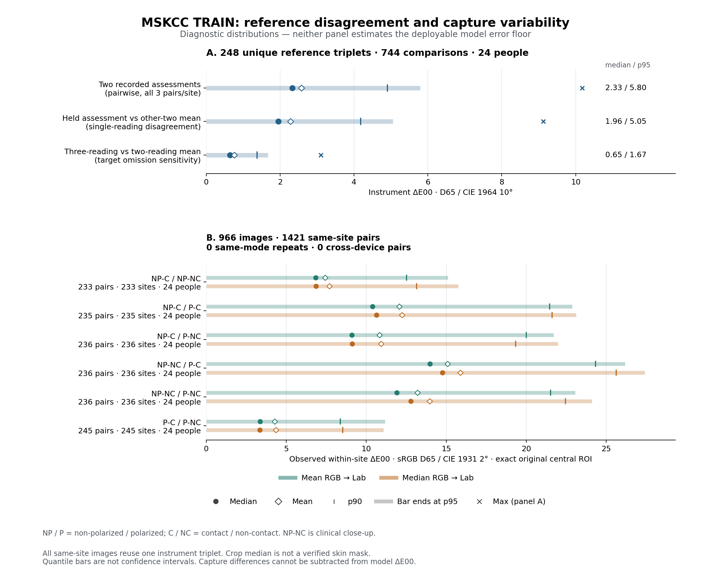

# Luma — MSKCC: diagnostic error-floor audit

Дата: 15 сентября 2026. Статус: измерения reference/capture завершены; декомпозиция ошибок C заблокирована отсутствием сохранённых OOF predictions. Новых моделей, quality predictor и обучения нет. Приведённые ниже результаты — новый диагностический расчёт на восстановленных исходных данных, не новый датасет и не проверка селфи.

| Диагностика ΔE00 | n | mean | median | p90 | p95 | max |
| --- | --- | --- | --- | --- | --- | --- |
| Прибор: пары записанных assessments | 744 | 2.576 | 2.333 | 4.900 | 5.796 | 10.174 |
| Один assessment против среднего двух других | 744 | 2.281 | 1.956 | 4.183 | 5.052 | 9.123 |
| Изменение среднего target при исключении одного assessment | 744 | 0.761 | 0.647 | 1.376 | 1.672 | 3.100 |

Эти три величины отвечают на разные вопросы. Ни pairwise disagreement отдельных измерений, ни чувствительность среднего к удалению одного измерения не являются установленной минимальной ошибкой модели относительно среднего target. ΔE00 нельзя вычитать из ΔE00 для разложения ошибки.

## 1. Что восстановлено и что сохранено

В начале этого запуска временная рабочая папка была пуста. Восстановлены исходный commit 9cad271aad159d73083259967b4107b2ce828eb1, шесть исходных файлов метаданных с точным совпадением прежних SHA256, затем только разрешённые TRAIN-фотографии. Рецепт роли TRAIN взят из неизменённого skin_mskcc_data.patient_roles и проверен по исходному split_receipt. Новые folds не создавались; private_folds.json и прежний архив C здесь отсутствуют. Для описательного анализа TRAIN fold назначения не требуются.

| Объект | Состав |
| --- | --- |
| TRAIN | 966 изображений; 24 человека; 248 уникальных patient + tag_id |
| Приборные данные | 248 троек / 744 записанных assessments; 744 зависимых pairwise сравнений |
| Фотографии на site | 232 site × 4; 7 × 3; 8 × 2; 1 × 1 |
| Тип изображения | 729 dermoscopic; 237 clinical: close-up |
| Камеры | 643 iPod / 16 человек; 323 SLR / 8 человек |
| Повторные фото | 1 421 пара одного exact site; 0 пар одинакового режима; 0 пар разных камер одного site |

Файлы S1/S2 используются только для принадлежности роли, устройства и exact site. Демография не включена в отчёт. Численные endpoint-значения вне TRAIN не анализировались. Source-validation, calibration и historical test не использовались для подбора или новых оценок. Фото, прямые ISIC/patient/tag IDs, секреты и веса моделей не включены в аналитическую поставку. C и inference не переобучались и не заменялись; отсутствующие прежние checkpoint нельзя назвать заново проверенными.

## 2. Конвенции и качество reference

Прибор: SkinColorCatch; сохранённый source_context фиксирует конвенцию производителя D65 / CIE 1964 10°. Это provenance из прежней проверки, а не индивидуальный сертификат прибора или повторная калибровка. Сравнения прибор–прибор используют CIEDE2000, kL=kC=kH=1. Наблюдаемый Lab рассчитывается из sRGB с D65 [0.95047, 1, 1.08883] / CIE 1931 2°. Прямой ΔE00 между наблюдаемым Lab 2° и приборным Lab 10° не вычислялся.

S4 описывает 1-й, 2-й и 3-й colorimeter assessments; словарь называет таблицу анализом межоценочного согласия. В данных нет времён, операторов, переустановки прибора или независимых сессий. Поэтому измерена вариативность записанных assessments, а статистическая независимость повторов и чистый шум прибора не установлены. Все экспортированные L*, a*, b* повторов целочисленны; это дискретизация опубликованных значений, не доказательство аппаратной точности 1 Lab.

| |Разность координат| | mean | median | p90 | p95 | max |
| --- | --- | --- | --- | --- | --- |
| L* | 1.290 | 1.000 | 3.000 | 4.000 | 9.000 |
| a* | 1.511 | 1.000 | 3.000 | 4.000 | 8.000 |
| b* | 1.683 | 1.000 | 4.000 | 5.000 | 7.000 |

| Within-site SD трёх assessments | mean | median | p90 | p95 | max |
| --- | --- | --- | --- | --- | --- |
| L* | 1.048 | 1.000 | 2.082 | 2.517 | 4.726 |
| a* | 1.221 | 1.155 | 2.309 | 2.887 | 4.359 |
| b* | 1.360 | 1.155 | 2.517 | 3.055 | 4.041 |

Среднее pairwise ΔE00 с равным весом людей: 2.566; bootstrap 95% CI [2.362; 2.774], 10 000 перевыборок 24 людей, seed 73019. 744 пары не трактуются как 744 независимых человека. Signed-гистограммы по каждой координате сохранены отдельно в instrument_signed_coordinate_histogram.csv.

| Анатомическая группа | sites | людей | pair mean | median | p95 |
| --- | --- | --- | --- | --- | --- |
| abdomen | 24 | 24 | 1.845 | 1.728 | 4.436 |
| dorsal forearm | 21 | 21 | 2.816 | 2.418 | 5.973 |
| head/neck | 23 | 23 | 2.070 | 2.031 | 4.563 |
| lower back | 22 | 22 | 2.195 | 2.072 | 4.635 |
| lower leg | 46 | 24 | 2.614 | 2.463 | 5.443 |
| palms/soles | 22 | 22 | 3.662 | 3.332 | 7.576 |
| upper back | 23 | 23 | 2.766 | 2.352 | 5.883 |
| upper chest | 24 | 24 | 2.397 | 1.881 | 5.642 |
| ventral forearm | 43 | 23 | 2.732 | 2.508 | 6.109 |

## 3. Site repeatability: общая разметка вместо повторного reference

Для каждого из 248 exact tag_id существует ровно одна строка S4. Каждая тройка S7 на фотографиях точно равна тройке этого site в S4. Между 1 421 парами фотографий одного site target ΔE00 mean=median=p95=max=0. Это буквальное повторное использование одной разметки. Независимых повторных reference-acquisitions одного site нет; временная и межсессионная site-repeatability не идентифицируется. Разные анатомические участки одного человека не объединялись.

## 4. Image repeatability: фактически измеренная вариативность capture

JPEG: EXIF transpose, встроенный ICC → sRGB (если имеется), центральный квадрат int(0.8 × min(width,height)), исходные пиксели для среднего/медианы RGB. Отдельно Lanczos 128×128 для color36: 27 квантилей RGB, 3 mean, 3 population SD, корреляции RG/RB/GB. Это восстановленный контракт; побитовое совпадение с утраченным C-cache не заявляется. Медиана центрального crop — robust pixel statistic, а не проверенная skin-only mask. Face parser к дерматоскопии не применялся.

| Разность same-site изображений | n pairs | mean | median | p90 | p95 | max |
| --- | --- | --- | --- | --- | --- | --- |
| Центральный ROI mean RGB → Lab | 1421 | 10.447 | 8.848 | 20.453 | 22.899 | 34.287 |
| Центральный ROI median RGB → Lab | 1421 | 10.809 | 9.135 | 21.009 | 23.706 | 34.751 |
| color36: raw RMS (не ΔE) | 1421 | 0.092 | 0.073 | 0.195 | 0.213 | 0.315 |
| color36: TRAIN-z RMS (не ΔE) | 1421 | 0.683 | 0.562 | 1.331 | 1.468 | 2.841 |

Observed ΔE00 в этой таблице — различие изображение–изображение в одной конвенции 2°, не ошибка модели и не приборная цветовая ошибка. Target в каждой паре одинаков из-за общей тройки S4; это не означает, что физическая кожа и измерение повторно проверялись в момент каждого кадра.

| Capture pair | pairs | sites | людей | mean ROI ΔE mean | median | p95 | median ROI ΔE median |
| --- | --- | --- | --- | --- | --- | --- | --- |
| NP-C / NP-NC | 233 | 233 | 24 | 7.425 | 6.842 | 15.093 | 6.853 |
| NP-C / P-C | 235 | 235 | 24 | 12.065 | 10.388 | 22.862 | 10.638 |
| NP-C / P-NC | 236 | 236 | 24 | 10.829 | 9.106 | 21.705 | 9.119 |
| NP-NC / P-C | 236 | 236 | 24 | 15.083 | 13.973 | 26.168 | 14.763 |
| NP-NC / P-NC | 236 | 236 | 24 | 13.204 | 11.918 | 23.064 | 12.784 |
| P-C / P-NC | 245 | 245 | 24 | 4.282 | 3.375 | 11.172 | 3.343 |

NP-C: contact non-polarized dermoscopy; P-C: contact polarized dermoscopy; P-NC: non-contact polarized dermoscopy; NP-NC: clinical close-up. Это шесть сравнений разных режимов, а не тест повторяемости одинакового capture. Контакт и поляризация изменяют оптическое изображение; данные не разделяют эффекты давления, бликов, освещения, ISP и экспозиции.

| Группа пар | pairs | sites | людей | mean ROI ΔE mean | median | p95 |
| --- | --- | --- | --- | --- | --- | --- |
| SLR | 469 | 84 | 8 | 13.457 | 14.456 | 24.179 |
| ipod | 952 | 163 | 16 | 8.965 | 7.766 | 20.266 |
| clinical: close-up / dermoscopic | 705 | 237 | 24 | 11.923 | 10.509 | 23.938 |
| dermoscopic / dermoscopic | 716 | 246 | 24 | 8.994 | 6.626 | 21.501 |

iPod и SLR принадлежат разным людям: различие cohort-метрик нельзя приписать только устройству. Все подробные анатомические группы, равные веса sites/людей, clipping/brightness и диагностические характеристики сохранены в capture.json. Profile/orientation counts: {"absent_assumed_sRGB": 966}; EXIF {"1": 966}.

| Site reference variability ↔ capture variability | n sites | Pearson r | Spearman ρ |
| --- | --- | --- | --- |
| Центральный ROI mean RGB → Lab | 247 | -0.193 | -0.183 |
| Центральный ROI median RGB → Lab | 247 | -0.189 | -0.179 |
| color36: raw RMS (не ΔE) | 247 | -0.114 | -0.125 |
| color36: TRAIN-z RMS (не ΔE) | 247 | -0.084 | -0.099 |

Это описательные корреляции 247 sites с несколькими фото, вложенных в 24 человека. Они не являются корреляциями с ошибкой C, доказательством причинности или независимыми p-values.

## 5. Oracle baselines — LEAKY_DIAGNOSTIC_ONLY

| Oracle | coverage | mean | median | p95 |
| --- | --- | --- | --- | --- |
| Среднее других изображений exact site | 99.90% | 0.000 | 0.000 | 0.000 |
| Ближайшее observed изображение exact site | 99.90% | 0.000 | 0.000 | 0.000 |
| Среднее других уникальных sites того же человека | 100.00% | 5.004 | 4.280 | 10.895 |
| Тот же человек + камера, другие sites | 100.00% | 5.004 | 4.280 | 10.895 |
| Та же камера + anatomical region, другие sites | 100.00% | 10.139 | 8.476 | 24.451 |
| Exact site после исключения общей reference-acquisition | 0.00% | — | — | — |

Два нулевых oracle имеют один и тот же shared target: это тавтология, а не достижимая точность нового человека. Nearest выбирается по авторскому median image Lab; неизвестный observer этого поля не используется для cross-observer ΔE. Patient-oracle исключает весь target site и усредняет другие уникальные sites с равными весами, не фотографии. Camera-поправка к нему ничего не меняет из-за person–camera confounding. Эти oracle не дают формальной нижней границы deployable ошибки.

## 6. Контрфактические срезы: определения зафиксированы до чтения C errors

Фиксированные описательные правила: оставить sites с mean приборных pairwise ΔE ≤ site-p80 (3.563); отдельно sites с mean pairwise median-ROI ΔE ≤ site-p80 (15.085); отдельно изображения с high-clip + low-clip ≤ image-p80 (0.004320). Все ties включаются. Site с одним фото не имеет измеренной capture-вариативности. Сумма high/low clipping — явно указанный proxy; пиксель с разными saturated каналами может учитываться дважды.

| LEAKY_DIAGNOSTIC_ONLY срез | images | sites | coverage | reference pair median | reference pair p95 | C median / p95 |
| --- | --- | --- | --- | --- | --- | --- |
| Все TRAIN | 966 | 248 | 100.00% | 2.333 | 5.796 | не вычислено: OOF отсутствует |
| Менее вариативные reference-sites | 774 | 198 | 80.12% | 2.012 | 4.293 | не вычислено: OOF отсутствует |
| Менее вариативные capture-sites | 765 | 197 | 79.19% | 2.343 | 6.054 | не вычислено: OOF отсутствует |
| Меньший clipping proxy | 773 | 241 | 80.02% | 2.332 | 5.868 | не вычислено: OOF отсутствует |
| Reference ∩ capture | 601 | 154 | 62.22% | 2.034 | 4.340 | не вычислено: OOF отсутствует |
| Reference ∩ capture ∩ clipping | 494 | 153 | 51.14% | 2.025 | 4.344 | не вычислено: OOF отсутствует |

Эти фильтры используют reference и повторные изображения, поэтому не являются quality gate для одной фотографии. Основные 966 строк не удалялись и основная метрика не переопределялась. Снижение reference variability на отобранных sites не доказывает снижение ошибки C. Контрфактическое удаление латентного instrument noise невозможно наблюдать напрямую; не выполнялись вычитание ΔE, псевдоочистка labels или оптимистичная замена истины ближайшим к prediction reading.

## 7. Что известно об ошибке C и что пока не измерено

Из предыдущей принятой поставки известны агрегаты C: OOF mean 5.050436, median 4.423216, p95 11.007970; >5 — 41.5114%, >10 — 7.4534%. Это исторические числа, не пересчитанные в данном аудите. Они не подменяют per-image predictions. Близкий p95 patient-oracle 10.895 не доказывает, что именно анатомия создаёт хвост C: требуется paired разбор тех же строк.

| Запрошенный разбор C | Статус |
| --- | --- |
| Patient/site/camera/type/anatomy/target L*/brightness/clipping correlations | BLOCKED: нет сохранённых OOF predictions |
| Группы, создающие p95 ≈ 11; top 50 ошибок с обезличенными IDs | BLOCKED: невозможно восстановить из mean/median/p95 |
| C на стабильных reference/capture срезах; reference perturbation при фиксированных predictions | BLOCKED: нужен исходный per-image OOF |
| Проверка C ↔ observed Lab | Будет coordinate proxy с явными разными observers; не физический cross-observer ΔE |
| Основная модель и inference | Не обучались, не изменялись и не заменялись |

Точный недостающий ресурс: LUMA_TRAIN_OOF_C.zip, файл experiment/private_review/oof_anonymized.npz. Предыдущие локальные commits 314d715 / ce64e8a и артефакты C не найдены в восстановленном GitHub. Реализован c_oof_audit.py: принимает явные названия NPZ keys, проверяет перестановку original row indices, target equality и взаимно-однозначное соответствие patient groups, затем считает требуемые residual tables и top 50. Код проверен на искусственном fixture; это проверка анализатора, не выполненный анализ C. Повторное обучение для восстановления predictions запрещено текущим заданием и не запускалось.

## 8. Решение и измеримый предел вывода

Честный итог этого состояния: FINAL A/B/C DECISION BLOCKED, а не MODEL-LIMITED или DATA/CAPTURE-LIMITED с выдуманной долей ошибки. Приборные записи и capture действительно вариативны, но их вклад в residual C пока не установлен. Даже после получения OOF этот observational dataset не позволит без дополнительных допущений причинно разделить ошибку на точные проценты instrument, camera и estimator.

Численно установлено: отдельные readings расходятся с median 2.333 и p95 5.796; средний target чувствителен к удалению одного reading с median 0.647 и p95 1.672; observed mean-ROI различие одного site между режимами имеет median 8.848 и p95 22.899. Независимых повторных site-reference acquisitions — 0, одинаковых-mode image repeats — 0. Эти числа подтверждают ограничения измерения, но не устанавливают точность после идеального удаления шума.

Следующее действие владельца одно: прикрепить LUMA_TRAIN_OOF_C.zip. После этого анализатор сможет закончить привязку хвоста ошибок C к sites/capture и диагностическим срезам без обучения модели, изменения inference или обращения к reserved endpoints. До paired residual анализа нет численного основания продвигать новый estimator или обещать достижение median≤2/p95≤5 на 80% фото, тем более селфи.

## 9. Воспроизведение и состав доказательств

```bash
git clone https://github.com/LITVA-HUB/luma-skin-vision-rnd.git
cd luma-skin-vision-rnd
git checkout 9cad271aad159d73083259967b4107b2ce828eb1
# Добавить только новые scripts/error_floor из аналитического пакета.
python scripts/error_floor/restore_metadata.py
PYTHONPATH=src python scripts/error_floor/instrument_audit.py --output ../error_floor
python scripts/error_floor/restore_train_images.py
PYTHONPATH=src python scripts/error_floor/capture_audit.py --rows ../error_floor/audit_train_rows.private.json --output ../error_floor/capture --workers 2
PYTHONPATH=src python scripts/error_floor/reference_capture_counterfactuals.py --audit ../error_floor
python scripts/error_floor/plot_audit.py --instrument ../error_floor/instrument.json --capture ../error_floor/capture/capture.json --output ../error_floor/figures
python scripts/error_floor/build_report.py --audit ../error_floor --output ../error_floor/report
```

CPU, Python 3.12.14; NumPy 2.3.5, SciPy 1.17.0, Pillow 12.3.0, Matplotlib 3.10.8. Реальные выполненные команды и результаты запуска сохранены в COMMANDS.md и logs. MANIFEST_SHA256.json фиксирует вложенные файлы. В анонимном NPZ сохранены рассчитанные признаки и три приборных assessment, чтобы продолжить аудит без повторного скачивания фотографий. Это численные производные данных, не изображения участников и не новые instrument labels.

Источники: исходный MSKCC skin-tone-labeling release DOI 10.34970-962049; https://isic-archive.s3.amazonaws.com/dois/10.34970-962049/mskcc-skin-tone-labeling-dataset.csv ; supplements/s1.csv, s2.csv, s4.csv, s7.csv и supplemental-data-dictionary.txt того же release. Научная публикация DOI 10.1038/s41746-025-02245-2. Первичные права, конвенции и прежние receipts: docs/data/provenance/mskcc_skin_v1 в исходном repository. Данные CC-BY; атрибуция оригинальному MSKCC/ISIC release сохраняется. Перечень прав и SHA скопирован из прежнего provenance, исходные фотографии не распространяются.


