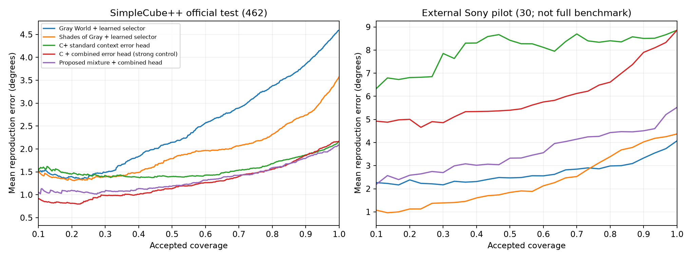
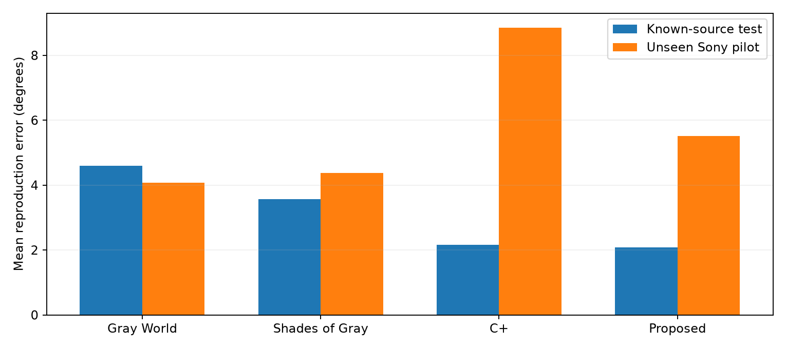

# Public real-data color-constancy milestone

All numerical model rows below are **REPRODUCED LOCALLY**. Units are degrees; lower is better. No physical ΔE00 or facial accuracy is measured. Seed mean ± sample standard deviation over 17/29/43, not a confidence interval and not an ensemble.

## Real data and license

SimpleCube++ v 2:2234 real images; official test 462; development 1126 estimator train /119 validation /259 risk-fit /268 calibration. Original data CC BY4.0, publisher MD5 verified. Additional 20MB Cube++ metadata supplies capture dates/camera labels. Sony pilot:30 author-selected C5-redistributed INTEL-TAU examples (13,826,580 bytes including JSON), original dataset CC BY-SA4.0; evaluation only. Original INTEL-TAU archives were inaccessible and the full benchmark was not run. See [inventory](../data/public_dataset_inventory.md), [attribution](PUBLIC_DATA_NOTICE.md), [protocol](../research/public_protocol_v1.md).

Official test contains 66 capture dates also present in development; no exact image-byte duplicates were found. This split is publisher-compatible, not scene-independent. Internal estimator/validation/risk/calibration dates are disjoint. Test scenes were not semantically deduplicated. No camera identity/CCM/test-set adaptation enters prediction; raw decoding does use sensor-level white metadata.

## Official SimpleCube++ results

| Method | Recovery mean | Reproduction mean | Reproduction median | Risk at 80% | AURC |
|---|---:|---:|---:|---:|---:|
| Gray World + learned selector | 3.476 ± 0.000 | 4.592 ± 0.000 | 2.971 ± 0.000 | 3.368 ± 0.043 | 2.451 ± 0.074 |
| Max RGB + learned selector | 4.895 ± 0.000 | 5.657 ± 0.000 | 3.038 ± 0.000 | 3.352 ± 0.009 | 2.429 ± 0.035 |
| Shades of Gray + learned selector | 2.758 ± 0.000 | 3.573 ± 0.000 | 1.778 ± 0.000 | 2.316 ± 0.021 | 1.900 ± 0.049 |
| Gray Edge + learned selector | 2.967 ± 0.000 | 3.887 ± 0.000 | 2.124 ± 0.000 | 2.638 ± 0.086 | 2.151 ± 0.126 |
| C+ standard context error head | 1.655 ± 0.035 | 2.166 ± 0.061 | 1.065 ± 0.107 | 1.678 ± 0.085 | 1.569 ± 0.178 |
| C + disagreement-only head | 1.655 ± 0.035 | 2.166 ± 0.061 | 1.065 ± 0.107 | 1.657 ± 0.090 | 1.241 ± 0.031 |
| C + combined error head (strong control) | 1.655 ± 0.035 | 2.166 ± 0.061 | 1.065 ± 0.107 | 1.556 ± 0.072 | 1.260 ± 0.119 |
| Mixture + context-only head | 1.573 ± 0.061 | 2.085 ± 0.071 | 0.979 ± 0.077 | 1.809 ± 0.137 | 1.915 ± 0.575 |
| Mixture + disagreement-only head | 1.573 ± 0.061 | 2.085 ± 0.071 | 0.979 ± 0.077 | 1.676 ± 0.068 | 1.435 ± 0.159 |
| Proposed mixture + combined head | 1.573 ± 0.061 | 2.085 ± 0.071 | 0.979 ± 0.077 | 1.586 ± 0.048 | 1.333 ± 0.145 |

Classical estimates are deterministic; their learned selectors share the corresponding baseline encoder. They therefore incur CNN compute for rejection. C+ uses a standard context error head. The combined-error control tests whether the special mixture adds anything beyond error-head features. Same stored capacity 966,760 parameters; baseline active 964,131 versus Proposed 966,760. No imported pretrained weights or claimed FC4/C5 paper reproduction.

## Fixed diagnostic coverage

| Accepted target | C+ | Strong combined control | Proposed |
|---|---:|---:|---:|
| 100% | 2.166 ± 0.061 | 2.166 ± 0.061 | 2.085 ± 0.071 |
| 95% | 1.970 ± 0.130 | 2.016 ± 0.028 | 1.912 ± 0.024 |
| 90% | 1.867 ± 0.150 | 1.855 ± 0.049 | 1.790 ± 0.065 |
| 80% | 1.678 ± 0.085 | 1.556 ± 0.072 | 1.586 ± 0.048 |
| 70% | 1.535 ± 0.021 | 1.398 ± 0.067 | 1.424 ± 0.088 |
| 60% | 1.429 ± 0.127 | 1.266 ± 0.067 | 1.319 ± 0.154 |

At 80% the accepted count is 369/462 =79.87% (floor convention). Full curves are stored per run; fixed-coverage ranking is descriptive, not a deployment threshold. Best/worst quartiles use ceil(n/4); trimean uses NumPy linear percentile convention.

## Camera transfer

| Protocol / method | Reproduction mean | Risk 80 | Frozen source 80 threshold: coverage / risk |
|---|---:|---:|---|
| Sony 30 / Gray World + learned selector | 4.073 ± 0.000 | 2.987 ± 0.248 | 54.4% / 2.556 ± 0.265 |
| Sony 30 / Shades of Gray + learned selector | 4.371 ± 0.000 | 3.389 ± 0.285 | 20.0% / 0.746 ± 0.495 |
| Sony 30 / C+ standard context error head | 8.859 ± 0.785 | 8.402 ± 0.336 | 51.1% / 8.455 ± 0.930 |
| Sony 30 / C + combined error head (strong control) | 8.859 ± 0.785 | 6.612 ± 0.566 | 22.2% / 5.151 ± 0.796 |
| Sony 30 / Proposed mixture + combined head | 5.520 ± 0.339 | 4.430 ± 0.320 | 48.9% / 3.181 ± 0.701 |
| 550D→600D / Gray World + learned selector | 2.991 | 2.193 | 79.1% / 2.167 |
| 550D→600D / Shades of Gray + learned selector | 2.869 | 1.966 | 79.9% / 1.966 |
| 550D→600D / C+ standard context error head | 2.983 | 2.637 | 96.2% / 2.884 |
| 550D→600D / C + combined error head (strong control) | 2.983 | 2.080 | 91.7% / 2.470 |
| 550D→600D / Proposed mixture + combined head | 2.848 | 1.891 | 82.2% / 1.896 |

550D→600D uses 829 train /72 validation /67 risk-fit /25 calibration and 931 held-out 600D images with no source-development date overlap. Both models have the same sensor type; this is limited held-out-camera evidence. The 25-image calibration subset is particularly weak. Sony is a different sensor, but only 30 author-selected samples and unknown scene dependence. Neither protocol establishes generalization to arbitrary phones/ISPs. Source-calibrated error estimates can remain badly wrong on unseen cameras.

## Tails and uncertainty of the comparison

| Method (seed 17) | Reproduction p 95 | Worst 25 mean | >10° fraction | >20° fraction |
|---|---:|---:|---:|---:|
| Shades of Gray + learned selector | 12.512 | 9.586 | 9.5% | 1.3% |
| C+ standard context error head | 8.250 | 6.058 | 3.0% | 0.0% |
| C + combined error head (strong control) | 8.250 | 6.058 | 3.0% | 0.0% |
| Proposed mixture + combined head | 9.614 | 6.211 | 4.5% | 0.0% |

Paired 2000-resample capture-date bootstrap, primary seed 17, Proposed minusbaseline_context: full mean difference 95% CI[-0.3727973715935649, 0.20191141526638873]; risk 80 difference 95% CI[-0.5624586155795368, 0.1688899453223474]. Negative favors Proposed. Conditional on this data/model; not a model-training uncertainty bound.

Paired 2000-resample capture-date bootstrap, primary seed 17, Proposed minusbaseline_combined: full mean difference 95% CI[-0.3727973715935649, 0.20191141526638873]; risk 80 difference 95% CI[-0.2811689596591885, 0.25378696688281627]. Negative favors Proposed. Conditional on this data/model; not a model-training uncertainty bound.

## Hardware

| Model seed 17 | Active / stored parameters | Checkpoint MB | Training peak allocated MB | Model-only batch 1 median ms | Inference peak allocated MB |
|---|---:|---:|---:|---:|---:|
| baseline | 964131 / 966760 | 3.991 | 618.9 | 3.181 | 16.9 |
| proposed | 966760 / 966760 | 3.991 | 619.0 | 3.300 | 16.9 |

RTX4060 8GB, FP32, input 128×128, 60 epochs each. Training peak includes 419MB cached image tensors; CUDA allocator measurements exclude driver/context and unrelated processes. Model-only timings exclude decode, expert bank, transfers and error head; see separate full-path profile. No TensorRT/quantization/public-model ONNX export was performed because special-mechanism advantage is not established.

## Interpretation and next decision

A real compact normalization component has now been measured against real illumination references. Selective ranking can reduce within-source error. This does not prove physical surface/skin color reconstruction, cosmetic shade matching, reliable rejection under domain shift, or patentable novelty. Reproduction angular error concerns residual neutral cast, not a measured ΔE00 over scene surfaces.

The mixture must beat the strong combined control and C+, with stable tail/generalization behavior, to justify continued development. Small point-estimate differences are not evidence of an innovation. Preserve every negative result; prioritize the ordinary compact estimator plus robust error calibration and genuinely diverse permissively licensed cameras, rather than expanding the mixture or tuning this test set. Proprietary facial validation stays future work and is not a prerequisite for the next public-data iteration.

Published author numbers: **not included as locally reproduced rows**. FC4/Reweight-CC/C5/CCMNet/uncertainty 2025/VLM-CC/GC3/GCC/BRE are documented prior-art comparators; no exactly compatible paper-number reproduction is claimed. Camera-blind raw input here differs from camera-CCM, multi-image or foundation-model protocols.

## Measured full input path

Unoptimized FP32 from compressed PNG bytes in RAM, including decode, sensor normalization, mask, resize, expert bank where needed, transfers, CNN, error head and diagonal image correction. Disk I/O and facial analysis excluded.

| Method | Median ms | p 95 ms | CPU expert bank median ms |
|---|---:|---:|---:|
| C+ standard context error head | 23.21 | 24.23 | 0.01 |
| C + combined error head (strong control) | 65.14 | 66.09 | 41.87 |
| Proposed mixture + combined head | 69.00 | 72.90 | 43.12 |

**Decision: the special mixture has not beaten the strongest baseline on the primary selective endpoint.** The ordinary estimator with combined risk features is better at 80/70/60% coverage on the three-seed average. The full-coverage point gain and limited same-sensor camera result are recorded, but do not establish robust superiority. No new patent/novelty claim follows.

## Reproducibility and protocol accounting

All eight checkpoints and data-cache hashes are recorded. Training source hashes differ only because Ruff wrapped the Sony decoder line; the exact old full source hash was reconstructed, its Python AST equals the current version, and the [source snapshot/diff](source_snapshots/verification.json) is retained. No model, preprocessing, split or optimizer behavior changed between seed pairs.

Oracle lower-bound curves and uniform-random expected risk are [diagnostic controls](public_oracle_controls.json), never deployable methods. [Transfer bootstrap](public_transfer_bootstrap.json) adds primary-seed 2000-resample Sony-image and Canon-date comparisons. Sony image bootstrap assumes independent examples despite unknown scene grouping; treat it as conditional pilot uncertainty, not a population claim.

Executed ablations isolate context/disagreement/combined risk features and mixture removal under matched backbones. Not executed: recovery-error-target head, brightness augmentation off, larger 1–5M capacity sweep, faithful named-paper training, full scene-independent INTEL-TAU protocol, calibrated physical surfaces. These remain follow-up experiments; the bounded v 1 is not an exhaustive model search.
