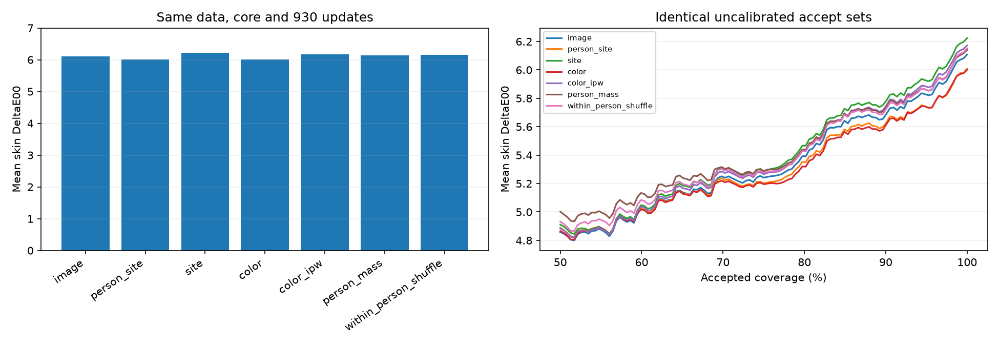

# Native skin-color allocation: matched results and confounding controls

21 REPRODUCED LOCALLY fits: initial15 plus six subsequently frozen person-mass
controls. Actual original MSKCC skin images and instrument-native Lab. Same18
training people and fixed six-person/232-image internal holdout;930 updates each.
Only original TRAIN loaded. This cohort was TRAIN in older experiments, so these
are exploratory results, not fresh independent or unseen-phone measurements.
All group values average three individual model runs, not ensemble predictions.

| Sampler | Mean | Median | p95 | Patient mean | Site mean | At80% | Above10 |
|---|---:|---:|---:|---:|---:|---:|---:|
| image | 6.1082 | 5.1353 | 14.9960 | 5.9237 | 6.0666 | 5.3918 | 15.37% |
| person_site | 6.0084 | 4.9119 | 14.3638 | 5.8129 | 5.9673 | 5.3496 | 14.37% |
| site | 6.2240 | 5.3056 | 15.2028 | 6.0072 | 6.1811 | 5.4664 | 16.38% |
| color | 6.0012 | 5.1767 | 14.2733 | 5.8156 | 5.9630 | 5.3187 | 14.22% |
| color_ipw | 6.1729 | 5.1754 | 14.6528 | 5.9757 | 6.1312 | 5.4306 | 16.09% |
| person_mass | 6.1407 | 5.1396 | 14.7468 | 5.9432 | 6.0991 | 5.4385 | 14.51% |
| within_person_shuffle | 6.1522 | 5.2643 | 14.6378 | 5.9447 | 6.1089 | 5.4265 | 15.37% |

Color allocation modestly improves the image-uniform control, but its mean
is almost tied with ordinary person/site balancing. Do not describe that as a
strong general accuracy or novelty win. p95 is the average of per-fit quantiles.
All fixed100/95/90/80/70/60% results are retained per fit and full curves in CSV.

## Matched differences

Negative favors color allocation. Intervals describe patient-balanced differences
using six patient clusters and10,000 draws after seed averaging. They do not
describe image-weighted differences, and are neither independent confirmation
nor multiplicity-adjusted inference.

| Color vs control | Image difference | Patient difference | Patient interval |
|---|---:|---:|---|
| image | -0.1071 | -0.1080 | [-0.2513, 0.0096] |
| person_site | -0.0073 | 0.0028 | [-0.0624, 0.0743] |
| site | -0.2228 | -0.1916 | [-0.4534, 0.0117] |
| color_ipw | -0.1717 | -0.1600 | [-0.3958, 0.0081] |
| person_mass | -0.1395 | -0.1275 | [-0.3003, 0.0178] |
| within_person_shuffle | -0.1510 | -0.1290 | [-0.2927, -0.0058] |

## What was removed or preserved

color_ipw uses identical color-biased draws but restores the expected site-uniform
loss through bounded importance weights. It does not restore the image-uniform
objective or duplicate the site sampler trajectory. The gain shrinking after
correction is consistent with a changed objective contributing to the result.

person_mass preserves each person's total color-sampler probability but equalizes
their site weights. within_person_shuffle preserves those person totals and the
original site-mass multiset while changing its association with actual color.
These challenge a purely person-composition explanation. Both remain post-screen
controls on the same small cohort, not an independent mechanism confirmation.

## Reproducibility and limits

21 exact color arrays; 3 exact historical control states; 4 complete additional state refits.
4872 independent scalar color cases; 750141 scalar TRAIN density pairs;126 coverage rows.
108 person-mass identities; all draws/counts and importance identities audited.
Every model has 929,297 parameters; maximum fit allocation 288.35 MiB; largest checkpoint 3,722,291 bytes.
No new isolated inference latency, export or calibrated-risk claim. Existing
input novelty supplies identical accept sets; it is not an expected-color-error
guarantee. No camera labels enter the sampling weights or model input. This is
known acquisition/internal person holdout, not a camera-generalization experiment.

Original dataset CC-BY; no new data, pretrained weights, paid cloud or publication.
Archived independent MSKCC remains primary4.4570/80%4.1591 versus ordinary
fusion4.3005/4.1447. Ordinary facial smartphone accuracy remains unvalidated.
[Research decision](../../research/skin_color_sampling_next_decision.md).
