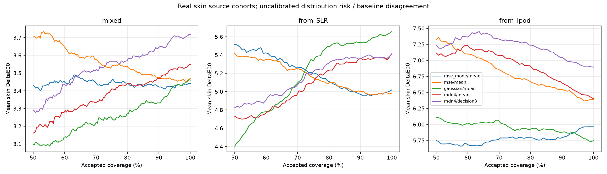

# Conditional skin-color distribution experiment

36 locally reproduced fits on real MSKCC skin images and actual native instrument Lab.
All numbers are DeltaE00, not illumination degrees. These source validation cohorts
have been inspected repeatedly; neither new-person independent confirmation nor
ordinary unseen-phone facial accuracy is established. No TEST/CAL endpoints loaded.

The prefit protocol/code checkpoint is `checkpoint/skin-distribution-pretrain-2026-09-11`.
Four training objectives share one compact backbone and parameter shapes. Three seeds,
80epochs, same data/resolution, target scales and same-camera point-error selection.
Mixture density networks and conditional risk decisions are existing ideas.

## Actual skin-color errors

Each cell averages three separate seed scores; this is not an ensemble. The p95
column averages individual seed p95 values. Lower is better.

| Protocol | Training / decision | Mean | Median | p95 | At80% |
|---|---|---:|---:|---:|---:|
| mixed | mse_mode/mean | 3.4406 | 2.9776 | 6.9316 | 3.4407 |
| mixed | mse/mean | 3.4694 | 2.9208 | 7.2176 | 3.5295 |
| mixed | gaussian/mean | 3.4605 | 2.9191 | 7.5348 | 3.2709 |
| mixed | gaussian/decision3 | 3.4605 | 2.9191 | 7.5348 | 3.2709 |
| mixed | mdn4/mean | 3.5484 | 3.0789 | 7.3575 | 3.4376 |
| mixed | mdn4/decision3 | 3.7181 | 3.1801 | 8.2025 | 3.5810 |
| mixed | mdn4/decision2 | 3.5766 | 3.0898 | 7.4244 | 3.4507 |
| from_SLR | mse_mode/mean | 5.0193 | 4.8340 | 9.7825 | 5.1087 |
| from_SLR | mse/mean | 4.9838 | 4.6078 | 9.4551 | 5.0986 |
| from_SLR | gaussian/mean | 5.6571 | 5.4041 | 11.2796 | 5.4955 |
| from_SLR | gaussian/decision3 | 5.6571 | 5.4041 | 11.2796 | 5.4955 |
| from_SLR | mdn4/mean | 5.4148 | 4.8055 | 11.0887 | 5.2370 |
| from_SLR | mdn4/decision3 | 5.4146 | 4.8235 | 10.7878 | 5.3228 |
| from_SLR | mdn4/decision2 | 5.4057 | 4.8141 | 10.8585 | 5.2748 |
| from_ipod | mse_mode/mean | 5.9635 | 5.5527 | 11.0896 | 5.7914 |
| from_ipod | mse/mean | 6.3885 | 6.1364 | 11.5979 | 6.6570 |
| from_ipod | gaussian/mean | 5.7474 | 5.4467 | 10.2485 | 5.9326 |
| from_ipod | gaussian/decision3 | 5.7474 | 5.4467 | 10.2485 | 5.9326 |
| from_ipod | mdn4/mean | 6.4005 | 5.9157 | 10.9951 | 6.8924 |
| from_ipod | mdn4/decision3 | 6.8962 | 6.6337 | 11.6709 | 7.2382 |
| from_ipod | mdn4/decision2 | 6.7023 | 6.2623 | 11.3796 | 7.0791 |

mse_mode is the strong ordinary control; mse removes auxiliary capture-mode
supervision. gaussian is a single diagonal density; mdn4 has four components.
decision3 minimizes approximate expected DeltaE00 among a frozen finite candidate
set using order3 Gaussian quadrature. decision2 is fixed numerical sensitivity,
not a validation-selected alternative. This is not the exact continuous Bayes optimum.

## Matched contrasts

Intervals resample patient means and are descriptive on heavily reused source data.
They are not simultaneous confidence intervals or confirmatory discovery tests.

| Protocol | Candidate vs control | Image mean difference | Patient95% interval | All3seeds improve |
|---|---|---:|---|---|
| mixed | mse/mean vs mse_mode/mean | 0.0288 | [-0.0705, 0.1130] | False |
| mixed | gaussian/mean vs mse_mode/mean | 0.0199 | [-0.0889, 0.1109] | False |
| mixed | mdn4/mean vs mse_mode/mean | 0.1078 | [0.0298, 0.1733] | False |
| mixed | mdn4/decision3 vs gaussian/decision3 | 0.2576 | [0.1405, 0.3642] | False |
| mixed | mdn4/decision3 vs mdn4/mean | 0.1697 | [0.1175, 0.2194] | False |
| from_SLR | mse/mean vs mse_mode/mean | -0.0355 | [-0.1798, 0.1745] | False |
| from_SLR | gaussian/mean vs mse_mode/mean | 0.6378 | [-0.4168, 1.2731] | False |
| from_SLR | mdn4/mean vs mse_mode/mean | 0.3955 | [-0.9054, 1.1268] | False |
| from_SLR | mdn4/decision3 vs gaussian/decision3 | -0.2425 | [-0.6360, 0.2521] | True |
| from_SLR | mdn4/decision3 vs mdn4/mean | -0.0002 | [-0.3280, 0.1824] | False |
| from_ipod | mse/mean vs mse_mode/mean | 0.4250 | [-0.5884, 1.3422] | False |
| from_ipod | gaussian/mean vs mse_mode/mean | -0.2161 | [-0.7385, 0.4679] | False |
| from_ipod | mdn4/mean vs mse_mode/mean | 0.4370 | [-0.6224, 1.4260] | False |
| from_ipod | mdn4/decision3 vs gaussian/decision3 | 1.1488 | [0.2460, 1.8868] | False |
| from_ipod | mdn4/decision3 vs mdn4/mean | 0.4957 | [0.1298, 0.9288] | False |

## Risk and limitations

Full curves are in risk_coverage.csv. All fixed coverage values including p95 and
catastrophic errors are in summary.json and each result.json. Density expected
error is uncalibrated; baseline ranking uses hypothesis dispersion, not expected
error. These are not matched calibrated C+ results or per-image guarantees.
Distribution misspecification, tiny source cohorts and Gaussian support outside
physically possible skin colors limit interpretation. Camera transfers also change
people/capture distributions. No single cause of transfer error is identified.

Strong historical source controls: mixed direct3.4406; SLR-to-iPod material4.9083;
reverse training-only graph4.9736. These are locally measured, not author-reported
numbers or independent benchmark comparisons. All remain part of the comparison.

## Compute and verification

Stored parameters: 935,453; maximum checkpoint: 3,747,373bytes.
Maximum fit-process GPU allocation: 108.44MiB.
MSE scale-head parameters are inactive. No foundation inference, camera-ID input,
or test-time calibration. CPU quadrature work is additional inference cost;
no new batch1latency, inference VRAM, export or end-to-end speed claim is made.

Audit: 108exact color arrays; 12672independent scalar color cases;
432coverage rows; 12672curve points; 51660manual quadrature scalar cases.
Fit-only scalers, shared initialization and same-camera checkpoint selection checked.
Tests compare density likelihood to torch.distributions and independently check
quadrature mean/covariance. This verifies calculations, not scientific superiority.

Original MSKCC CC-BY data; no newly imported third-party weights/code/constants.
Independent test remains primary4.4570/80%4.1591 versus ordinary fusion4.3005/4.1447.
Product precision and a distinctive superior mechanism remain unproven.

## Post-hoc numerical integration diagnostic

Weights and the finite candidate family remain unchanged. Antithetic Sobol
1024/4096nodes per component are fixed sensitivity checks, not replacements
for the frozen primary results or guarantees of an exact integral.

| Protocol | Density | Mean1024 | Mean4096 | At80%4096 |
|---|---|---:|---:|---:|
| mixed | gaussian | 3.4605 | 3.4605 | 3.2593 |
| mixed | mdn4 | 3.6015 | 3.5993 | 3.4788 |
| from_SLR | gaussian | 5.6571 | 5.6571 | 5.4955 |
| from_SLR | mdn4 | 5.3926 | 5.3897 | 5.2960 |
| from_ipod | gaussian | 5.7474 | 5.7474 | 5.9347 |
| from_ipod | mdn4 | 6.8491 | 6.8491 | 7.1584 |

More accurate integration does not rescue the four-component density here.
6876additional independent scalar cases pass; antithetic means checked.
Full rule differences and empirical normal covariance matrices are in
[integration_diagnostic.json](integration_diagnostic.json).

[Research decision and competing next experiments](../../research/skin_distribution_next_decision.md).
