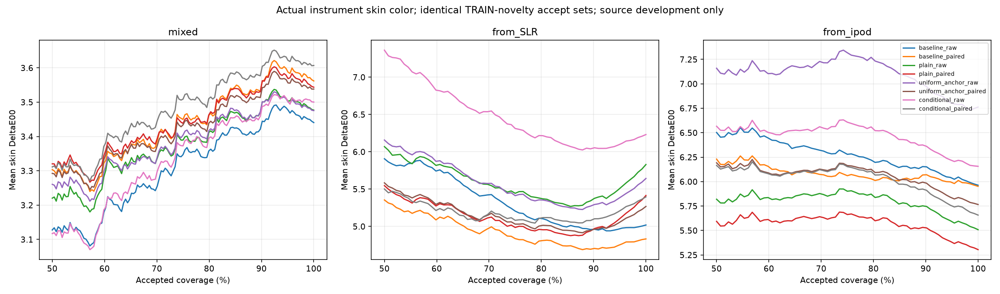

# Removal versus explicit expert supervision: real skin color

72 locally reproduced fits, original MSKCC photographs and actual instrument-native Lab.
All errors are skin DeltaE00. Three seed scores are averaged, not ensembled.
Source validation has been heavily reused. No new independent result or phone claim.

| Protocol | Arm | Mean | Median | p95 | Mean at 80% |
|---|---|---:|---:|---:|---:|
| mixed | baseline_raw | 3.4406 | 2.9776 | 6.9316 | 3.3631 |
| mixed | baseline_paired | 3.5619 | 3.0658 | 7.2012 | 3.4679 |
| mixed | plain_raw | 3.4770 | 2.9910 | 7.0725 | 3.4162 |
| mixed | plain_paired | 3.5436 | 3.0482 | 7.1905 | 3.4722 |
| mixed | uniform_anchor_raw | 3.4755 | 2.9683 | 7.0491 | 3.4225 |
| mixed | uniform_anchor_paired | 3.5383 | 3.1241 | 7.1313 | 3.4445 |
| mixed | conditional_raw | 3.5004 | 2.9766 | 7.0508 | 3.3989 |
| mixed | conditional_paired | 3.6070 | 3.2080 | 7.2163 | 3.5151 |
| from_SLR | baseline_raw | 5.0193 | 4.8340 | 9.7825 | 5.1031 |
| from_SLR | baseline_paired | 4.8328 | 4.7462 | 9.2002 | 4.8112 |
| from_SLR | plain_raw | 5.8301 | 5.4395 | 11.2459 | 5.3698 |
| from_SLR | plain_paired | 5.4150 | 4.9757 | 10.8473 | 4.9554 |
| from_SLR | uniform_anchor_raw | 5.6433 | 5.4743 | 10.4964 | 5.3540 |
| from_SLR | uniform_anchor_paired | 5.2683 | 4.9777 | 10.1849 | 5.0154 |
| from_SLR | conditional_raw | 6.2317 | 6.0018 | 11.6676 | 6.2160 |
| from_SLR | conditional_paired | 5.3966 | 5.1289 | 9.8849 | 5.1184 |
| from_ipod | baseline_raw | 5.9635 | 5.5527 | 11.0896 | 6.1970 |
| from_ipod | baseline_paired | 5.9520 | 5.6234 | 10.7105 | 6.0121 |
| from_ipod | plain_raw | 5.5087 | 5.3784 | 9.4012 | 5.8382 |
| from_ipod | plain_paired | 5.3047 | 5.1265 | 9.5612 | 5.5999 |
| from_ipod | uniform_anchor_raw | 6.7628 | 6.3749 | 11.6373 | 7.2334 |
| from_ipod | uniform_anchor_paired | 5.7660 | 5.6213 | 9.8701 | 6.0936 |
| from_ipod | conditional_raw | 6.1566 | 5.8291 | 10.4416 | 6.5216 |
| from_ipod | conditional_paired | 5.6578 | 5.5357 | 10.0006 | 6.0675 |

p95 above averages each seed p95. Acceptance is identical across methods,
using nearest TRAIN image distance of standardized mean patch statistics.
This is uncalibrated input novelty, not a trained error bound or matched
calibrated C+. Earlier dispersion curves use a different selection rule.

## Matched descriptive comparisons

Patient-cluster intervals use 10,000 resamples after averaging per-image seed
errors. They are exploratory, not multiplicity-adjusted or confirmatory.

| Protocol | Candidate vs control | Mean difference | Patient 95% interval | All 3 seeds |
|---|---|---:|---|---|
| mixed | baseline_paired vs baseline_raw | 0.1213 | [-0.0416, 0.2869] | False |
| mixed | plain_raw vs baseline_raw | 0.0364 | [-0.0886, 0.1456] | False |
| mixed | plain_paired vs baseline_raw | 0.1030 | [-0.0987, 0.3114] | False |
| mixed | uniform_anchor_raw vs baseline_raw | 0.0350 | [-0.0474, 0.1294] | False |
| mixed | uniform_anchor_paired vs baseline_raw | 0.0977 | [-0.0293, 0.2341] | False |
| mixed | conditional_raw vs baseline_raw | 0.0598 | [-0.0368, 0.1326] | False |
| mixed | conditional_paired vs baseline_raw | 0.1664 | [0.0654, 0.2760] | False |
| mixed | conditional_raw vs uniform_anchor_raw | 0.0248 | [-0.0614, 0.1187] | False |
| mixed | conditional_paired vs uniform_anchor_paired | 0.0687 | [0.0307, 0.1031] | False |
| mixed | plain_paired vs plain_raw | 0.0667 | [-0.1283, 0.2617] | False |
| mixed | uniform_anchor_paired vs uniform_anchor_raw | 0.0628 | [0.0047, 0.1183] | False |
| mixed | conditional_paired vs conditional_raw | 0.1067 | [0.0264, 0.1727] | False |
| from_SLR | baseline_paired vs baseline_raw | -0.1865 | [-0.7170, 0.6199] | False |
| from_SLR | plain_raw vs baseline_raw | 0.8108 | [0.0094, 1.9716] | False |
| from_SLR | plain_paired vs baseline_raw | 0.3957 | [-0.5793, 1.8465] | False |
| from_SLR | uniform_anchor_raw vs baseline_raw | 0.6240 | [0.1021, 1.4576] | False |
| from_SLR | uniform_anchor_paired vs baseline_raw | 0.2490 | [-0.5710, 1.5130] | False |
| from_SLR | conditional_raw vs baseline_raw | 1.2124 | [-0.1443, 2.2976] | False |
| from_SLR | conditional_paired vs baseline_raw | 0.3773 | [-0.7681, 2.0530] | False |
| from_SLR | conditional_raw vs uniform_anchor_raw | 0.5885 | [-0.2464, 1.9854] | False |
| from_SLR | conditional_paired vs uniform_anchor_paired | 0.1283 | [-0.1971, 0.5400] | False |
| from_SLR | plain_paired vs plain_raw | -0.4151 | [-0.5887, -0.1252] | True |
| from_SLR | uniform_anchor_paired vs uniform_anchor_raw | -0.3750 | [-0.6731, 0.0553] | False |
| from_SLR | conditional_paired vs conditional_raw | -0.8352 | [-2.4507, 0.5690] | True |
| from_ipod | baseline_paired vs baseline_raw | -0.0115 | [-0.4616, 0.2500] | False |
| from_ipod | plain_raw vs baseline_raw | -0.4547 | [-0.8051, -0.1313] | True |
| from_ipod | plain_paired vs baseline_raw | -0.6588 | [-0.9404, -0.3574] | True |
| from_ipod | uniform_anchor_raw vs baseline_raw | 0.7993 | [-0.0144, 1.6332] | False |
| from_ipod | uniform_anchor_paired vs baseline_raw | -0.1974 | [-0.7666, 0.2414] | False |
| from_ipod | conditional_raw vs baseline_raw | 0.1931 | [-0.4204, 0.7484] | False |
| from_ipod | conditional_paired vs baseline_raw | -0.3057 | [-0.9538, 0.1961] | True |
| from_ipod | conditional_raw vs uniform_anchor_raw | -0.6062 | [-0.8847, -0.4060] | True |
| from_ipod | conditional_paired vs uniform_anchor_paired | -0.1083 | [-0.1873, -0.0454] | False |
| from_ipod | plain_paired vs plain_raw | -0.2040 | [-0.2507, -0.1353] | True |
| from_ipod | uniform_anchor_paired vs uniform_anchor_raw | -0.9968 | [-1.3918, -0.7522] | True |
| from_ipod | conditional_paired vs conditional_raw | -0.4988 | [-0.5524, -0.4107] | False |

## True-mode head diagnostic (labels unavailable at inference)

Select the corresponding color head using the real capture-mode label.
This measures a labeled diagnostic, not deployment accuracy. Native Lab
is used only for scoring. It does not select the best head using the target.

| Protocol / arm | Deployed prediction mean | Label-assisted head mean | Mode accuracy |
|---|---:|---:|---:|
| mixed/baseline_raw | 3.4406 | 4.3679 | 0.6048 |
| mixed/baseline_paired | 3.5619 | 4.4928 | 0.5833 |
| mixed/uniform_anchor_raw | 3.4755 | 3.5182 | 0.6477 |
| mixed/uniform_anchor_paired | 3.5383 | 3.5536 | 0.6326 |
| mixed/conditional_raw | 3.5004 | 3.4865 | 0.7184 |
| mixed/conditional_paired | 3.6070 | 3.4280 | 0.6414 |
| from_SLR/baseline_raw | 5.0193 | 7.5998 | 0.4495 |
| from_SLR/baseline_paired | 4.8328 | 6.5957 | 0.4268 |
| from_SLR/uniform_anchor_raw | 5.6433 | 5.6797 | 0.4015 |
| from_SLR/uniform_anchor_paired | 5.2683 | 5.2952 | 0.3838 |
| from_SLR/conditional_raw | 6.2317 | 6.6371 | 0.3813 |
| from_SLR/conditional_paired | 5.3966 | 6.2591 | 0.4091 |
| from_ipod/baseline_raw | 5.9635 | 5.8697 | 0.4268 |
| from_ipod/baseline_paired | 5.9520 | 5.6167 | 0.4091 |
| from_ipod/uniform_anchor_raw | 6.7628 | 6.9307 | 0.4495 |
| from_ipod/uniform_anchor_paired | 5.7660 | 5.5997 | 0.5278 |
| from_ipod/conditional_raw | 6.1566 | 6.7652 | 0.4394 |
| from_ipod/conditional_paired | 5.6578 | 5.7853 | 0.4495 |

## Compute and evidence

Plain contains 924,932 parameters; other arms 929,297. Maximum checkpoint 3,722,227 bytes.
Maximum fit allocation 108.51 MiB; total recorded fit time 599.9 seconds.
No new inference latency, inference VRAM, ONNX or deployment claim.
Audit: 216 exact color arrays, 12672 scalar color cases, 432 coverage rows and 12672 curve points.
18 original baseline refits exactly match old best/final states and predictions.
3456 anchor arithmetic checks; 9504 additional scalar label-assisted scoring cases.
Shared backbone initialization, all epoch pair/plan digests, original patch provenance
and source-only scale/selection are checked. No participant arrays or weights published.
Original MSKCC CC-BY. Independent TEST/CAL archive unchanged; primary mean
4.4570/80%4.1591 versus ordinary fusion 4.3005/4.1447. Skin product targets unmet.
[Research decision](../../research/skin_expert_anchor_next_decision.md).
