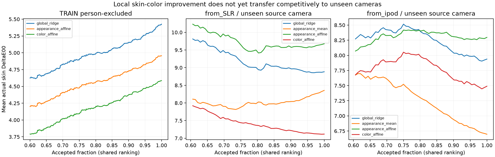

# Local-reference skin color: useful component, no universal win

All errors below are actual CIEDE2000 against original MSKCC instrument-native skin Lab. Original release CC-BY; no new datasets, third-party code/weights, proprietary collection or cloud. The independent400-image TEST and208-image CAL were not opened. Original source data have been extensively reused, so these are exploratory results, not new independent facial-phone accuracy.

## Mechanism and exact controls

One input image supplies36 color descriptors. A bank of other training people supplies fixed descriptors and genuine reference Lab. Appearance weights use Gaussian RMS descriptor distance, bandwidth1. Color weights use Gaussian DeltaE00 distance between global-ridge estimated query and bank colors, bandwidth5. No actual query color, camera identity or test-time calibration enters the method. Both affinities use identical weighted-mean and local-affine controls. All parameters/configurations were frozen before outputs.

Local affine regression estimates a color relationship near each query; it is not merely copying similar reference colors. Weights sum to bank size and ridge penalty stays1. Uniform weights recover ordinary global ridge. This is established [locally weighted learning](https://link.springer.com/article/10.1023/A:1006559212014), not a claimed new architecture or a reproduction of an author benchmark table.

## Person-excluded TRAIN screen

24 folds; each evaluated person and every one of their sites is excluded from the bank, scales and all fits.966 real photographs. The original global ridge and mean controls replay exactly from the preceding relational probe.

| System | Mean DeltaE00 | Median | p95 | Error>10 | Mean at80% | People improved vs ridge |
|---|---:|---:|---:|---:|---:|---:|
| global_ridge | 5.4259 | 4.7431 | 11.4364 | 7.35% | 4.9899 | 0/24 |
| global_mean | 10.9115 | 9.8601 | 22.6492 | 49.17% | 10.6179 | 2/24 |
| appearance_mean | 8.6773 | 7.7410 | 18.1422 | 29.71% | 8.3442 | 1/24 |
| appearance_affine | 4.9555 | 4.3992 | 10.1019 | 5.28% | 4.5666 | 18/24 |
| color_mean | 5.7978 | 5.3023 | 11.5360 | 10.04% | 5.5455 | 7/24 |
| color_affine | 4.5860 | 3.9255 | 10.0157 | 5.07% | 4.2031 | 21/24 |

Color-affine improves the mean by15.48% versus global ridge and improves21/24 people. The mean-only color bank is worse than ridge, so this local result supports the affine mapping component rather than reference averaging alone. The source folds share training people and have been explored historically; this is not a significance claim or victory over the separate independent-test neural models.

## Unchanged method on explicit source camera-held-out banks

After the screen passed its independent numeric audit, all six methods were frozen unchanged for source transfer. Mixed uses24TRAIN/6VALIDATION people; SLR-only8TRAIN and iPod-only16TRAIN each have3 same-camera and3 unseen-camera validation people. No unseen device occurs in its training bank. Device and person/capture effects are confounded; these clinical SLR/iPod photographs are not ordinary uncalibrated phone selfies.

| Training bank / domain | System | Mean DeltaE00 | p95 | Mean at80% |
|---|---|---:|---:|---:|
| mixed /known | global_ridge | 4.5314 | 8.9563 | 4.3159 |
| mixed /known | global_mean | 9.9879 | 17.8445 | 10.4153 |
| mixed /known | appearance_mean | 7.8084 | 15.0530 | 7.8538 |
| mixed /known | appearance_affine | 4.1525 | 8.2099 | 3.9371 |
| mixed /known | color_mean | 4.5036 | 8.6499 | 4.3367 |
| mixed /known | color_affine | 3.9343 | 7.8965 | 3.7276 |
| from_SLR /known | global_ridge | 4.0025 | 8.7965 | 3.6429 |
| from_SLR /known | global_mean | 7.5679 | 12.6286 | 7.9645 |
| from_SLR /known | appearance_mean | 5.4123 | 10.3827 | 5.5126 |
| from_SLR /known | appearance_affine | 3.8133 | 8.0388 | 3.4656 |
| from_SLR /known | color_mean | 3.9949 | 8.3978 | 3.7553 |
| from_SLR /known | color_affine | 3.6365 | 7.2549 | 3.3071 |
| from_SLR /unseen | global_ridge | 8.8835 | 17.8859 | 8.9403 |
| from_SLR /unseen | global_mean | 9.3195 | 19.3989 | 9.4112 |
| from_SLR /unseen | appearance_mean | 8.3549 | 15.4807 | 8.0280 |
| from_SLR /unseen | appearance_affine | 9.6764 | 17.7088 | 9.4151 |
| from_SLR /unseen | color_mean | 7.3523 | 16.2273 | 8.3584 |
| from_SLR /unseen | color_affine | 7.1177 | 12.9255 | 7.3607 |
| from_ipod /known | global_ridge | 4.3910 | 9.1592 | 4.4145 |
| from_ipod /known | global_mean | 10.5246 | 20.7206 | 10.1553 |
| from_ipod /known | appearance_mean | 8.9164 | 16.4992 | 8.6943 |
| from_ipod /known | appearance_affine | 4.2187 | 8.7614 | 4.2316 |
| from_ipod /known | color_mean | 4.7983 | 10.5910 | 4.9151 |
| from_ipod /known | color_affine | 4.2610 | 9.3657 | 4.2341 |
| from_ipod /unseen | global_ridge | 7.9382 | 12.8151 | 8.3834 |
| from_ipod /unseen | global_mean | 11.9149 | 20.8247 | 10.7090 |
| from_ipod /unseen | appearance_mean | 6.6968 | 12.0623 | 7.2906 |
| from_ipod /unseen | appearance_affine | 8.2966 | 12.1561 | 8.4029 |
| from_ipod /unseen | color_mean | 8.7939 | 14.1091 | 9.1801 |
| from_ipod /unseen | color_affine | 7.4895 | 12.5179 | 7.9720 |

Color-affine improves global ridge in both unseen directions, but appearance-affine worsens both. On reverse transfer, appearance-weighted mean6.6968 is stronger than color-affine7.4895; retain that result rather than selecting only the favored mechanism.

## Stronger previously locally reproduced neural comparators

| Source protocol | Best system in this six-method phase | Earlier strong compact neural result |
|---|---:|---:|
| Mixed known cameras | color_affine3.9343 | mixture3.4406 |
| SLR to unseen iPod | color_affine7.1177 | paired mixture4.8328 |
| iPod to unseen SLR | appearance_mean6.6968 | training-only graph4.9736 |

Historical figures are means of three individual seed scores, reproduced locally in [capture](../skin_capture_v1/report.md), [paired expert](../skin_expert_anchor_v1/report.md) and [training branch](../skin_train_branch_v1/report.md) experiments. They use the same source people but different capacity, optimization and source checkpoint selection. These are contextual strong comparators, not newly refitted or capacity/budget-matched C+. **No strongest-neural-baseline win is established.** No author-reported accuracy is being inserted as a local reproduction.

## Risk and coverage

All six systems use identical accepted-image sets per protocol, ranked only by nearest-bank descriptor distance. This tests the color mapping at fixed coverage; it is not a calibrated expected-error head or a per-image guarantee. All216 coverage rows and full curves are retained. For color-affine, unseen forward80%7.3607 exceeds full7.1177; reverse80%7.9720 exceeds full7.4895. Novelty ranking therefore fails to provide reliable selective improvement under these shifts.

## Verification, compute and deployment scope

Both audits PASS. Combined3516 independent weighted augmented solves,1758 uniform-limit checks,1,415,244 scalar color cases and216 coverage checks. Two previous full controls replay exactly; two held-person reference perturbations cannot affect predictions. Thirty source method/domain arrays and camera exclusions replay. All original caches/checkpoints remain unchanged.

No new neural parameters were trained in these linear-reference experiments.27 global ridge fits were used across the screen/follow-up, with3516 nonuniform local affine solves,3516 weighted means and1758 additional uniform-limit diagnostic solves. Reference-bank scalars, base coefficients and normalizations must count toward a future complete model payload. No new RTX VRAM, batch1 latency, ONNX or TensorRT claim follows from CPU algebra or cached descriptors.

## Next decision and Luma limits

Keep the positive local-affine component, but combine it with a strong compact neural representation before repeating correction on the weak raw-descriptor mapping. The user has authorized up to200,000 additional neural parameters. The next single prototype uses the929,297-parameter base and at most1,129,297 neural parameters total, with an ordinary equal-capacity residual-head C+ control and full accounting of any reference bank. This permission is a compute budget, not a result.

Independent MSKCC remains primary4.4570/80%4.1591 versus ordinary fusion4.3005/4.1447. No new independent skin accuracy, universal camera behavior, ordinary-phone facial validation or defensible novel-method advantage. Goal active and unmet.
