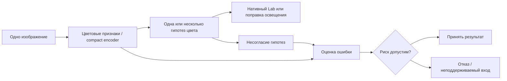

> Историческая публикация этапа 10–11 сентября. [Полный обновлённый архив 14 сентября](../archive/2026-09-14/README.md).

# Компактная оценка цвета кожи и надёжности: исследование от нормализации освещения до приборных эталонов

**Luma / Beauty Concierge · технический исследовательский отчёт · 10–11 сентября 2026**

Статус: завершённый архив по решению автора проекта. Работа не рецензировалась научным журналом. Числа ниже — локально воспроизведённые результаты, если прямо не сказано иное. Исследовательскую реализацию и анализ выполнял Codex по постановке владельца проекта; внешняя независимая репликация другим коллективом не заявляется.

[Главная](../../README.md) · [Все поколения](GENERATIONS.md) · [Галерея](GALLERY.md) · [Методики воспроизведения](REPRODUCIBILITY.md) · [Машиночитаемые таблицы](all_report_tables.csv)

## Аннотация

Исследована возможность компактной одноизображенческой оценки цвета и её надёжности для будущего Luma Skin Vision Engine. Из-за невозможности собрать собственный приборный датасет работа последовательно использовала публичные эталоны освещения, телефонные данные и реальные фотографии кожи с приборными Lab измерениями. Проверялись классические методы, компактные нейросети, цветовые базисы, графы, итеративные критики поправок, семантические teachers, спектральные представления, условные распределения, локальные эталонные банки и cross-fit корректоры.

На отдельном MSKCC тесте из 400 изображений десяти новых людей основной ансамбль достиг mean 4,4570 ΔE00; при 80% покрытия — 4,1591. Его различие со стандартным matched C+ неубедительно по patient-cluster интервалу. Обычная более крупная fusion достигла 4,3005 / 4,1447. Последующий интенсивный поиск дал локальные улучшения, но не универсальный перенос: последний head, улучшивший внутренний экран на 7,40%, ухудшил оба направления source camera transfer. Поэтому работа содержит реальную компонентную и приборную доказательную базу, но не подтверждает готовую универсальную модель лица, надёжный подбор оттенка косметики или новый state of the art.

## 1. Задача и ограничения

Конечная потребность продукта — достоверный цвет кожи. Угловая ошибка освещения полезна для подсистемы нормализации, но не является заменой ошибки восстановленного цвета кожи. Проект начинался с инженерной синтетики, затем перешёл к публичному color constancy и, после уточнения продуктовой цели, к прямому native-Lab эталону.

Ограничения: одно изображение на inference; локальная компактная модель; обучение на RTX 4060 8 GB; отсутствие обязательного облака/foundation model при выполнении; желательная работа без camera ID/CCM и без test-time calibration; возможность отклонить ненадёжный вход. Собственная измеренная facial dataset недоступна. Увеличение последнего компактного core на 200 000 параметров было разрешено отдельно: база 929 297, предел 1 129 297.

Три исходные гипотезы: A — предсказывать downstream color risk; B — использовать несогласие дешёвых/обучаемых гипотез; C — компактно обобщаться на невиданные камеры. Ни одна из этих широких идей сама по себе не нова. [Prior art](../research/prior_art.md) и [novelty hypothesis](../research/novelty_hypothesis.md) сохраняют исходный поиск FC4, Reweight-CC, C5, CCMNet, uncertainty work и VLM-CC. Поздние протоколы дополнительно обсуждают stacking, local regression, metric learning, teacher transfer, graph regularization и differentiable solvers.

## 2. Данные и смысл эталона

| Данные | Что реально измерено | Использование и ограничения |
|---|---|---|
| SimpleCube++ | Освещение в линейном camera RGB, 2 234 изображения | Основное CC обучение, исходная CC BY 4.0; нормализованный RGB не становится измеренным Lab поверхности |
| INTEL-TAU | Реальное освещение, несколько камер | Evaluation only в проекте, исходная CC BY-SA 4.0; не перенесена MIT метка стороннего зеркала; происхождение sparse mirror ограничено |
| Beyond RGB | Парные телефонные сцены, chart/reference captures, спектры | Samsung S21 Plus/Oppo Find X5 Pro, CC BY 4.0; 3,23 GB подмножество, custom protocol, не обычный JPEG/HEIC |
| He 2021 | Региональные RGB и соответствующие XYZ кожи | 40 обучающих / 20 тестовых людей; XYZ RMSE, без ΔE00 при неподтверждённом белом |
| MSKCC | SkinColorCatch Lab участка + реальные фотографии | 1 838 JPEG, 2 128 062 766 bytes, 46 людей; исходная CC-BY без приписывания неподтверждённой версии |
| UMINHO-HSFD | Измеренная спектральная отражательная способность | Три TRAIN лица, 22 500 выбранных спектров; CC BY 4.0, спектры ≠ независимые RGB снимки |
| ISSA v4 | Измеренные спектры и цветовые сведения кожи | 15 256 записей / 2 107 кодов; CC BY 4.0; source-origin/identity ограничения и неиспользованные резервы сохранены |

Оригиналы, лицензии, размер, камера, формат, CCM и коммерческие категории — в [сводке прав](DATA_AND_RIGHTS.md) и [полном inventory](../data/public_dataset_inventory.md). Изображения участников не публикуются в этом репозитории. CIE таблицы и производные спектральные buffers имеют отдельный CC BY-SA 4.0 provenance; они не превращаются автоматически в неограниченные коммерческие веса.

### Протокол прямого skin benchmark

MSKCC разбиение по людям: TRAIN 24 / 966 изображений; source VALIDATION 6 / 264; CALIBRATION 6 / 208; independent TEST 10 / 400, 105 участков. Люди между ролями не пересекаются. Эталон — среднее полных опубликованных native-Lab чтений участка в исходной D65/10° конвенции. Три CAL строки с одним чтением были описаны до теста; данные не исключались и не дополнялись выдуманными измерениями. Все 400 тестовых строк имеют три полных чтения.

Не следует считать изображения независимыми людьми, считать копии Lab одного участка новыми измерениями или называть site-reference плотной пиксельной разметкой. Участок анатомически общий, но кадры не доказаны зарегистрированными пиксель к пикселю. Ноль same-site cross-camera пар означает, что парная инвариантность не изолирует именно смену сенсора.

Модели и риск были зафиксированы до первого TEST decoding. После оценки этот тест стал **раскрытым архивом**, его не использовали для последующей оптимизации. Поздние source cohorts исследовались многократно и не считаются новым независимым подтверждением.

## 3. Метрики и сравнения

Color constancy: recovery/reproduction angular error, mean/median/trimean, best/worst quartiles, tails и risk–coverage. Для прямого цвета кожи: CIEDE2000 между предсказанным native Lab и приборным reference; mean/median/p90/p95, доли ошибок >5/>10, person/site-balanced контроли. Для спектров и XYZ пилота сохранены собственные единицы, без искусственного перевода в ΔE00.

Селективная система ранжирует входы по ожидаемому риску; сравнение ведётся при одинаковом покрытии 100/95/90/80/70/60%. Полная кривая и фиксированный deployment threshold отвечают на разные вопросы. На independent TEST порог для 80% CAL принял 74,25%, а не 80%. Предсказанная средняя ошибка не является верхней границей ошибки конкретной фотографии.

Matched C+ должен иметь сопоставимые данные, ёмкость, разрешение и бюджет обучения, а также обычную error head и post-hoc calibration. В независимом skin опыте C+ и Proposed имеют одинаковые цветовые ответы; их разница — признаки и выбор error head в одинаковом поисковом бюджете. Основное сравнение — matched search procedures, а не чистая абляция одного типа головы: C+ выбрал MLP, Proposed — HGB. Более крупная обычная fusion честно учитывается как full-system контроль.

В отчётах явно разделены среднее метрик трёх отдельно обученных seeds и inference ensemble. Seed SD не является доверительным интервалом по новым людям. Для основного результата применён paired bootstrap с кластерами по людям; повторное сравнение множества вариантов не даёт автоматически подтверждённой значимости лучшего.

## 4. Архитектуры и исследовательские развилки

Схема описывает семейство исследованных подходов, а не одну финальную production architecture. CC гипотеза выдаёт illuminant/correction; прямой skin estimator выдаёт Lab. Их ground truth не взаимозаменяем.

**Классические и компактные CC контроли.** Gray World, Max RGB, Shades of Gray, Gray Edge; прямой компактный learned baseline; residual correction вокруг классического якоря; calibrated selector. На реальных данных V1 предложенная смесь не выиграла сильнейшую абляцию при 80%. V2 дала внешний matched-control gain, но не универсальный выигрыш по всем камерам и source.

**Каноническая геометрия.** V3 выбирала трёхвекторный цветовой базис из патчей, решала координаты, строила граф из 64 relational tokens и транспортировала illuminant posterior обратно в RGB. Это попытка изменить представление вместо увеличения CNN. При равной ёмкости 1 215 535 параметров full frame проиграл RGB graph: 4,281° против 2,547° на source validation. Условность базиса, неоднозначность и неинвариантность reproduction geometry ограничили гипотезу.

**Повторные проходы и critics.** V4/V5 оценивали правдоподобие разных поправок и последовательно уточняли ответ. Запрос пользователя о повторной обработке ответа был проверен через recurrence, adaptive search и equal-query controls, а не принят как гарантированное улучшение. V5 использовала общий 20-эпоховый warmup с клонированным полным состоянием и три seeds. Selected-action и derivative supervision не превзошли обычный critic последовательно. V6 скрестила frame и critic; результат не унаследовал достоинства обоих.

**Перенос современного обучения.** V7 сравнила semantic teacher, corrected training views, виртуальные sensor transforms и GT-only controls; teacher отсутствует при inference. Fourier/ridge отдельно проверила, обязательна ли пространственная нейросеть. Большой teacher или физически мотивированный transform не стали общим решением реальной camera shift.

**Прямой цвет кожи.** PatchVotes использует локальные цветовые descriptors и контекст; сравнивались CNN, MLP, локальные голоса, robust repeated aggregation, tighter residuals и ordinary fusion. Для независимого risk этапа исключённые по людям residuals создали OOF supervision. Пространственные графы, train-only ветви, copula/rank, capture-mode mixture, paired invariance/VICReg и density/field losses расширили пространство поиска.

**Инверсия и физика.** Спектральные priors/декодеры проверялись отдельно от фотометрической точности. При known-target solve возможность представить 248 тренировочных эталонов не означала способность вывести правильный материал по RGB. Conditional appearance inversion и patch likelihood сравнивались с прямой регрессией и mean-only controls. Более богатое распределение не обеспечило универсальный gain.

**Эталонные банки и correction.** Локальная аффинная регрессия помогла ridge на leave-person-out TRAIN экране, но проиграла сильным camera controls. Neural reference heads затем получили разрешённую дополнительную ёмкость. Последний stable head использовал 36 цветовых признаков + 3 predicted Lab, слои 39→384→384→64→3, 188 035 добавленных параметров, без reference bank или camera ID при inference. Его локальный выигрыш подвергся отдельной transfer проверке и не выдержал её.

Каждая ветка, методика, все таблицы и её отрицательные контроли — в [полном атласе](GENERATIONS.md). Он включает и диагностические эксперименты без обучения; количество JSON файлов не выдаётся за количество независимых опытов.

## 5. Основные измеренные результаты

### Независимый приборный skin test

| Метод | Mean ΔE00 | Median | p95 | Mean при 80% |
|---|---:|---:|---:|---:|
| Primary patch ensemble, C+ ranking | 4,4570 | 4,0012 | 9,2631 | 4,3328 |
| Тот же ensemble, Proposed ranking | 4,4570 | 4,0012 | 9,2631 | 4,1591 |
| Обычная CNN/patch fusion, density ranking | 4,3005 | 3,9637 | 8,6024 | 4,1447 |

| Покрытие | C+ mean | Proposed mean | Proposed median | Proposed p95 | Доля ΔE00 >10 |
|---:|---:|---:|---:|---:|---:|
| 100% | 4,4570 | 4,4570 | 4,0012 | 9,2631 | 3,75% |
| 95% | 4,4452 | 4,3176 | 3,9625 | 8,8808 | 3,16% |
| 90% | 4,4401 | 4,2439 | 3,9323 | 8,5672 | 2,78% |
| 80% | 4,3328 | 4,1591 | 3,8834 | 8,0966 | 1,88% |
| 70% | 4,3037 | 4,1219 | 3,8834 | 8,2565 | 1,79% |
| 60% | 4,1801 | 4,1287 | 3,9117 | 7,9873 | 1,67% |

Proposed−C+ при 80% = −0,173636; 95% patient-cluster interval [−0,568483; +0,164724], 2 000 resamples. Во всех четырёх вариантах head replication интервалы пересекали ноль. Threshold predicted error ≤2 не принимал тестовых изображений; ≤5 принимал 69,25%, но у 29,24% принятых истинная ошибка превышала 5. Это не надёжная гарантия отказа.

Источник: [полный отчёт со всеми 41 цветовым comparator](../benchmarks/skin_mskcc_selective_v1/report.md), [неокруглённый JSON](../benchmarks/skin_mskcc_selective_v1/test_results.json). Все эти модели фиксировались до теста; сортировка в отчёте описательная, не post-test refit.

### Что было получено на color constancy и телефонах

V2 на внешних 384 изображениях INTEL-TAU получила reproduction risk80 3,805° против 5,558° у сильнейшего matched direct C+, снижение 31,5%. Но source регрессировал, Canon transfer проигрывал, дешёвый GW+ridge был конкурентен. Sony camera model уже встречалась в раннем пилоте; новые снимки не означают первую встречу исследователя с этой моделью камеры. V7 primary external population 317 исключала 67 строк с совпадающими reference hashes; это proxy для сцен, не доказанная уникальность физических сцен. [V2](../benchmarks/cc_v2_report.md), [V7](../benchmarks/cc_v7_external/report.md).

На Beyond RGB после документированного alias repair старая V2 SoG получила pooled mean 4,367° и risk80 3,951°; V5 transport random — 4,947° / 5,106°. Пригодны 79 из 88 эталонов. Исправление формата сделано после первого наблюдения test, поэтому это переоценка раскрытого набора, не новый независимый тест. [Телефонный отчёт](../benchmarks/phone_v1_alias_report.md). Эти градусы не переводятся в skin ΔE00.

### Последний внутренний gain и его опровержение при переносе

Внутренний TRAIN-derived экран: 18 support людей / 734 изображения, 6 evaluation / 232. Три seeds, фиксированный core. In-matched head снизила mean с 6,1082 до 5,6560 (7,40%), p95 с 14,9960 до 12,9644; выиграли 3/3 seeds и 5/6 людей. Однако genuinely excluded-person OOF head уступила included-person matched control. Это не подтверждает исходное объяснение OOF.

Отдельная зафиксированная transfer фаза: 36 inner-core fits, 27 head fits, девять неизменённых полных cores. Core — 930 обновлений, head — 300, одинаковые seed/batches/initialization и zero correction. По одному изображению при inference, без camera ID. Ниже средние метрики трёх отдельных seeds, не ensemble.

| Source evaluation | Base | In-full | In-matched | Out-person |
|---|---:|---:|---:|---:|
| Mixed known | 3,8277 | 3,7626 | 3,8184 | 3,9889 |
| SLR → unseen iPod | **5,4877** | 5,9953 | 5,7371 | 6,0910 |
| iPod → unseen SLR | **6,5602** | 7,2462 | 7,2908 | 7,6725 |

**Все три correction head ухудшили оба unseen mean.** Исторические source рецепты достигали 3,4406 mixed, 4,8328 forward и 4,9736 reverse; это разные методы/бюджеты, а не одна универсальная модель. Ещё более низкие mixed source значения встречаются у двухмодельных combinations с большей стоимостью. Их нельзя скрыть или приписать одиночному compact core. [Внутренний screen](../benchmarks/skin_crossfit_correction_v1/report.md), [transfer](../benchmarks/skin_correction_transfer_v1/report.md), [combinations](../benchmarks/skin_branch_combination_v1/report.md).

## 6. Что выяснили и какие предположения не выдержали

| Проверяемое предположение | Наблюдение | Что допустимо заключить |
|---|---|---|
| Более сложная frame/graph architecture уберёт camera dependence | RGB control сильнее full frame; graph gains направленные | Геометрическая симметрия не гарантирует полезной статистической инвариантности |
| Повторная обработка обязательно улучшает ответ | Equal-query и robust recurrence не дали устойчивого выигрыша | Дополнительные итерации требуют нового полезного свидетельства или подходящей целевой функции |
| Хорошие компоненты складываются в ещё лучший метод | V6, graph/support и neural reference имеют отрицательные переносы | Совместимость механизмов — экспериментальная гипотеза, не правило |
| Убрать абсолютный цвет — сделать модель универсальной | Rank-only и constant/bias controls хуже | Можно уничтожить информацию о целевой величине вместе с camera nuisance |
| Семантика большого teacher даст точный материал | Teacher/readout и sensor controls не универсально сильнее | Объектная семантика не заменяет колориметрическую идентифицируемость |
| Предсказывать полное распределение всегда лучше point regression | MDN, loss fields и appearance likelihood не обошли сильнейшие контроли везде | Более сложная плотность добавляет вычисления и оценочную ошибку |
| Согласованные снимки означают правильный цвет | Shared-bias/correspondence показывают общую систематическую ошибку | Согласие и абсолютная точность различаются |
| Уменьшение TRAIN loss или локальный gain переносится | Все larger heads снижали TRAIN MSE; последние heads ухудшили unseen | Поддержка данных и distribution shift остаются центральными ограничениями |
| Отказ по ожидаемой ошибке гарантирует качество каждого ответа | CAL threshold меняет coverage; многие принятые превышают ΔE5 | Требуется отдельная гарантия/калибровка отказа на целевом распределении |

Это выводы о проверенных реализациях и данных. Отрицательный эксперимент не доказывает невозможность всех графов, teachers, спектральных методов или универсальной модели вообще. Повторная source validation и малое число людей ограничивают силу даже положительных находок.

## 7. Вычисления, контроль качества и исправления

Обучение было локальным на RTX 4060 8 GB. Основной независимый patch ensemble: 2 774 796 параметров, 11 113 890 bytes; GPU model-only batch1 median 1,469888 ms, p95 1,726651 ms, allocated inference peak 20,0366 MiB. Подготовка descriptors/JPEG, локализация и CPU risk не включены. CPU heads отдельно: C+ median 0,2208 ms, Proposed 0,5018 ms. Их нельзя механически выдавать за измеренную полную задержку приложения. [Профиль](../benchmarks/skin_mskcc_selective_v1/profile.json).

Финальный stable head: 1 117 332 параметра всего, +188 035 к core; 4 477 653 bytes checkpoint. Inner-core training allocated peak 104,42–109,50 MiB, head 73,81–76,78 MiB, с cached data и ограниченной областью процесса. Новые isolated production VRAM, latency и ONNX/TensorRT для этого метода не измерены.

Историческая синтетика сохранила 48 tests, 34 smoke commands, ONNX и ~3,2 ms при 64×64, но эти цифры нельзя переносить на последнюю модель. Последний полный suite завершился: **379 passed, 14 исторических предупреждений ONNX/export, 35,85 s**. Тесты программной корректности не являются независимой оценкой accuracy.

Последняя фаза сохраняет существенное исправление протокольной реализации: объединённый evaluation batch изменил четыре baseline Lab значения максимум на 3,8147e−6. Восстановление прежних раздельных known/unseen batch32 границ дало побитовое совпадение. Архитектуры, fitting, гиперпараметры и candidate selection не менялись; исходный lock и pretest checkpoint оставлены, recovery lock зафиксирован отдельно. Итоговый аудит: 60 exact arrays, 27 NumPy heads, 26 892 scalar CIEDE2000 cases, 360 coverage checks, три полных core refits и три head refits. [Recovery](../research/skin_correction_transfer_batch_recovery.md), [audit](../benchmarks/skin_correction_transfer_v1/audit.json).

## 8. Значение для продукта и критерий победы

Получены две разные формы evidence: photometric normalization/reliability на реальных CC benchmarks и прямой instrument-referenced skin-color regression на клиническом публичном наборе. Вторая важнее для конечной потребности Luma, но не отменяет domain gap к лицу обычного пользователя.

Победой считалась бы заранее зафиксированная single-image модель, которая на новых людях и обычных невиданных телефонах устойчиво превосходит сильные matched/full-system контроли при одинаковом coverage и приемлемых tails, сохраняет компактность и имеет измеренный полный путь выполнения. Числовая aspiration проекта: median ≤2 и p95 ≤5 ΔE00 при ≥80%; эти пороги не заявляются стандартом и требуют связи с реальными косметическими решениями. **Такой победы сейчас нет.**

Формулировка технологического направления для рассмотрения: «Компактная адаптивная нормализация цвета и оценка надёжности для анализа цветочувствительных визуальных объектов, с первым коммерческим применением в анализе кожи и рекомендациях косметики». Это рабочее позиционирование, а не юридическая классификация или подтверждённая заявка в Сколково. [Досье](SKOLKOVO_EVIDENCE.md).

## 9. Завершение и сохранённые исследовательские вопросы

Владелец проекта остановил новые исследования и запросил открытое оформление всех работ. Текущая фаза завершена отрицательным camera-transfer результатом; дальнейшее обучение не продолжается. Если проект когда-либо будет возобновлён, новый независимый endpoint и достаточная приборная поддержка целевого facial/phone домена важнее дальнейшего подбора по раскрытой source validation. Это сохранённое наблюдение, не обещание будущих экспериментов или запрос на сбор закрытых данных сейчас.

Полный документальный след: [атлас](GENERATIONS.md), [таблицы и provenance](catalog.json), [история](HISTORY.md), [права](DATA_AND_RIGHTS.md), [предыдущие исследовательские решения](../research), [IP provenance](../ip), [все Сколково addenda](../skolkovo). Отчёты прежних этапов сохранены как исторические документы; их прежние планы не являются текущими заданиями.
