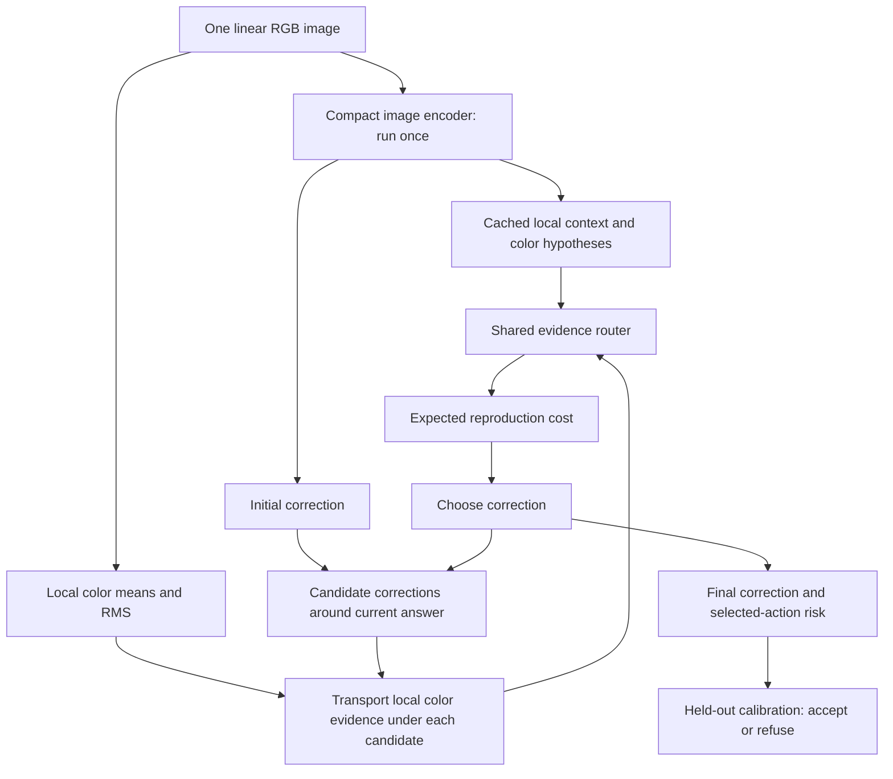

# A compact model that evaluates and refines color corrections

Research decision, 2026-09-10. **Proposed mechanism and training programme; no V4 accuracy result is established by this document.** Companion source ledgers cover [modern visual training](cc_v4_visual_training_sources.md), [efficient models](cc_v4_efficient_training_sources.md), [photometric prior art](cc_v4_photometric_sources.md) and [independent mathematical critique](cc_v4_action_field_critique.md). Exact executable contract and first experiments: [specification](cc_v4_spec.md), [source lock](cc_v4_source_lock.md).

The selected idea is **correction-conditioned evidence routing**: encode the scene once, retain local color measurements, and repeatedly ask which pieces of evidence support each possible correction. A small router changes the contribution of those pieces under the proposed correction. A physically defined reproduction cost scores the resulting hypotheses. The model can spend one, two or four short refinement stages before reporting its answer and an estimated residual risk.

The intended gain comes from reconsidering ambiguous evidence, rather than increasing the backbone size. A white-looking area, a colored wall and a highlight can imply different corrections. Instead of pooling their features once and discarding the disagreement, the model keeps their competing proposals available while choosing a correction. This explanation is a hypothesis about finite-data learning; these latent proposals are not measured local illuminants or reliable object labels.

This responds to the broader product goal: one compact photometric subsystem for varied scenes, surfaces and capture conditions, with camera as one variation axis. Universality is a target operating envelope, not a mathematical promise. A single uncalibrated image can be consistent with different surface/illuminant combinations. A small network can learn useful priors and rejection, but a name or architecture cannot supply missing observations.

## What the leading-lab training review changes

The useful pattern across contemporary systems is to arrange supervision, information preservation and compute deliberately. Copying a frontier model's parameter count or adding a fashionable objective is not a local training recipe. The following are **source-backed principles with our proposed adaptation**, not reported photometric gains.

| Established mechanism | Evidence | Concrete transfer to Luma R&D |
|---|---|---|
| A stronger teacher and curated training views can improve a smaller student | Meta DINOv2 trains large representations and distills smaller backbones; its smallest standard backbone is still21M | Train our own complementary compact experts on the cleared real source, cache predictions for exactly matched views, then test a1–5M student against GT-only training. No external foundation model is required at inference. [DINOv2](https://arxiv.org/abs/2304.07193) |
| Dense local information can degrade while global representations improve | DINOv3 uses Gram anchoring to preserve patch relations | Keep measured local chromaticity and moments outside the pooled semantic representation. Later test a local-feature consistency loss; do not mistake feature similarity for physical color fidelity. [DINOv3](https://arxiv.org/abs/2508.10104) |
| Auxiliary self-supervision can be staged after a useful model exists | SigLIP2 introduces EMA/local and masked objectives late in its standard training recipe | Warm up on actual illuminant labels first. Only then introduce an own-model teacher, with exact view/target correspondence and teacher-off controls. Its full training scale is unavailable on a4060. [SigLIP2](https://arxiv.org/abs/2502.14786) |
| Intermediate and visible local features matter for dense tasks | V-JEPA2.1 extends supervision across representations and visible/masked evidence | Preserve the local color stream and compare intermediate versus final features. Video latent prediction does not create illuminant GT from our still images. [V-JEPA2.1](https://arxiv.org/abs/2603.14482) |
| Complementary teacher information can be cached before student training | MobileCLIP2 develops offline data reinforcement and multiple teachers | A small expert cache is affordable; its released models/data are not adopted because code/model/data terms differ and the model terms restrict product development. Study the recipe, use our own cleared teachers. [Paper](https://arxiv.org/abs/2508.20691), [model terms](https://github.com/apple/ml-mobileclip/blob/main/LICENSE_MODELS) |
| Hardware-efficient operator choices and view-matched distillation matter | MobileNetV4 has a3.8M Conv-S architecture; larger-family headline accuracy uses much larger models/training | Keep a strong compact encoder control and measure full batch-one inference. Do not infer our accuracy from ImageNet or our latency from another device. [Official paper](https://www.ecva.net/papers/eccv_2024/papers_ECCV/papers/05647.pdf) |
| Shared updates can trade more inference computation for fewer weights | TRM studies recurrent answer/state updates with deep supervision | Test2–4 shared photometric refinement stages with measured error after each. Its puzzle task and expensive training recipe are not evidence that a photometric model will improve. [TRM](https://arxiv.org/abs/2510.04871) |
| Feedback and verification can support refinement | Self-Refine reuses an LLM to generate feedback and refine output; Huginn repeats an internal block | Retain the original image evidence, evaluate the current correction, then update it. Ground the critic in measured training labels and evaluate true stage-wise error. More confident feedback alone is insufficient. [Self-Refine](https://arxiv.org/abs/2303.17651), [recurrent depth](https://arxiv.org/abs/2502.05171) |

Training invariance must depend on the output. Semantic recognition may profit from ignoring illumination changes. An illuminant estimator must often respond to those changes. CLCC already makes this distinction explicitly for color constancy. Therefore no grayscale or arbitrary color-jitter invariance is attached to the illumination head. A structural/context branch may have different auxiliary objectives, but the photometric anchor is retained. [CLCC](https://arxiv.org/abs/2106.04989).

We also examined RL/process-supervision analogies. For our current supervised target, the outcome of a candidate correction is directly computable from GT and differentiable. Dense supervised values and derivatives are more direct than introducing an LLM, reward model or policy-gradient loop. Learning from derivatives is established Sobolev training, so the derivative objective itself is not our contribution. [Sobolev Training](https://arxiv.org/abs/1706.04859).

## Alternatives considered before choosing

Scores are qualitative engineering judgments from the source review and existing failures, not measured rankings. High distinctiveness means a narrower potential contribution worth testing, not verified novelty.

| Direction | Potential distinction | Fast meaningful test |4060 feasibility | Product relevance | Duplication/technical risk | Decision |
|---|---|---|---|---|---|---|
| Better teacher/EMA/data curriculum with standard compact predictor | Low by itself | High | High with own small teachers | High | Distillation and color pretexts already directly published | Training control and later enhancement |
| Global/local color graph with relaxed normalization | Low–medium | High | High | High | Standard fusion/graph mechanisms; V3 full-frame failed | Preserve as alternate, not primary |
| Continuous scalar action-risk MLP | Medium in precise form | High | High | High for reliability | Can be an unnecessarily complicated posterior approximation; optimizer exploits its errors | Refine into a constrained evidence-routing model |
| **Correction-conditioned evidence routing** | **Medium, unresolved** | **High on existing real source** | **High expected, to measure** | **High for correction and rejection** | Candidate scoring, modulation and uncertainty all precede it; needs strong analytic-posterior null | **Selected first architecture experiment** |
| Large intrinsic/world model, then distillation | Unclear | Low | Low for full training | Potentially high long term | Ill-posed factors, missing supervision, restricted assets, expensive training | Defer |

The rejected V3 full-frame construction was more unusual than a conventional CNN, yet it worsened real validation. That evidence argues for novelty in the useful decision mechanism, not complexity for its own sake. We retain a strong3M encoder in the first V4 comparison to isolate the contribution of how evidence is used. A new encoder should later earn its place in the same comparison. [Measured V3 failure](../benchmarks/cc_v3_report.md).

## The proposed architecture in detail



Let candidate action `a=(log e_R/e_G,log e_B/e_G)` define the illuminant divisor. Local mean and RMS log chromaticities `z_p,s_p` become `z_p-a,s_p-a` under this correction. Convert these into actual channel-normalized corrected chromaticity, `T(z,a)=(3p_R-1,3p_B-1)` with `p=softmax([z_R-a_R,0,z_B-a_B])`. This nonlinear update is inexpensive and exact for those cached statistics under a global positive diagonal action, subject to the numerical floors; it does not require rendering another full image or rerunning the encoder.

The encoder produces global context `k`, local features `f_p`, a direct action `a0`, and16 latent local illuminant proposals `b_p`. The routing network computes

```text
w_p(a) = softmax over p of router(f_p, k, T(z_p,a), T(s_p,a), a-a0)
R_angle(a) = sum_p w_p(a) * angle(exp(b_p-a), neutral)
R_sin2(a) = sum_p w_p(a) * sin²(angle(exp(b_p-a), neutral))
```

The three-channel exponential above inserts green log-coordinate zero. Stable implementation subtracts a common maximum before exponentiation. These costs concern neutral reproduction in sensor RGB. They do not represent colorimetry of a material patch, corrected skin Lab or DeltaE.

All weights are positive and normalized. Costs retain a physical bounded form. However, the weights change with the candidate action, so the collection is not one posterior distribution over lighting. This flexibility could help the network revise which evidence matters, or it could let it invent a low-risk correction. That is the precise experiment.

The posterior null uses the same local proposals and router, but conditions it on `T(z_p,a0),T(s_p,a0),0`. Its weights are fixed across actions, so expected cost is the analytic decision risk of a finite illuminant posterior. A further generic action router keeps these same fixed chromaticities but receives `a-a0`. This is essential for isolating the explicit nonlinear physical transform from action conditioning alone. A sufficiently accurate posterior already produces the Bayes-optimal decision under the same information. Our only plausible advantage is better approximation/inductive bias per compute at finite capacity and limited training data, not access to more truth.

Independent preflight review found that passing only shifted log colors and relative action would be an exact linear reparameterization of the first MLP layer. That draft was amended before any training. The nonlinear corrected-simplex transform removes that exact linear equivalence, but a generic MLP can approximate it. The appropriate claim remains an explicit physical inductive bias tested against the action control, not a new expressivity theorem.

Current controlled comparison keeps the same module graph. The posterior variant leaves128 scalar router input weights inactive because the two relative-action coordinates are zero; this small capacity difference is disclosed. Training/inference FLOPs are also measured separately rather than declared identical because parameter counts match. A later standard C+ has its own held-out confidence/error head and receives all selected training enhancements.

## Repeated refinement, including the user's LLM analogy

Self-Refine explicitly generates an answer, feedback and a revised answer. Recurrent-depth LLMs instead repeat hidden computation. Our first implementation is closer to the first pattern: the **action** is the answer, transported image evidence provides feedback, and the shared router scores refinements. It is a learned evaluator with bounded search, not a reproduction of either language-model architecture.

Start from the direct estimate. Search a5×5 candidate grid of radius.24 in the two log coordinates. Then refine around the selected action at radii.06,.03,.015. Measure1,2 and4 stages, with25,51 and103 total candidate queries. Each later set includes the original direct estimate and the previous selected center. The image encoder runs once for all stages.

Retaining the center means predicted risk should not increase. It does **not** imply that real error decreases. The report must include the number of images worsened by each extra stage, mean/p95/tail changes, oracle candidate error, and full latency including all queries. A fixed two-stage policy is used for initial checkpoint selection; inspecting four-stage results does not silently redefine that primary comparison.

If repeated search succeeds, first compare a nonadaptive candidate policy with the same number of queries and domain before crediting sequential feedback itself;1/2/4 results initially describe only the compute–accuracy curve. Then train a shared update block or distill the successful trajectory into a single pass, with equal-compute baselines. If it fails, distinguish inadequate candidate coverage from inaccurate ranking. If extra stages mostly exploit critic errors, stop spending compute there and improve the critic's selected-action training/calibration. Repetition alone is not a scientific contribution.

## Training stages and why they are ordered

1. **Real-GT supervised warmup.** Fit the direct estimate before allowing the learned action field to influence representation learning. The first source screen uses20 warmup epochs, then a20epoch ramp for field losses. This is our local starting design, not a hyperparameter recommendation from SigLIP2.
2. **Grounded action values.** Sample actions from a GT-independent mixture around the detached current prediction and a fixed broad reference box. Compute true reproduction values using the real illuminant label. Centering actions on GT would leak label information through the sampling distribution and bias conditional-risk learning.
3. **Derivative supervision, only as a declared ablation.** Match the gradient of the scalar sin² field itself to the exact target derivative. A separate vector head could disagree with its scalar and produce nonconservative updates. Dense queries and derivatives all come from the same two GT coordinates; count original scenes, never generated actions, as independent examples.
4. **Lawful intervention training.** Under a linear unclipped global diagonal model, `x'=Dx, b'=b+d,a'=a+d`, and reproduction cost is unchanged. Introduce these paired transformations with transformed targets, then test whether they improve real held-out conditions. The algebra is not a simulation of arbitrary camera spectral responses or unknown ISP processing.
5. **Own teacher and local preservation.** After a useful supervised model exists, test a delayed EMA teacher and local-feature relation targets with the color stream retained. A later spatial/statistical expert ensemble may be distilled with exact view matching. Keep GT loss, teacher-off and ordinary-KD controls; record teacher cost separately.
6. **Selected-action reliability.** Freeze the model, search depth/domain and fallback policy; fit expected error on independent held-out residuals and calibrate acceptance on a separate role. Calibration on arbitrary sampled actions does not calibrate the minimum of a learned field. Source calibration has no blanket guarantee under shift.

The first implementation tests stages1–2 and repeated inference. Stages3–6 are planned gates, not hidden accomplishments. No foundation weights, model-generated physical labels, or new facial data are used.

## What would count as a real advance

The first screen reuses1126 source fitting images and119 development-validation images from SimpleCube++, with original CC BY4.0 provenance. It can reject a bad architecture cheaply, but it cannot establish a final benchmark or broad universality. All earlier synthetic and real negative results stay archived.

A surviving model must beat both the strong direct predictor and the action-independent posterior using matched data, capacity, resolution, training schedule, teacher and action budget where applicable. The component ablations are transport versus fixed evidence, values versus values+derivatives, ordinary teacher versus proposed training, one pass versus repeated refinement, and calibrated selective risk versus standard C+ confidence.

The later independent protocol must stratify evidence by scene/color diversity, illumination direction, exposure/clipping and capture device. Source-defined descriptors can form diagnostic strata without selecting on test error. They do not create new real surface labels. New INTEL reference-group overlap and scene duplication must be resolved before role locking; random camera mixing is never a held-out-camera experiment. The existing source and external datasets also differ in scene content, so a transfer difference is not isolated camera causality.

For unknown JPEG/ISP, physically measured paired color targets remain needed. Neither a diagonal stress test nor a visually attractive corrected photograph is proof of surface-color accuracy. A future broader data acquisition can use legitimately public paired data, but all code/weight/data rights must be audited separately.

## Nearest prior art and the boundary of our contribution

Candidate-corrected-image evaluation already appears in the compact Multi-Hypothesis method. SAFE's recent preprint already modulates structured color cues by scene characteristics and learns an adaptive color axis through teacher-guided per-image optimization. VLM-CC already evaluates residual cast after correction and iterates. These are direct, substantial overlaps. [Multi-Hypothesis2020](https://arxiv.org/abs/2002.12896), [SAFE2026](https://arxiv.org/abs/2608.13967), [VLM-CC2026](https://arxiv.org/abs/2605.19613).

Hybrid distillation from larger architectures into a compact color-constancy CNN is already a2025 TPAMI contribution. Confidence, uncertainty, learned algorithm selection, equivariance and camera transfer have their own established literature. The broader ledger retains FC4, Reweight-CC, C5, CCMNet and uncertainty work from the earlier milestone; this new review does not replace it. [TPAMI2025](https://doi.org/10.1109/TPAMI.2025.3583090), [project prior-art index](prior_art.md).

The possible narrower contribution is **action-dependent routing of transported cached local photometric evidence, constrained reproduction-cost prediction and selective refinement under a small compute budget**, supported by real comparisons. We have not established that no earlier paper or patent covers this exact combination. If the posterior control matches or wins, its more coherent and simpler risk model should be preferred. A new name is not grounds for keeping a worse method.

## Luma and Skolkovo interpretation

The product component would supply a photometric correction and a measured basis for deciding whether downstream color analysis should proceed. A successful public benchmark would validate that component within its tested image/illumination domain. It would not prove facial skin-color accuracy, product recommendations or instrument-equivalent colorimetry.

Candidate positioning remains: compact adaptive color normalization and reliability estimation for color-sensitive visual objects, with facial skin analysis and cosmetics recommendation as a first intended application. This is a technical positioning hypothesis, not an approved legal classification or patent opinion. Separate records must continue to state **implemented**, **measured on public real data**, and **still requiring facial colorimetric validation**.

No model accuracy, speed, VRAM, novelty or commercial asset clearance is inferred from this research document. Those claims belong to hashed experiment receipts and the dataset/model provenance ledger.
