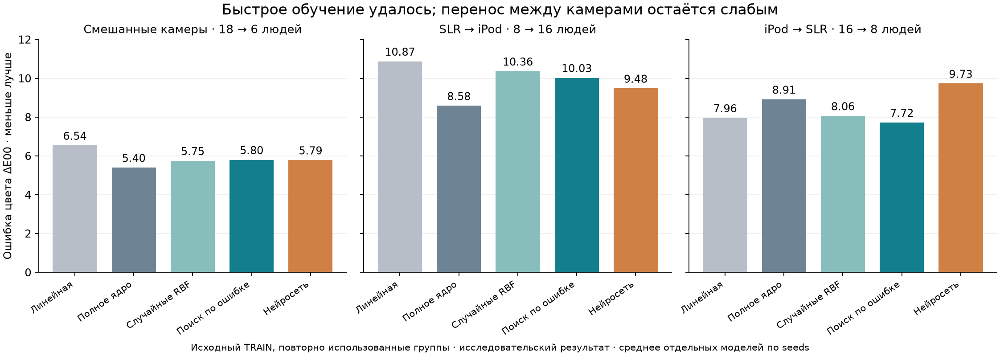

# Luma: результат возобновлённого исследования, 13 сентября 2026

**Получено очень маленькое и быстро обучаемое ядро оценки цвета кожи. Преимущество по точности между камерами неустойчиво.** На RTX 4060 поиск по ошибке обучается за медианные **74,9 мс** по готовым признакам. Числовые параметры занимают **10 996 байт FP32** или **5 498 байт FP16**. Это исследовательский регрессор цвета, а не законченная модель распознавания лица по селфи.

## Что получилось из идеи «подбирать веса по локализованной ошибке»

Обучение без backprop работает так: строим до 768 локальных нелинейных элементов; на каждом из 64 шагов GPU оценивает, какой элемент лучше уменьшит текущую ошибку с учётом уже выбранных. Выходные веса вычисляются аналитически. До 49 152 оценок кандидатов не требуют столько же отдельных обучений.

Сравнение включает случайный выбор из того же банка, обычную нейросеть с ровно тем же объёмом параметров, линейную регрессию и полное ядро. Уменьшение обучающей ошибки проверено независимым полным перебором на численных тестах. Гипотеза, что такое управление ошибкой обязательно улучшит перенос на других людей/камеры, не подтвердилась.

## Измеренная точность

Ошибка CIEDE2000 относительно инструментального Lab, средняя сначала по каждому человеку, затем между людьми; меньше лучше. Среднее отдельных моделей по трём seeds, без ансамбля.

| Обучение → проверка | Случайные элементы | Поиск по ошибке | Нейросеть того же размера | Полное ядро |
|---|---:|---:|---:|---:|
| Смешанные камеры, 18 → 6 людей | 5,752 | 5,801 | 5,786 | 5,398 |
| SLR → iPod, 8 → 16 людей | 10,364 | 10,028 | 9,481 | 8,584 |
| iPod → SLR, 16 → 8 людей | 8,062 | 7,719 | 9,731 | 8,913 |

В смешанной группе выигрыш поиска по ошибке отсутствует. По отношению к нейросети он проигрывает SLR→iPod и выигрывает обратное направление. Полное ядро сильнее в двух из трёх проверок, но в смешанном протоколе хранит 114 820 числовых байт против 10 996 у компактных моделей.

Описательный парный bootstrap по шести людям смешанной группы даёт разницу guided−MLP **+0,016**, интервал **[−0,391; +0,351]**. Это не независимое статистическое подтверждение: группы использовались раньше, протоколы пересекаются, неопределённость выбора настроек в интервал не включена. [Полный независимый аудит](../benchmarks/skin_local_search_v1/independent_audit.json).

## Обучение и размер

На одной и той же обучающей части из 734 снимков, после прогрева, один поток CPU, медиана трёх повторов:

| Метод | CPU | RTX 4060 | Числовые байты FP32 |
|---|---:|---:|---:|
| Линейная регрессия | 4,75 мс | 5,41 мс | 756 |
| Полное ядро | 107,72 мс | 28,91 мс | 114 820 |
| Случайные RBF | 69,10 мс | 31,05 мс | 10 996 |
| Поиск по ошибке | 214,99 мс | 74,91 мс | 10 996 |
| Нейросеть AdamW, 512 шагов | 196,24 мс | 462,05 мс | 10 996 |

Поиск на GPU в этом измерении примерно в **2,62 раза** быстрее нейросети на более подходящем ей здесь CPU. Сравнение только GPU дало бы 6,17 раза, но скрыло бы более быстрый CPU-контроль. Это характеристики конкретных реализаций и маленького набора, не универсальная оценка оптимизаторов. CUDA Graphs, fused Adam и специальные INT8 kernels не реализовывались.

Время одного fit включает нормализацию, построение банка, поиск и решение весов по **уже рассчитанным 36 статистикам цвета**. Извлечение лица/кожи и признаков, загрузка фотографий, холодный запуск и весь подбор настроек сюда не входят. Основная фаза из 297 внутренних и 33 итоговых fits заняла 54,27 с. Вторичная серия содержит 216 пересчётов префиксов; дополнительно выполнялись проверки и отдельный замер CPU/GPU. Это не время полного обучения системы компьютерного зрения с нуля.

FP16 сократил параметры guided RBF до **5 498 байт**. Средняя ошибка стала 5,802 / 10,042 / 7,719; максимальное изменение отдельного предсказания во всех трёх протоколах — **0,048 ΔE00**. Служебный контейнер NPZ занимает больше числовой нагрузки. Перед вычислением FP16 распаковывается в FP32, поэтому рабочая память и скорость вычисления не уменьшаются автоматически.

INT8 guided хранит 3 143 байта, но максимальное отклонение предсказания достигло 1,045 ΔE00; у полного ядра — 7,102. Все форматы были зафиксированы до проверки; выбор победителя по внешней ошибке не выполнялся.

Префиксы 8/16/32 элементов дают 2 036 / 3 316 / 5 876 байт FP32. В смешанной группе их ошибка guided составила 6,151 / 6,027 / 5,880 против 5,801 у 64. Внутренняя проверка выбрала K8 только для SLR→iPod; на внешней части он оказался хуже K64. Поэтому такое сокращение не стало подтверждённым улучшением. [Все сокращения и разрядности](../benchmarks/skin_local_search_v1/ablations.md).

## Решение для следующего этапа

Сохранить guided RBF как быстрый компактный контроль и FP16 как перспективный способ хранения. Сохранить MLP и полное ядро как обязательные сильные сравнения. Не продвигать INT8 или удачный внешний K16 как выбранного победителя: они не прошли соответствующий внутренний отбор.

Следующая содержательная гипотеза — улучшить представление цвета и устойчивость к освещению/обработке камеры при сохранении этого дешёвого обучаемого ядра. На этом масштабе само обучение уже занимает десятки миллисекунд; дальнейшая оптимизация перебора не устраняет наблюдаемую ошибку переноса. Для подтверждения технологии Luma всё равно нужна новая проверка обычных лиц с приборным цветовым эталоном. Новые данные в этой серии не собирались и не скачивались.

Эти методы имеют предшественников OMP, stochastic configuration networks, ELM и kernel ridge; новизна общего алгоритма не заявляется. Для материалов «Сколково» это измеренная компетенция по компактному обучению, а не доказательство прорыва в точности.

## Проверяемость и продолжение работы

Рабочая ветка: `codex/skin-local-search-2026-09-13`. Авторитетная рабочая копия: `C:\Users\dimal\Documents\просто\.worktrees\luma-local-search`. Исходный завершённый архив не изменён. Новые веса находятся в gitignored `experiments/runs/skin_local_search_v1`, `skin_local_search_compact_v1` и `skin_local_search_v1/precision`. Ничего не публиковалось и не интегрировалось в приложение.

Использован исключительно исходный TRAIN: 966 изображений / 24 человека. Старые validation/calibration/test не использовались для новых fits или оценки. Группы текущей проверки уже исторически знакомы; результат строго исследовательский. Архивный encoder на точно той же смешанной группе имел 6,108 по снимкам / 5,924 по людям; сравнение с ним контекстное, поскольку представление и рецепт обучения различаются. Старый независимый результат 4,457 относится к другой группе и не сопоставляется с нынешними числами напрямую.

Свежая проверка: **61 тест прошёл**, включая численные решения, разбиения по людям, отсутствие влияния внешних меток, сериализацию и дополнительные исследования. Независимый аудит воспроизвёл все 33 итоговых набора метрик и выравнивание строк. Проверены 216 артефактов сокращения и 99 вариантов разрядности. В сокращении исправлена только запись статуса оценки после fit; первоначальный lock и описание изменения сохранены, модели и их выбор не изменялись. Старый каталог `skin_local_search_compact_v1_superseded_cost_receipt` сохранён как неавторитетная техническая история исправления учёта затрат.

[Основной отчёт и точные агрегаты](../benchmarks/skin_local_search_v1/report.md) · [Протокол](skin_local_search_v1_protocol.md) · [Воспроизведение](../benchmarks/skin_local_search_v1/reproduce.md) · [Происхождение данных/весов](../ip/skin_local_search_provenance.md).
