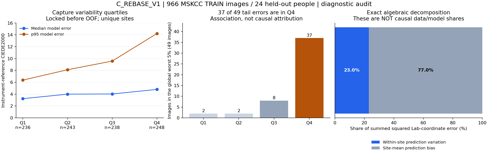

# C_REBASE_V1 — error-floor audit

| model | OOF mean | OOF median | OOF p95 | >5 | >10 |
|---|---:|---:|---:|---:|---:|
| C_REBASE_V1 | 4.619 | 3.897 | 10.190 | 34.68% | 5.59% |

**Диагностический вывод: MIXED. Статус воспроизведения: BITWISE_REPRODUCED_FOLD_0. Цель median ≤2 / p95 ≤5 не достигнута.**

966 исходных TRAIN изображений / 24 человека / 248 sites. Каждый человек ровно один раз в OOF holdout; 6 folds по 4 человека. Покрытие основной метрики 100%; обученного правила отказа здесь нет. Изображения: 729 dermoscopic, 237 clinical close-up; 643 iPod / 323 SLR. Это не независимый тест селфи.

Исторический C — **HISTORICAL_NOT_REPRODUCIBLE**. Его агрегаты не использовались для подбора и не служат controlled comparator. Существующие данные и reference/capture-аудит восстановлены ранее; новый результат — шесть фиксированных обучений, полный OOF и диагностика его ошибок. Production C и face inference не изменены.

## Где сосредоточен высокий p95

- Q4 нестабильности съёмки: 248 снимков, p95 **14.232**, 37 из 49 ошибок выше общего p95 (**75.5%** хвоста). Q1: 236 снимков, p95 **6.365**, только 2 из 49.
- P12: 44 снимка, mean **10.723**, p95 **17.476**, 24 из 49 ошибок хвоста. Приборный L*=26–34.333. Это один человек: вывод о всех людях с таким тоном делать нельзя.
- Palms/soles: 86 снимков, p95 **16.533**, 17 из 49 ошибок хвоста. Группы пересекаются; их доли нельзя суммировать.
- Для клинических кадров: iPod p95 **13.529**, SLR **7.426**. Устройство закреплено за человеком; независимого cross-camera сравнения одного человека нет.

Spearman ошибка–within-site variability = **0.236**, patient-bootstrap 95% CI **[0.080, 0.400]**. После центрирования внутри человека: **0.085 [−0.021, 0.195]**. Связь заметно зависит от межличностных различий; это не доказательство причинности освещения.

## Что позволяет разложить dataset

Точное разложение суммы квадратов Lab-coordinate errors: **23.0%** — вариация predictions между снимками одного site (95% CI 17.1–31.3%); **77.0%** — ошибка среднего prediction этого site относительно общего target. Это алгебраические компоненты фиксированного estimator, **не причинные доли «capture против модели»**. Вторая компонента включает model bias и неразличимые систематические capture/reference effects.

Приборные повторы: mean **2.576**, median **2.333**, p95 **5.796 ΔE00**. Однако это разброс отдельных assessments, а target — среднее трёх. При исключении одного assessment сдвиг target: mean **0.761**, median **0.647**, p95 **1.672**. p95 ошибки модели при таких perturbations остаётся **10.099–10.333**. Гипотеза «весь p95 задаётся только шумом прибора» этими числами не поддерживается.

Только при недоказанном допущении независимых одинаково распределённых zero-mean readings оценка variance среднего target составляет **5.20%** наблюдаемой суммарной coordinate MSE. Это сравнение масштабов, не установленный noise floor и не величина, которую можно вычесть из ΔE00.

Независимый физический error floor **не идентифицируется**: один triplet reference переиспользуется для всех снимков site; независимых повторных acquisitions target нет, одинаковые capture modes внутри site не повторяются. Нулевой same-site target oracle тавтологичен. Неизвестны общий reference bias и систематическая ошибка capture. Точный ресурс для их разделения — независимые повторные reference acquisitions того же site, связанные с повторными кадрами при фиксированном mode; сейчас таких строк в release нет.

## Заранее фиксированные диагностические срезы

**LEAKY_DIAGNOSTIC_ONLY**: это анализ сохранившихся строк, не селектор для одиночной фотографии и не доказанная достижимая точность после «удаления шума». Основная метрика всех 966 строк остаётся выше.

| Срез | Coverage | Снимки | mean | median | p95 |
|---|---:|---:|---:|---:|---:|
| Все TRAIN | 100.00% | 966 | 4.619 | 3.897 | 10.190 |
| Меньший разброс reference | 80.12% | 774 | 4.549 | 3.910 | 9.866 |
| Меньшая capture variability | 79.19% | 765 | 4.213 | 3.776 | 8.766 |
| Меньший clipping | 80.02% | 773 | 4.332 | 3.783 | 9.251 |
| Reference + capture | 62.22% | 601 | 4.180 | 3.785 | 8.403 |
| Reference + capture + clipping | 51.14% | 494 | 4.120 | 3.699 | 8.291 |

Даже при привилегированном отборе 51.14% самых стабильных по трём правилам снимков median **3.699**, p95 **8.291**. Достаточной точности это не даёт. Усреднение frozen predictions всех кадров site снижает p95 до **9.075**; коррекция по residuals других sites того же человека — до **8.676**. Оба oracle привилегированные и не входят в production.

## Полные метрики и folds

p90 **8.056**, max **21.375**. >5: 335/966; >10: 54/966. Person-balanced mean **4.578**, mean of person medians **4.163**, equal-person weighted median **3.883**.

Patient-cluster bootstrap, 2000 draws: mean 95% CI **[4.089, 5.343]**, median **[3.579, 4.437]**, p95 **[8.112, 13.255]**. Это описательные интервалы фиксированного OOF с перекрывающимися train-частями, без повторного обучения внутри bootstrap; они не заменяют независимый confirmatory test.

| Координата | MAE | RMSE |
|---|---:|---:|
| L* | 3.580 | 4.854 |
| a* | 2.272 | 2.879 |
| b* | 2.365 | 2.975 |

| Fold | Снимки | Люди | mean | median | p95 |
|---|---:|---:|---:|---:|---:|
| 0 | 155 | 4 | 3.923 | 3.444 | 8.159 |
| 1 | 153 | 4 | 4.719 | 4.113 | 9.756 |
| 2 | 145 | 4 | 4.141 | 3.865 | 7.995 |
| 3 | 167 | 4 | 6.121 | 4.596 | 15.137 |
| 4 | 170 | 4 | 4.177 | 3.767 | 9.168 |
| 5 | 176 | 4 | 4.540 | 4.100 | 8.952 |

## Воспроизведение и артефакты

До обучения конфиг и mapping опубликованы в commit `b744a5130d144b350885db4f92ce6801c614fcac`. После просмотра OOF они не менялись. Одна архитектура 36→64→3; seed17; 100 эпох; AdamW LR0.001/WD0.0001; normalizers только fold TRAIN; никаких search или новых quality models.

Исходные артефакты fold0 перенесены в quarantine. Повтор в новом процессе с нуля дал **max absolute Lab difference = 0**, совпадение всех predictions, весов эпох50/100, нормализаторов, RNG и training logs. Проверены 155 held-out строк / 4 человека. Итоговый статус — в [reproduction_result.json](reproduction_result.json); первоначальный `run/oof_metrics.json` сохраняет историческую запись PENDING до этой проверки.

- [Полный количественный разбор](run/audit/INTERPRETATION_RU.md)
- [Полный OOF NPZ](run/experiment/private_review/c_rebase_v1_oof.npz)
- [Top-50: 50 строк × 81 поле](run/audit/top50_anonymized.csv)
- [Strata](run/audit/strata_summary.csv) · [Correlations](run/audit/correlations.csv) · [Полный JSON](run/audit/c_rebase_v1_error_audit.json)
- [Config](config.lock.json) · [Person mapping](person_folds.lock.json) · [Dataset manifest](train_manifest.lock.json) · [Freeze](freeze.lock.json)
- [Выполненные команды](COMMANDS.md) · [Протокол](PROTOCOL_RU.md) · [SHA256 всех файлов](MANIFEST_SHA256.json)

OOF SHA256: `f0b492bc17087c86359f9c05527fbf01863651c9d6bd3b444cc8bc52cdf0affa`.

Приборный Lab — D65/10°. Наблюдаемый Lab — sRGB D65/2°. Их discrepancy рассчитан только как явно маркированный mixed-observer coordinate proxy, не physical ΔE00. Корреляция с ним имеет также математическую связь через общий target. Все права и ограничения источника MSKCC сохраняются. Фотографии и прямые исходные идентификаторы не публикуются.

**Решение:** MIXED; обнаружены capture-sensitive ошибки и сохраняющийся site/person bias. Данных недостаточно для честного численного причинного деления или гарантированного физического floor. Аудит завершён, новая модель или production-ready статус не заявляются.
